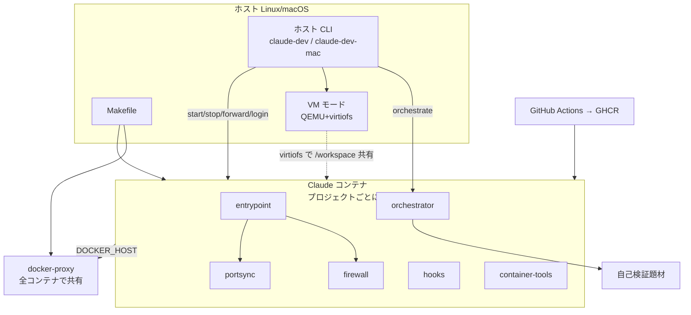
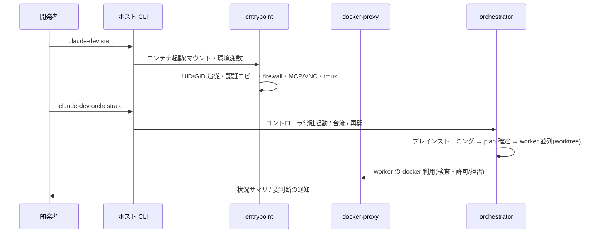

<!-- 2026-08-04 /task-close: 認証の置き場所の記述を**実装に合わせた**(人間の裁定=実装が正。
     `docs/issues/040`)。コピー先はプロジェクトディレクトリ配下(`/workspace/.claude/` `/workspace/.codex/`)で、
     ホームからは symlink(`~/.claude` / `~/.codex` はディレクトリ、`~/.claude.json` はファイル単位)。
     起点の `D0-auth-03` と `FR-env-03` #2・#7 も同時に直した。
     **残るリスク**(ファイル単位 symlink がアトミック書き込みで置き換わりうる / 認証が
     バインドマウント配下に平文で存在する)は `D0-auth-03` に明記した。 -->

# システムアーキテクチャ

## 全体構成

- 開発者はホスト CLI で Claude コンテナのライフサイクルを操作する。OS 差分はホスト CLI に閉じる。
- コンテナ起動時は `entrypoint` が UID/GID 追従・認証コピー・ファイアウォール起動・MCP/VNC 設定・
  tmux 開始を行う。
- コンテナ内 Docker は共有の `docker-proxy` を介して制限付きで使う。重い案件は VM モード。
- `orchestrator`(Go、コンテナ内常駐)が 2 モードで worker を並列制御する。
- イメージは Makefile でビルドし、GitHub Actions で GHCR へ配布する。

## コンポーネントの責務

| コンポーネント | 責務 | 対応要件 |
|---|---|---|
| ホスト CLI | コンテナのライフサイクル・認証・ポート・SSH 鍵・オーケストレーター起動。OS 依存をここに閉じる | FR-env-01〜FR-env-12, FR-orch-02 |
| Makefile | ビルド・セットアップ・CLI の導入/除去・自己検証題材の配置 | FR-env-09, FR-env-10, FR-orch-09 |
| コンテナイメージ | 開発ツール・エージェント CLI・ブラウザ確認資産を同梱した実行基盤 | FR-env-09, FR-env-11, FR-env-12 |
| entrypoint | コンテナ起動時の初期化(UID/GID・認証・既定設定・ファイアウォール・VNC・tmux・同期ループ) | FR-env-02, FR-env-03, FR-env-05, FR-env-11, FR-env-12 |
| firewall | コンテナ内の外向き通信制御 | FR-env-05 |
| docker-proxy | Docker API の検査・書き換え・拒否。全コンテナで共有 | FR-env-07, NFR-sec-01 |
| portsync | 公開ポートの検出と転送(DooD / VM の両経路) | FR-env-06 |
| orchestrator | 2モードの制御ループ・worker 並列・介入・レビュー・TUI・通知・状態保全 | FR-orch-01〜FR-orch-08 |
| hooks | エージェントのイベントを受けてプロンプト保存と通知を行う | FR-orch-07 |
| container-tools | コンテナ内で利用者が使う補助資産(レート制限の待機など) | FR-env-01 |
| VM モード | ゲスト VM の起動・provision・ポート同期・資源逼迫の監視 | FR-env-08 |
| 自己検証題材 | オーケストレーターを実走させて振る舞いを確認するための題材 | FR-orch-09 |

## データの流れ

1. **認証**: 利用者がホストでログイン → 一時コンテナが認証ファイルを共有ボリュームへ書く →
   `start` 時にプロジェクトディレクトリ配下へコピー → コンテナ内の同期ループが 30 秒ごとに
   変更を共有ボリュームへ書き戻す。**ホストのホームディレクトリの認証情報は読まない。**
2. **ソースコード**: カレントディレクトリを `/workspace` にマウントする(ライブ反映)。
   VM モードでは同じパスを virtiofs でゲストにも共有する。worker は `/workspace` 内の
   git worktree で作業し、統合はコントローラが直列に行う。
3. **Docker 操作**: コンテナ内の `docker` → `DOCKER_HOST` → docker-proxy が検査 →
   許可/書き換え/拒否 → ホストの Docker Engine。
4. **公開**: 既定ではポートを公開しない。`forward` のときだけ中継コンテナを立ててホスト側ポートを
   割り当てる。ブラウザ確認ありの場合は noVNC ポートのみ起動時に公開する。
5. **運用状態**: オーケストレーターの plan・制御・状態・追記型ログは `/workspace/.orchestrator/` に
   置き、機械だけが読み書きする。

## 外部システムとの境界

| 外部システム | 何を渡すか | 何を受け取るか | 失敗時の方針 |
|---|---|---|---|
| Anthropic API | プロンプト(worker / 対話 Claude 経由) | 応答 | エージェント側の失敗として扱う。実行ループは停止条件に従う |
| OpenAI API | プロンプト(codex 経由) | 応答 | codex を使わない利用者の起動を妨げない |
| GHCR | 認証(CI 側) | 配布イメージ | 取得失敗は非0終了。ローカルビルドで代替できる |
| npm registry / Claude Code リリース配布 | なし | 最新バージョン文字列(CI の prepare) | CI の失敗として扱う。手動バージョン指定で回避する |
| GitHub Meta API | なし | 許可する IP レンジ | 名前解決へフォールバックし、それも失敗した場合は当該通信が不許可になる |
| Slack | 通知本文(コントローラのみ) | なし | 失敗しても実行を止めない。トークンは worker へ渡さない |
| ホストの Docker Engine | 検査済みの Docker API リクエスト | 応答 | 中継失敗は 502 を返す |

## インフラ構成の設計

| 環境 | 用途 | 構成の方針 | 他環境との差異 |
|---|---|---|---|
| local | 開発者のホスト(Linux サーバ / macOS)。**本システムの唯一の実行環境** | Docker のネットワーク1本・共有ボリューム3本・プロジェクトごとのコンテナ・共有 docker-proxy 1本で構成する。具体的な構成値は `03-impl/infra/local/` が正 | - |
| dev / prod | 該当なし | 本システムはサーバとしてデプロイされる製品ではなく、開発者の手元で動く開発環境である。配布物はコンテナイメージのみで、その公開先(GHCR)の構成は `03-impl/infra/local/ghcr.md` が持つ | 存在しない |

## 設計判断

### DSN-arch-01 ホスト CLI + 隔離コンテナ + 共有 docker-proxy + 任意のゲスト VM の4層構成

- 判断: 開発環境を「ホスト側の CLI」「プロジェクトごとの隔離コンテナ」「全コンテナで共有する
  docker-proxy」「オプトインのゲスト VM」の4つに分ける。利用者の操作はすべてホスト CLI を通り、
  コンテナ内資産は OS を意識しない。
- 理由: 隔離境界をコンテナ/ホスト間の1本に集約でき(`D0-sec-06`)、OS 依存をホスト CLI に閉じられる
  (`NFR-ops-02`)。docker-proxy を共有にすると、プロジェクトが増えてもホスト側の常駐は1つで済む。
- 却下した案: コンテナごとに docker-proxy を立てる — 常駐が増え、ホストのリソースを浪費する。
  ホスト CLI を持たず `docker run` を直接使わせる — マウント・環境変数・鍵の受け渡しを利用者が
  毎回組み立てることになり、構成が揃わない。
- 影響する要件: FR-env-01, FR-env-07, FR-env-10, NFR-ops-02

### DSN-arch-02 状態は「共有ボリューム」「プロジェクトディレクトリ」「運用状態」の3箇所にだけ置く

- 判断: 永続する状態を次の3種類に限定する。
  1. **共有ボリューム**(`claude-dev-auth` / `claude-dev-config` / `claude-dev-history`): 認証・
     シェル設定・コマンド履歴。全コンテナで共有する。
  2. **プロジェクトディレクトリ**(`/workspace`): ソースコード、`.claude-dev.yaml`、
     **認証・設定の実体**(`/workspace/.claude/` `/workspace/.codex/`。コンテナのホームからは
     symlink で参照する。下の表と `DSN-auth-01` を参照)。
  3. **運用状態**(`/workspace/.orchestrator/`): plan・制御・状態・追記型ログ。機械のみが読み書きする。

  | エンティティ | 置き場所 | 所有 | 共有範囲 |
  |---|---|---|---|
  | 認証ファイル(Claude / Codex) | 共有ボリューム → **プロジェクトディレクトリ配下(`/workspace/.claude/` `/workspace/.codex/`)へコピー**。ホームからは symlink で参照 | entrypoint(コピーは CLI) | 全コンテナ |
  | セッション・設定(`settings.json` / `config.toml` 等) | プロジェクトディレクトリ | entrypoint | コンテナ固有 |
  | `.claude-dev.yaml`(SSH 鍵の指定) | プロジェクトディレクトリ | ホスト CLI | プロジェクト固有 |
  | plan / control / state / 追記型ログ | 運用状態 | orchestrator | プロジェクト固有 |
  | Docker リソース(ネットワーク・ボリューム・イメージ) | ホストの Docker | ホスト CLI / Makefile | `claude-dev-` 接頭辞で命名 |
- 理由: 「共有すべきもの(認証)」と「共有してはならないもの(セッション・運用状態)」を置き場所で
  分けると、同期ループも片付け操作も分岐を持たずに済む。
- 却下した案: すべてをプロジェクトディレクトリに置く — プロジェクトごとに再ログインが必要になる。
  すべてを共有ボリュームに置く — セッションが混ざり、複数プロジェクトの同時利用が壊れる。
- 影響する要件: FR-env-03, FR-orch-05

### DSN-arch-03 主要フロー(起動から自律実行まで)

- 判断: 利用者の操作から自律実行までを次の一本道に固定し、途中に別経路を作らない。

- 理由: オーケストレーターの起動をコンテナ起動の後段に固定すると、認証・ネットワーク・ポートの
  前提が整った状態から始められる。
- 却下した案: オーケストレーターをホスト側で動かす — レビュー前コードをホストで実行することになり、
  隔離の目的に反する。
- 影響する要件: FR-env-01, FR-orch-01, FR-orch-02

### DSN-arch-04 配布はマルチアーキ日次ビルドの GHCR 公開に一本化する

- 判断: 配布経路を GHCR のみとし、GitHub Actions の日次ビルドでタイムスタンプタグと `latest` を
  push する。利用者は `claude-dev pull` で取得する。ローカルビルド(`make build`)は開発・
  切り戻し用に残す。
- 理由: チーム全員が同一構成を得るには、配布物が1箇所にあり自動更新されている必要がある。
- 却下した案: 配布せず各自ビルド — 構成が揃わない。手動 push — 更新が滞る。
- 影響する要件: FR-env-09, NFR-perf-01

### DSN-auth-01 認証はコピーと定期書き戻しで共有する(ホームからの参照は symlink)

- 判断: 認証ファイルは起動時に**プロジェクトディレクトリ配下へ**コピーし(ホームからは symlink で参照する)、30 秒ごとの同期ループで共有ボリュームへ
  書き戻す。Claude Code と Codex CLI で同一方式・同一の同期ループを使う。
- 理由: Claude Code は認証ファイルをアトミックに書き込む(一時ファイル → rename)ため symlink が
  壊れる。Codex の `auth.json` はその場書き換えで symlink でも壊れないが、**方式を2つ持たない**
  ことを優先する(同期ループ・`logout`・`reset` の分岐を増やさない)。トークンリフレッシュで内容が
  変わる点は双方に共通で、書き戻しはどちらにも必要。
- 却下した案: symlink 共有 — 壊れる。ホストの認証ファイルを直接マウント — ホストの資格情報を
  コンテナへ渡す経路を作ることになる。同期せず起動時コピーのみ — リフレッシュされたトークンが
  失われ、次回起動で再ログインになる。
- 影響する要件: FR-env-03(受け入れ基準2・3・7・8)

### DSN-dist-01 エージェント CLI の導入は「内容由来キー」で配布ステージの終端レイヤーに置く

- 判断: イメージを4ステージに分ける——重い共通層の `base`、ブラウザ確認資産を積む
  `vnc-base`(`FROM base`)、配布する2つの終端ステージ(`FROM base` / `FROM vnc-base`)。
  Claude Code と Codex CLI の導入は**終端ステージの最終レイヤーにのみ**置き、キャッシュキーには
  CI が解決した具体バージョンを使う。
- 理由: `vnc-base` は `base` に連なるため、`base` 途中の層を失効させるとブラウザ確認資産の高コスト層
  (VNC 一式・Chrome)まで巻き込んで再ビルド・再 push・再 pull になる。終端レイヤーへ移すと失効の
  波及先がエージェント CLI の層だけになり、鮮度(`FR-env-09` 受け入れ基準3・4)と取得の増分性
  (`NFR-perf-01`)を同時に満たせる。
- 却下した案: `base` の途中で導入し日次タイムスタンプで無効化する — 新版が無い日も毎日失効する。
  `base` の途中で導入しバージョンで無効化する — 波及範囲が VNC 層まで及ぶ。実行時に自動更新させる —
  ファイアウォール下・オフライン起動で不確定になり「同一構成の保証」を失う。
- 一般原則: レイヤーチェーンに入れてよいのは**内容由来**の値(実バージョン等)だけであり、時刻など
  内容と無関係に動く値を入れてはならない。内容由来であっても、失効の波及範囲を最小化できる位置
  ——依存される側ではなく終端——に置く。
- 影響する要件: FR-env-09, FR-env-12, NFR-perf-01, NFR-perf-02

### DSN-dist-02 Codex サンドボックスは既定で無効化し、読み取り専用用途だけ landlock で生かす

- 判断: entrypoint が既定3鍵(`sandbox_mode = "danger-full-access"` / `approval_policy = "never"` /
  `[features] use_legacy_landlock = true`)を置く。設定ファイルが無ければ生成し、あれば**書かれて
  いない鍵だけを追記**して既存の値は変えない。既定では codex 自前のサンドボックスを使わないが、
  読み取り専用を明示要求する呼び出しだけは landlock バックエンドで成立させる。
- 理由: codex の Linux サンドボックスは bubblewrap 実装で、ユーザー名前空間の作成とマウント伝播の
  変更を必要とする。Claude コンテナは Docker 既定 seccomp と `docker-default` AppArmor の下で動く
  ため、seccomp が `CLONE_NEWUSER` を拒否し、それを外しても AppArmor が `mount --make-rslave /` を
  拒否する2段構えで起動できない。放置すると codex のシェルコマンドが例外なく失敗し、しかも
  **失敗が静かに起きる**(モデルが失敗を認識せず出力を捏造する。`codex doctor` も検知せず、
  `codex exec` の終了コードは 0 のまま)。隔離境界はコンテナ/ホスト間のみという前提(`D0-sec-06`)
  のもとでは、コンテナ内の二重サンドボックスは元から想定していない。
- 却下した案: `--security-opt` で seccomp と AppArmor を外す — 隔離境界そのものを弱める。
  既定のまま運用する — シェルコマンドが例外なく失敗する。設定ファイルをイメージへ焼き込む —
  プロジェクトごとに設定を変える余地を失う。landlock を使わず添付方式で回避する — 恒久策にすると
  codex にファイルを読ませる経路が使えなくなる(`use_legacy_landlock` が撤去された場合の退避先
  としては残す)。起動時に疎通確認を走らせる — codex を使わない利用者にも毎起動のコストがかかる。
- 副作用として設計に織り込む点: 失敗が静かに起きるため、E2E は「起動する」ではなく**シェル実行が
  成功する**ところまで観測し、判定は成果物で行う。`use_legacy_landlock` は deprecated であり版更新で
  撤去されうるため、E2E に landlock の疎通確認を含めて回帰を検知する。
- 影響する要件: FR-env-12(受け入れ基準4〜11), NFR-sec-01

### DSN-orch-01 自作の外部制御ループ(コントローラがループを所有する)

- 判断: 継続/停止の判定をコードが持つ外部制御ループを自作し、推論ループは `claude -p` / 対話 Claude
  から借りる。
- 理由: 暴走しない・コンテキストを汚さない・再開可能。変化の速い依存を中核に据えると配布の安定性に
  リスクがある。
- 却下した案: Docker Agent 方式(推論と委譲の配管を任せる) — 変化が速く中核に据えられない。
  Stop-hook による力技の連続走行 — 停止条件を LLM の裁量に委ねることになる。
- 影響する要件: FR-orch-02, FR-orch-03, FR-orch-05

### DSN-orch-02 コントローラは tmux セッションに常駐させる

- 判断: コントローラを `orch-<project>-main` セッションの `dashboard` ウィンドウで常駐させ、
  worker とブレインストーミングを同セッションの独立ウィンドウにする。生存判定はプロセスの存在で行う。
- 理由: クライアント端末が壊れても tmux サーバがセッションを保持するため、再接続で復旧できる。
  完全デーモン化より単純で、ダッシュボードの描画を別プロセスに分けずに済む。セッションの存在で
  生存を判定すると、空き殻を生存と誤判定して二重起動や合流不能を招く。
- 却下した案: `setsid` による完全デーモン化 — 描画の別プロセス化が必要で複雑になる。
  常駐しない — 端末を閉じると実行が失われる。
- 影響する要件: FR-orch-02(受け入れ基準2・4), NFR-avail-01

## 未解決事項

- なし
