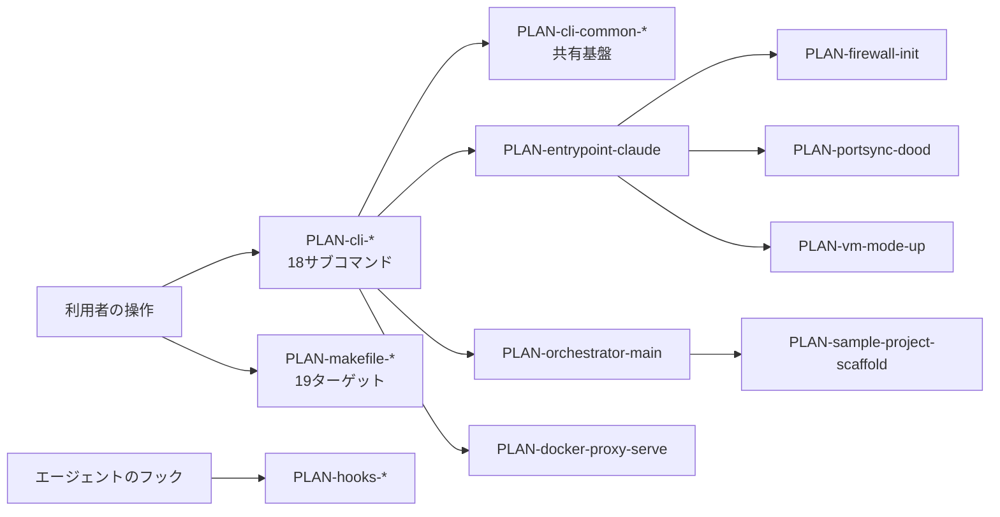

# 想定機能連携一覧

## 一覧

<!-- 網羅の範囲(この設計での取り決め):
     ・要件に係る**入口となる機能**(kind: tool)を全件書く。
     ・**モジュール境界をまたぐ呼び出し**の相手方(MOD-cli-common の共有基盤)を全件書く。
     ・同一モジュール内部で完結する private helper は書かない(MOD-orchestrator の内部関数18本と
       自己検証題材の実装本体がこれに当たる)。呼び出す先の欄に「同一モジュール内部で完結」と
       書いてあるものは、03 側では内部の機能を呼んでいる。
     ・**入口機能の呼び出し元は「なし」と書く**。利用者の操作が契機であることは kind: tool と
       下の「連携の詳細」の契機で表す(03 側の実装仕様と語彙を揃えるため。USER-* は使わない)。 -->

| PLAN-ID | モジュール | kind | sync | 呼び出し元 | 呼び出す先 | 契約 | 対応要件 | 概要 |
|---|---|---|---|---|---|---|---|---|
| PLAN-cli-attach | MOD-cli-attach | tool | sync | なし | PLAN-cli-common-container-name, PLAN-cli-common-is-running, PLAN-cli-common-require-setup, PLAN-cli-common-resolve-container-user | なし | FR-env-01 | 実行中コンテナの tmux セッションに接続する |
| PLAN-cli-code | MOD-cli-code | tool | sync | なし | PLAN-cli-common-container-name, PLAN-cli-common-is-running, PLAN-cli-common-require-setup, PLAN-cli-common-resolve-container-user | なし | FR-env-01, FR-env-08, FR-env-12 | 新しい tmux ウィンドウで Claude Code を起動する |
| PLAN-cli-common-container-exists | MOD-cli-common | function-call | sync | PLAN-cli-forward, PLAN-cli-logout, PLAN-cli-start, PLAN-cli-stop, PLAN-cli-unforward | なし | なし | FR-env-01 | 指定名のコンテナが存在するか(停止中を含む)を判定する |
| PLAN-cli-common-container-name | MOD-cli-common | function-call | sync | PLAN-cli-attach, PLAN-cli-code, PLAN-cli-firewall, PLAN-cli-forward, PLAN-cli-orchestrate, PLAN-cli-ports, PLAN-cli-ssh-keys, PLAN-cli-ssh-keys-reset, PLAN-cli-start, PLAN-cli-stop, PLAN-cli-unforward | なし | なし | FR-env-01 | プロジェクト名からコンテナ名を導出する(命名規則の実体) |
| PLAN-cli-common-dev-agent-path | MOD-cli-common | function-call | sync | PLAN-cli-ssh-keys-reset, PLAN-cli-start, PLAN-cli-stop | なし | なし | FR-env-04, FR-env-10 | macOS の専用 ssh-agent とブリッジのファイル配置を決める |
| PLAN-cli-common-ensure-infrastructure | MOD-cli-common | function-call | sync | PLAN-cli-login, PLAN-cli-login-codex, PLAN-cli-start | なし | CTR-cli-container | FR-env-01, FR-env-03 | docker network と共有 3 ボリュームを冪等に作成する |
| PLAN-cli-common-get-novnc-url | MOD-cli-common | function-call | sync | PLAN-cli-list, PLAN-cli-ports, PLAN-cli-start | なし | なし | FR-env-11 | 公開中の noVNC ポートから接続 URL を組み立てる |
| PLAN-cli-common-image-exists | MOD-cli-common | function-call | sync | PLAN-cli-common-require-setup, PLAN-cli-start | なし | なし | FR-env-01, FR-env-09 | 指定イメージがローカルに存在するかを判定する |
| PLAN-cli-common-is-running | MOD-cli-common | function-call | sync | PLAN-cli-attach, PLAN-cli-code, PLAN-cli-firewall, PLAN-cli-forward, PLAN-cli-list, PLAN-cli-orchestrate, PLAN-cli-ports, PLAN-cli-start, PLAN-cli-stop | なし | なし | FR-env-01 | 指定コンテナが running 状態かを判定する |
| PLAN-cli-common-require-setup | MOD-cli-common | function-call | sync | PLAN-cli-attach, PLAN-cli-code, PLAN-cli-login, PLAN-cli-login-codex, PLAN-cli-logout, PLAN-cli-orchestrate, PLAN-cli-start | PLAN-cli-common-image-exists | なし | FR-env-01, FR-env-09 | セットアップ未実施なら必要なイメージを自動ビルドする事前条件ゲート |
| PLAN-cli-common-resolve-container-user | MOD-cli-common | function-call | sync | PLAN-cli-attach, PLAN-cli-code, PLAN-cli-orchestrate, PLAN-cli-start | なし | なし | FR-env-01, FR-env-02, FR-env-09 | docker exec に渡す実行ユーザを稼働中コンテナ自身の env から決定する |
| PLAN-cli-common-select-ssh-keys | MOD-cli-common | function-call | sync | PLAN-cli-ssh-keys-select, PLAN-cli-start | PLAN-cli-common-write-project-ssh-keys | なし | FR-env-04 | 利用可能な SSH 鍵を列挙し対話選択させて保存する |
| PLAN-cli-common-write-project-ssh-keys | MOD-cli-common | function-call | sync | PLAN-cli-common-select-ssh-keys, PLAN-cli-start | なし | なし | FR-env-04 | 選択した鍵を .claude-dev.yaml へ書き出す |
| PLAN-cli-firewall | MOD-cli-firewall | tool | sync | なし | PLAN-cli-common-container-name, PLAN-cli-common-is-running | なし | FR-env-05 | コンテナ内のファイアウォールルールを表示する |
| PLAN-cli-forward | MOD-cli-forward | tool | sync | なし | PLAN-cli-common-container-exists, PLAN-cli-common-container-name, PLAN-cli-common-is-running | なし | FR-env-06 | 指定コンテナポートのホスト側フォワードを動的に追加する |
| PLAN-cli-list | MOD-cli-list | tool | sync | なし | PLAN-cli-common-get-novnc-url, PLAN-cli-common-is-running | なし | FR-env-01, FR-env-11 | 実行中セッションの一覧と noVNC URL を表示する |
| PLAN-cli-login | MOD-cli-login | tool | sync | なし | PLAN-cli-common-ensure-infrastructure, PLAN-cli-common-require-setup | CTR-cli-container | FR-env-03 | Claude の OAuth ログインをコンテナ内で実行し共有ボリュームへ保存する |
| PLAN-cli-login-codex | MOD-cli-login-codex | tool | sync | なし | PLAN-cli-common-ensure-infrastructure, PLAN-cli-common-require-setup | CTR-cli-container | FR-env-03, FR-env-12 | Codex のデバイス認証を実行し認証情報を共有ボリュームの codex/ へ置く |
| PLAN-cli-logout | MOD-cli-logout | tool | sync | なし | PLAN-cli-common-container-exists, PLAN-cli-common-require-setup | なし | FR-env-03 | Claude と Codex の認証情報を共有ボリュームごと削除する |
| PLAN-cli-orchestrate | MOD-cli-orchestrate | tool | sync | なし | PLAN-cli-common-container-name, PLAN-cli-common-is-running, PLAN-cli-common-require-setup, PLAN-cli-common-resolve-container-user, PLAN-cli-start | CTR-cli-orchestrator | FR-orch-01, FR-orch-02 | コンテナ内で orchestrator を起動する(ゴール指定・--fresh 対応) |
| PLAN-cli-ports | MOD-cli-ports | tool | sync | なし | PLAN-cli-common-container-name, PLAN-cli-common-get-novnc-url, PLAN-cli-common-is-running | なし | FR-env-06, FR-env-11 | コンテナのポートフォワード一覧と noVNC URL を表示する |
| PLAN-cli-pull | MOD-cli-pull | tool | sync | なし | なし | なし | FR-env-09 | GHCR からビルド済みイメージを取得して latest へ retag する |
| PLAN-cli-reset | MOD-cli-reset | tool | sync | なし | なし | なし | FR-env-01, FR-env-03 | コンテナ・ボリューム・イメージを全削除して初期状態へ戻す |
| PLAN-cli-setup | MOD-cli-setup | tool | sync | なし | なし | なし | FR-env-01, FR-env-09 | イメージをビルドし docker network と共有ボリュームを作る初回セットアップ |
| PLAN-cli-ssh-keys | MOD-cli-ssh-keys | tool | sync | なし | PLAN-cli-common-container-name | なし | FR-env-04 | ssh-keys の引数を reset / select へ振り分けるディスパッチャ |
| PLAN-cli-ssh-keys-reset | MOD-cli-ssh-keys | tool | sync | なし | PLAN-cli-common-container-name, PLAN-cli-common-dev-agent-path | なし | FR-env-04 | このプロジェクトの SSH 鍵選択を初期化する |
| PLAN-cli-ssh-keys-select | MOD-cli-ssh-keys | tool | sync | なし | PLAN-cli-common-select-ssh-keys | なし | FR-env-04 | 使う SSH 鍵を対話選択して .claude-dev.yaml に保存する |
| PLAN-cli-start | MOD-cli-start | tool | sync | PLAN-cli-orchestrate | PLAN-entrypoint-claude, PLAN-cli-common-container-exists, PLAN-cli-common-container-name, PLAN-cli-common-dev-agent-path, PLAN-cli-common-ensure-infrastructure, PLAN-cli-common-get-novnc-url, PLAN-cli-common-image-exists, PLAN-cli-common-is-running, PLAN-cli-common-require-setup, PLAN-cli-common-resolve-container-user, PLAN-cli-common-select-ssh-keys, PLAN-cli-common-write-project-ssh-keys | CTR-cli-container | FR-env-01, FR-env-02, FR-env-03, FR-env-04, FR-env-05, FR-env-06, FR-env-07, FR-env-08, FR-env-11, FR-env-12 | カレントディレクトリで開発コンテナを起動する(VNC+Chrome が既定) |
| PLAN-cli-stop | MOD-cli-stop | tool | sync | なし | PLAN-cli-common-container-exists, PLAN-cli-common-container-name, PLAN-cli-common-dev-agent-path, PLAN-cli-common-is-running | なし | FR-env-01, FR-env-07 | セッションを停止し、遊休なら docker-proxy と ssh ブリッジも止める |
| PLAN-cli-unforward | MOD-cli-unforward | tool | sync | なし | PLAN-cli-common-container-exists, PLAN-cli-common-container-name | なし | FR-env-06 | 指定ポートのフォワードを解除する |
| PLAN-cli-upgrade | MOD-cli-upgrade | tool | sync | なし | なし | なし | FR-env-01, FR-env-09 | 全イメージを --no-cache で再ビルドして更新する |
| PLAN-container-tools-wait-limit-reset | MOD-container-tools | tool | sync | なし | なし | なし | FR-env-01, NFR-ops-01 | Claude のレート制限解除時刻まで待機し tmux 経由で作業を再開させる |
| PLAN-docker-proxy-serve | MOD-docker-proxy | tool | sync | なし | なし | CTR-docker-api | FR-env-07, NFR-sec-01 | Docker API を検査・書き換えして透過中継する常駐プロキシ |
| PLAN-entrypoint-claude | MOD-entrypoint | tool | sync | PLAN-cli-start | PLAN-firewall-init, PLAN-portsync-dood, PLAN-vm-mode-up | CTR-cli-container, CTR-entrypoint-firewall | FR-env-02, FR-env-03, FR-env-05, FR-env-06, FR-env-07, FR-env-08, FR-env-11, FR-env-12 | コンテナ起動時に UID/GID・認証共有・VNC・firewall・portsync を整える |
| PLAN-firewall-init | MOD-firewall | tool | sync | PLAN-entrypoint-claude | なし | CTR-entrypoint-firewall | FR-env-05, NFR-sec-01 | iptables/ipset でブラックリスト型のファイアウォールを構成する |
| PLAN-hooks-save-prompt | MOD-hooks | tool | sync | なし | なし | なし | FR-orch-07, NFR-ops-01 | Claude Code フックから渡されたプロンプトを一時ファイルへ保存する |
| PLAN-hooks-send-slack-message | MOD-hooks | tool | sync | なし | なし | なし | FR-orch-07, NFR-ops-01 | Claude Code フックの通知をプロンプト文脈つきで Slack へ送る |
| PLAN-makefile-build | MOD-makefile | tool | sync | PLAN-makefile-setup | PLAN-makefile-build-claude, PLAN-makefile-build-claude-vnc, PLAN-makefile-build-docker-proxy | なし | FR-env-01, FR-env-09, FR-env-12 | claude / claude-vnc / docker-proxy の全イメージをビルドする |
| PLAN-makefile-build-claude | MOD-makefile | tool | sync | PLAN-makefile-build, PLAN-makefile-build-claude-vnc | なし | なし | FR-env-01, FR-env-09, FR-env-12 | Claude ベースイメージをビルドする |
| PLAN-makefile-build-claude-vnc | MOD-makefile | tool | sync | PLAN-makefile-build | PLAN-makefile-build-claude | なし | FR-env-01, FR-env-09, FR-env-11 | ベースイメージの上に VNC/Chrome 層を重ねてビルドする |
| PLAN-makefile-build-docker-proxy | MOD-makefile | tool | sync | PLAN-makefile-build | なし | なし | FR-env-07, FR-env-09 | Docker Socket Proxy のイメージをビルドする |
| PLAN-makefile-build-orchestrator | MOD-makefile | tool | sync | なし | なし | なし | FR-orch-01 | orchestrator をローカルでビルドしテストする |
| PLAN-makefile-clean | MOD-makefile | tool | sync | なし | なし | なし | FR-env-01, FR-env-03 | コンテナ・ボリューム・イメージを削除して初期化する |
| PLAN-makefile-env | MOD-makefile | tool | sync | PLAN-makefile-setup | なし | なし | FR-env-01 | .env を雛形から作成する |
| PLAN-makefile-help | MOD-makefile | tool | sync | なし | なし | なし | FR-env-01 | 利用可能なターゲットの一覧を表示する |
| PLAN-makefile-install | MOD-makefile | tool | sync | PLAN-makefile-setup | なし | なし | FR-env-01, FR-env-10 | claude-dev CLI のシンボリックリンクを PATH へ登録する |
| PLAN-makefile-login | MOD-makefile | tool | sync | なし | なし | なし | FR-env-03 | Claude の OAuth ログインを実行する |
| PLAN-makefile-network | MOD-makefile | tool | sync | PLAN-makefile-setup | なし | なし | FR-env-01 | 専用 docker network を作成する |
| PLAN-makefile-orch-sample | MOD-makefile | tool | sync | なし | なし | なし | FR-orch-09 | orchestrator 自己検証用のサンプルプロジェクトを配置する |
| PLAN-makefile-orch-sample-clean | MOD-makefile | tool | sync | なし | なし | なし | FR-orch-09 | サンプルプロジェクトの生成物を削除する |
| PLAN-makefile-setup | MOD-makefile | tool | sync | なし | PLAN-makefile-build, PLAN-makefile-env, PLAN-makefile-install, PLAN-makefile-network, PLAN-makefile-volumes | なし | FR-env-01, FR-env-09 | env→network→volumes→build→install を順に実行する初回セットアップ |
| PLAN-makefile-status | MOD-makefile | tool | sync | なし | なし | なし | FR-env-01 | イメージ・コンテナ・ボリュームの状態を表示する |
| PLAN-makefile-uninstall | MOD-makefile | tool | sync | なし | なし | なし | FR-env-01, FR-env-10 | CLI のシンボリックリンクを削除する |
| PLAN-makefile-update-claude | MOD-makefile | tool | sync | なし | なし | なし | FR-env-09, FR-env-12 | Claude Code だけをキャッシュ利用で高速更新する |
| PLAN-makefile-upgrade | MOD-makefile | tool | sync | なし | なし | なし | FR-env-01, FR-env-09 | 全イメージを --no-cache で完全再ビルドする |
| PLAN-makefile-volumes | MOD-makefile | tool | sync | PLAN-makefile-setup | なし | なし | FR-env-01, FR-env-03 | 認証情報などの共有ボリュームを作成する |
| PLAN-orchestrator-main | MOD-orchestrator | tool | sync | なし | 同一モジュール内部で完結(03 側では内部の機能 `MODULE-orchestrator-{config,controller,plan,session,slack,state,term,worktree}` へ展開される。粒度差であって連携の欠落ではない) | CTR-cli-orchestrator | FR-orch-01, FR-orch-02, FR-orch-05 | フラグを解釈し実行環境を組み立てて制御ループを起動する |
| PLAN-portsync-dood | MOD-portsync | tool | sync | PLAN-entrypoint-claude | なし | なし | FR-env-06, FR-env-07 | DooD 環境で公開ポートを検出し socat で 127.0.0.1 へ転送する |
| PLAN-sample-project-scaffold | MOD-sample-project | tool | sync | なし | なし | なし | FR-orch-09 | サンプルプロジェクトと seed plan を作業領域へ配置する |
| PLAN-vm-mode-cli | MOD-vm-mode | tool | sync | なし | なし | なし | FR-env-08, NFR-ops-01 | VM の起動状態・health・ポート同期を操作するヘルパー |
| PLAN-vm-mode-healthd | MOD-vm-mode | tool | sync | なし | なし | なし | FR-env-08, NFR-ops-01 | QEMU の CPU 使用率から資源逼迫を検知し tmux と health へ書く |
| PLAN-vm-mode-portsync | MOD-vm-mode | tool | sync | なし | なし | なし | FR-env-06, FR-env-08 | ゲストの公開ポートを QMP hostfwd_add で 127.0.0.1 へ転送する |
| PLAN-vm-mode-up | MOD-vm-mode | tool | sync | PLAN-entrypoint-claude | なし | なし | FR-env-08 | QEMU/KVM で VM を起動し provision して常駐ヘルパーを立ち上げる |

<!-- 63 行 / 全82機能中。除外: MOD-orchestrator の内部関数18本と MODULE-sample-project-mathkit -->

## 連携図

## 連携の詳細(設計上の期待)

### PLAN-cli-start

- 目的: 「任意のプロジェクトで1コマンド打つだけで隔離環境が立ち上がる」という中核体験を実現する。
- 契機と前提条件: 利用者が `claude-dev start` を実行したとき。カレントディレクトリが対象プロジェクトで
  あり、前提コマンド(`docker` / `jq`、macOS では `socat`)が導入済みであること。
- 呼び出す先ごとの期待: 共有基盤(`PLAN-cli-common-*`)へは、名前の導出・稼働判定・イメージの保証・
  インフラの用意・鍵の選択を委ねる。共有基盤の失敗は起動の失敗として扱ってよいが、**鍵の選択と
  接続 URL の取得の失敗は起動を止めない**(SSH 転送なし・URL 非表示で続行する)。
- 順序性・冪等性・並行性: 同一ディレクトリでの再実行は再接続として冪等に振る舞う。異なる
  ディレクトリでの並行実行が衝突しないこと(コンテナ名・ポート・Chrome プロファイルの分離)。
- 対応する設計判断: DSN-arch-01, DSN-mod-01, DSN-auth-01

### PLAN-entrypoint-claude

- 目的: コンテナ起動時に、利用者が何もしなくても開発を始められる状態を作る。
- 契機と前提条件: コンテナのプロセス起動時。`CTR-cli-container` の環境変数とマウントが渡っていること。
- 呼び出す先ごとの期待: ファイアウォールへは適用を1度だけ依頼し、**失敗しても起動を止めない**
  (`CTR-entrypoint-firewall`)。ポート同期は常駐として起動する。VM モードが要求されている場合のみ
  ゲストを起動し、失敗したら既定の DooD 経路を維持する。
- 順序性・冪等性・並行性: UID/GID 追従 → 認証コピー → 既定設定の補完 → ファイアウォール →
  VNC/Chrome → tmux の順に進む。再起動しても同じ結果になること(既定設定の補完は冪等)。
- 対応する設計判断: DSN-arch-02, DSN-auth-01, DSN-dist-02

### PLAN-docker-proxy-serve

- 目的: コンテナ内から Docker を使えるようにしつつ、ホストを危険に晒す操作を通さない。
- 契機と前提条件: コンテナ内の Docker クライアントからの HTTP リクエスト。`claude-dev-net` 内に
  常駐していること。
- 呼び出す先ごとの期待: ホストの Docker Engine へは検査済みのリクエストだけを中継する。中継に
  失敗したら 502 を返す。
- 順序性・冪等性・並行性: 複数コンテナからの同時アクセスを前提とする。判定は呼び出し元コンテナごとに
  独立していること(呼び出し元を特定できない場合は安全側に倒す)。
- 対応する設計判断: DSN-arch-01

### PLAN-orchestrator-main

- 目的: 2モードの制御ループを起動し、以降の自律実行を担う。
- 契機と前提条件: `PLAN-cli-orchestrate` から起動されたとき。コンテナが起動しており、
  `/workspace` が git リポジトリであること。
- 呼び出す先ごとの期待: 同一モジュール内部で完結する(制御ループ・状態・レビュー・TUI)。
  外部との連携は、worker/対話 Claude へのプロンプト注入(`CTR-orchestrator-prompt`)と通知に限る。
- 順序性・冪等性・並行性: 未完了の plan が残っていれば再開する(新規実行にしない)。
  worker は並行、統合は直列。
- 対応する設計判断: DSN-orch-01, DSN-orch-02

### PLAN-cli-common-*(共有基盤)

- 目的: 18 のサブコマンドが同じ規則で名前・状態・インフラを扱えるようにする。
- 契機と前提条件: 各サブコマンドからの呼び出し。
- 呼び出す先ごとの期待: 共有基盤どうしは呼び合わない(相互依存を作らない)。判定系は状態を変えず、
  用意系(インフラ・鍵の保存)だけが副作用を持つ。
- 順序性・冪等性・並行性: 用意系はすべて冪等であること(複数プロジェクトの同時起動で競合しない)。
- 対応する設計判断: DSN-mod-03

## 未実装として認識しているもの

| PLAN-ID | 状態 | 理由・予定 |
|---|---|---|

**なし**(全 PLAN に対応する `MODULE-*` が存在する)。
