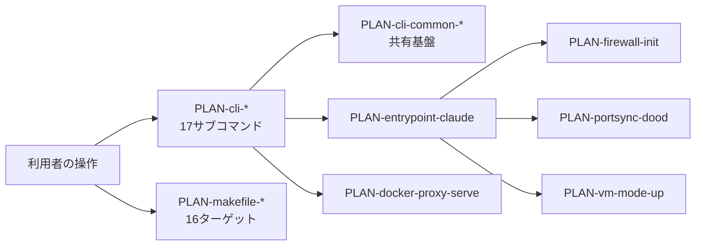

# 想定機能連携一覧

## 一覧

<!-- 網羅の範囲(この設計での取り決め):
     ・要件に係る**入口となる機能**(kind: tool)を全件書く。
     ・**モジュール境界をまたぐ呼び出し**の相手方(MOD-cli-common の共有基盤)を全件書く。
     ・同一モジュール内部で完結する private helper は書かない。呼び出す先の欄に
       「同一モジュール内部で完結」と書いてあるものは、03 側では内部の機能を呼んでいる。
     ・**入口機能の呼び出し元は「なし」と書く**。利用者の操作が契機であることは kind: tool と
       下の「連携の詳細」の契機で表す(03 側の実装仕様と語彙を揃えるため。USER-* は使わない)。 -->

| PLAN-ID | モジュール | kind | sync | 呼び出し元 | 呼び出す先 | 契約 | 対応要件 | 概要 |
|---|---|---|---|---|---|---|---|---|
| PLAN-cli-attach | MOD-cli-attach | tool | sync | なし | PLAN-cli-common-container-name, PLAN-cli-common-is-running, PLAN-cli-common-require-setup, PLAN-cli-common-resolve-container-user | なし | FR-env-01 | 実行中コンテナの tmux セッションに接続する |
| PLAN-cli-code | MOD-cli-code | tool | sync | なし | PLAN-cli-common-container-name, PLAN-cli-common-is-running, PLAN-cli-common-require-setup, PLAN-cli-common-resolve-container-user | なし | FR-env-01, FR-env-08, FR-env-12 | 新しい tmux ウィンドウで Claude Code を起動する |
| PLAN-cli-common-compose-project-name | MOD-cli-common | function-call | sync | PLAN-cli-start, PLAN-cli-stop | なし | CTR-cli-container | FR-env-01, FR-env-07 | compose プロジェクト名の一意化名と旧い名前を、両 OS で同じ値になる1機能で導出する |
| PLAN-cli-common-container-exists | MOD-cli-common | function-call | sync | PLAN-cli-forward, PLAN-cli-logout, PLAN-cli-reset, PLAN-cli-start, PLAN-cli-stop, PLAN-cli-unforward | なし | なし | FR-env-01 | 指定名のコンテナが存在するか(停止中を含む)を判定する |
| PLAN-cli-common-container-name | MOD-cli-common | function-call | sync | PLAN-cli-attach, PLAN-cli-code, PLAN-cli-firewall, PLAN-cli-forward, PLAN-cli-ports, PLAN-cli-ssh-keys, PLAN-cli-ssh-keys-reset, PLAN-cli-start, PLAN-cli-stop, PLAN-cli-unforward | なし | なし | FR-env-01 | プロジェクト名からコンテナ名を導出する(命名規則の実体) |
| PLAN-cli-common-container-project-dir | MOD-cli-common | function-call | sync | PLAN-cli-start, PLAN-cli-stop | なし | CTR-cli-container | FR-env-01 | コンテナの管理ラベル claude-dev.project-dir(起動時の絶対パス)を読む |
| PLAN-cli-common-destructive | MOD-cli-common | function-call | sync | PLAN-cli-logout, PLAN-cli-reset | なし | CTR-cli-container | FR-env-01, FR-env-03 | 削除の計画・実行・結果の記録と、中断要求の遅延を扱う共通手順 |
| PLAN-cli-common-dev-agent-path | MOD-cli-common | function-call | sync | PLAN-cli-ssh-keys-reset, PLAN-cli-start, PLAN-cli-stop | なし | なし | FR-env-04, FR-env-10 | macOS の専用 ssh-agent とブリッジのファイル配置を決める |
| PLAN-cli-common-ensure-infrastructure | MOD-cli-common | function-call | sync | PLAN-cli-login, PLAN-cli-login-codex, PLAN-cli-start | なし | CTR-cli-container | FR-env-01, FR-env-03 | docker network と共有 3 ボリュームを冪等に作成する |
| PLAN-cli-common-get-novnc-url | MOD-cli-common | function-call | sync | PLAN-cli-list, PLAN-cli-ports, PLAN-cli-start | なし | なし | FR-env-11 | 公開中の noVNC ポートから接続 URL を組み立てる |
| PLAN-cli-common-image-exists | MOD-cli-common | function-call | sync | PLAN-cli-common-require-setup, PLAN-cli-reset, PLAN-cli-start | なし | なし | FR-env-01, FR-env-09 | 指定イメージがローカルに存在するかを判定する |
| PLAN-cli-common-is-running | MOD-cli-common | function-call | sync | PLAN-cli-attach, PLAN-cli-code, PLAN-cli-firewall, PLAN-cli-forward, PLAN-cli-list, PLAN-cli-ports, PLAN-cli-start, PLAN-cli-stop | なし | なし | FR-env-01 | 指定コンテナが running 状態かを判定する |
| PLAN-cli-common-lock | MOD-cli-common | function-call | sync | PLAN-cli-login, PLAN-cli-login-codex, PLAN-cli-logout, PLAN-cli-reset, PLAN-cli-start, PLAN-cli-stop | なし | CTR-cli-container | FR-env-01, FR-env-03 | 共有資源を触る6コマンドを直列化するロックを取得・解放し、残骸を引き継ぐ |
| PLAN-cli-common-net-other-running-containers | MOD-cli-common | function-call | sync | PLAN-cli-logout, PLAN-cli-reset, PLAN-cli-stop | なし | CTR-cli-container | FR-env-01, FR-env-03 | 遊休判定に使う「claude-dev-net に接続している稼働中の他コンテナ」を列挙する |
| PLAN-cli-common-require-setup | MOD-cli-common | function-call | sync | PLAN-cli-attach, PLAN-cli-code, PLAN-cli-login, PLAN-cli-login-codex, PLAN-cli-logout, PLAN-cli-start | PLAN-cli-common-image-exists | なし | FR-env-01, FR-env-09 | セットアップ未実施なら必要なイメージを自動ビルドする事前条件ゲート |
| PLAN-cli-common-resolve-container-user | MOD-cli-common | function-call | sync | PLAN-cli-attach, PLAN-cli-code, PLAN-cli-start | なし | なし | FR-env-01, FR-env-02, FR-env-09 | docker exec に渡す実行ユーザを稼働中コンテナ自身の env から決定する |
| PLAN-cli-common-select-ssh-keys | MOD-cli-common | function-call | sync | PLAN-cli-ssh-keys-select, PLAN-cli-start | PLAN-cli-common-write-project-ssh-keys | なし | FR-env-04 | 利用可能な SSH 鍵を列挙し対話選択させて保存する |
| PLAN-cli-common-spawned-resources | MOD-cli-common | function-call | sync | PLAN-cli-logout, PLAN-cli-reset, PLAN-cli-stop | なし | CTR-cli-container | FR-env-01, FR-env-03 | セッション由来の資源を種別とラベルフィルタ式から名前で列挙する |
| PLAN-cli-common-write-project-ssh-keys | MOD-cli-common | function-call | sync | PLAN-cli-common-select-ssh-keys, PLAN-cli-start | なし | なし | FR-env-04 | 選択した鍵を .claude-dev.yaml へ書き出す |
| PLAN-cli-firewall | MOD-cli-firewall | tool | sync | なし | PLAN-cli-common-container-name, PLAN-cli-common-is-running | なし | FR-env-05 | コンテナ内のファイアウォールルールを表示する |
| PLAN-cli-forward | MOD-cli-forward | tool | sync | なし | PLAN-cli-common-container-exists, PLAN-cli-common-container-name, PLAN-cli-common-is-running | なし | FR-env-06 | 指定コンテナポートのホスト側フォワードを動的に追加する |
| PLAN-cli-list | MOD-cli-list | tool | sync | なし | PLAN-cli-common-get-novnc-url, PLAN-cli-common-is-running | なし | FR-env-01, FR-env-11 | 実行中セッションの一覧と noVNC URL を表示する |
| PLAN-cli-login | MOD-cli-login | tool | sync | なし | PLAN-cli-common-ensure-infrastructure, PLAN-cli-common-lock, PLAN-cli-common-require-setup | CTR-cli-container | FR-env-03 | Claude の OAuth ログインをコンテナ内で実行し共有ボリュームへ保存する |
| PLAN-cli-login-codex | MOD-cli-login-codex | tool | sync | なし | PLAN-cli-common-ensure-infrastructure, PLAN-cli-common-lock, PLAN-cli-common-require-setup | CTR-cli-container | FR-env-03, FR-env-12 | Codex のデバイス認証を実行し認証情報を共有ボリュームの codex/ へ置く |
| PLAN-cli-logout | MOD-cli-logout | tool | sync | なし | PLAN-cli-common-container-exists, PLAN-cli-common-destructive, PLAN-cli-common-lock, PLAN-cli-common-net-other-running-containers, PLAN-cli-common-require-setup, PLAN-cli-common-spawned-resources | CTR-cli-container | FR-env-03 | Claude と Codex の認証情報を共有ボリュームごと削除する |
| PLAN-cli-ports | MOD-cli-ports | tool | sync | なし | PLAN-cli-common-container-name, PLAN-cli-common-get-novnc-url, PLAN-cli-common-is-running | なし | FR-env-06, FR-env-11 | コンテナのポートフォワード一覧と noVNC URL を表示する |
| PLAN-cli-pull | MOD-cli-pull | tool | sync | なし | なし | なし | FR-env-09 | GHCR からビルド済みイメージを取得して latest へ retag する |
| PLAN-cli-reset | MOD-cli-reset | tool | sync | なし | PLAN-cli-common-container-exists, PLAN-cli-common-destructive, PLAN-cli-common-image-exists, PLAN-cli-common-lock, PLAN-cli-common-net-other-running-containers, PLAN-cli-common-spawned-resources | CTR-cli-container | FR-env-01, FR-env-03 | 管理ラベルを持つ Claude コンテナ・**所有者を問わないセッション由来の資源**・固定名の共有資源(ボリューム・イメージ・docker-proxy・ネットワーク)を削除して初期状態へ戻す(共有 docker-proxy とネットワークは遊休のときだけ) |
| PLAN-cli-setup | MOD-cli-setup | tool | sync | なし | なし | なし | FR-env-01, FR-env-09 | イメージをビルドし docker network と共有ボリュームを作る初回セットアップ |
| PLAN-cli-ssh-keys | MOD-cli-ssh-keys | tool | sync | なし | PLAN-cli-common-container-name | なし | FR-env-04 | ssh-keys の引数を reset / select へ振り分けるディスパッチャ |
| PLAN-cli-ssh-keys-reset | MOD-cli-ssh-keys | tool | sync | なし | PLAN-cli-common-container-name, PLAN-cli-common-dev-agent-path | なし | FR-env-04 | このプロジェクトの SSH 鍵選択を初期化する |
| PLAN-cli-ssh-keys-select | MOD-cli-ssh-keys | tool | sync | なし | PLAN-cli-common-select-ssh-keys | なし | FR-env-04 | 使う SSH 鍵を対話選択して .claude-dev.yaml に保存する |
| PLAN-cli-start | MOD-cli-start | tool | sync | なし | PLAN-entrypoint-claude, PLAN-cli-common-compose-project-name, PLAN-cli-common-container-exists, PLAN-cli-common-container-name, PLAN-cli-common-container-project-dir, PLAN-cli-common-dev-agent-path, PLAN-cli-common-ensure-infrastructure, PLAN-cli-common-get-novnc-url, PLAN-cli-common-image-exists, PLAN-cli-common-is-running, PLAN-cli-common-lock, PLAN-cli-common-require-setup, PLAN-cli-common-resolve-container-user, PLAN-cli-common-select-ssh-keys, PLAN-cli-common-write-project-ssh-keys | CTR-cli-container | FR-env-01, FR-env-02, FR-env-03, FR-env-04, FR-env-05, FR-env-06, FR-env-07, FR-env-08, FR-env-11, FR-env-12 | カレントディレクトリで開発コンテナを起動する(VNC+Chrome が既定) |
| PLAN-cli-stop | MOD-cli-stop | tool | sync | なし | PLAN-cli-common-compose-project-name, PLAN-cli-common-container-exists, PLAN-cli-common-container-name, PLAN-cli-common-container-project-dir, PLAN-cli-common-dev-agent-path, PLAN-cli-common-is-running, PLAN-cli-common-lock, PLAN-cli-common-net-other-running-containers, PLAN-cli-common-spawned-resources | CTR-cli-container | FR-env-01, FR-env-07 | セッションと、**そのセッションが作った資源(コンテナ・ネットワーク)**を停止・削除し、遊休なら docker-proxy と ssh ブリッジも止める |
| PLAN-cli-unforward | MOD-cli-unforward | tool | sync | なし | PLAN-cli-common-container-exists, PLAN-cli-common-container-name | なし | FR-env-06 | 指定ポートのフォワードを解除する |
| PLAN-cli-upgrade | MOD-cli-upgrade | tool | sync | なし | なし | なし | FR-env-01, FR-env-09 | 全イメージを --no-cache で再ビルドして更新する |
| PLAN-container-tools-wait-limit-reset | MOD-container-tools | tool | sync | なし | なし | なし | FR-env-01 | Claude のレート制限解除時刻まで待機し tmux 経由で作業を再開させる |
| PLAN-docker-proxy-serve | MOD-docker-proxy | tool | sync | なし | なし | CTR-docker-api | FR-env-07, NFR-sec-01 | Docker API を検査・書き換えして透過中継し、**作られたコンテナとネットワークに所有者ラベルを付ける**常駐プロキシ |
| PLAN-entrypoint-claude | MOD-entrypoint | tool | sync | PLAN-cli-start | PLAN-firewall-init, PLAN-portsync-dood, PLAN-vm-mode-up | CTR-cli-container, CTR-entrypoint-firewall | FR-env-02, FR-env-03, FR-env-05, FR-env-06, FR-env-07, FR-env-08, FR-env-11, FR-env-12 | コンテナ起動時に UID/GID・認証共有・VNC・firewall・portsync を整える |
| PLAN-firewall-init | MOD-firewall | tool | sync | PLAN-entrypoint-claude | なし | CTR-entrypoint-firewall | FR-env-05, NFR-sec-01 | iptables/ipset でブラックリスト型のファイアウォールを構成する |
| PLAN-makefile-build | MOD-makefile | tool | sync | PLAN-makefile-setup | PLAN-makefile-build-claude, PLAN-makefile-build-claude-vnc, PLAN-makefile-build-docker-proxy | なし | FR-env-01, FR-env-09, FR-env-12 | claude / claude-vnc / docker-proxy の全イメージをビルドする |
| PLAN-makefile-build-claude | MOD-makefile | tool | sync | PLAN-makefile-build, PLAN-makefile-build-claude-vnc | なし | なし | FR-env-01, FR-env-09, FR-env-12 | Claude ベースイメージをビルドする |
| PLAN-makefile-build-claude-vnc | MOD-makefile | tool | sync | PLAN-makefile-build | PLAN-makefile-build-claude | なし | FR-env-01, FR-env-09, FR-env-11 | ベースイメージの上に VNC/Chrome 層を重ねてビルドする |
| PLAN-makefile-build-docker-proxy | MOD-makefile | tool | sync | PLAN-makefile-build | なし | なし | FR-env-07, FR-env-09 | Docker Socket Proxy のイメージをビルドする |
| PLAN-makefile-clean | MOD-makefile | tool | sync | なし | なし | なし | FR-env-01, FR-env-03 | コンテナ・ボリューム・イメージを削除して初期化する |
| PLAN-makefile-env | MOD-makefile | tool | sync | PLAN-makefile-setup | なし | なし | FR-env-01 | .env を雛形から作成する |
| PLAN-makefile-help | MOD-makefile | tool | sync | なし | なし | なし | FR-env-01 | 利用可能なターゲットの一覧を表示する |
| PLAN-makefile-install | MOD-makefile | tool | sync | PLAN-makefile-setup | なし | なし | FR-env-01, FR-env-10 | claude-dev CLI のシンボリックリンクを PATH へ登録する |
| PLAN-makefile-login | MOD-makefile | tool | sync | なし | なし | なし | FR-env-03 | Claude の OAuth ログインを実行する |
| PLAN-makefile-network | MOD-makefile | tool | sync | PLAN-makefile-setup | なし | なし | FR-env-01 | 専用 docker network を作成する |
| PLAN-makefile-setup | MOD-makefile | tool | sync | なし | PLAN-makefile-build, PLAN-makefile-env, PLAN-makefile-install, PLAN-makefile-network, PLAN-makefile-volumes | なし | FR-env-01, FR-env-09 | env→network→volumes→build→install を順に実行する初回セットアップ |
| PLAN-makefile-status | MOD-makefile | tool | sync | なし | なし | なし | FR-env-01 | イメージ・コンテナ・ボリュームの状態を表示する |
| PLAN-makefile-uninstall | MOD-makefile | tool | sync | なし | なし | なし | FR-env-01, FR-env-10 | CLI のシンボリックリンクを削除する |
| PLAN-makefile-update-claude | MOD-makefile | tool | sync | なし | なし | なし | FR-env-09, FR-env-12 | コンテナイメージを作り直さずに Claude Code だけを更新する(ビルドキャッシュを使う) |
| PLAN-makefile-upgrade | MOD-makefile | tool | sync | なし | なし | なし | FR-env-01, FR-env-09 | 全イメージを --no-cache で完全再ビルドする |
| PLAN-makefile-volumes | MOD-makefile | tool | sync | PLAN-makefile-setup | なし | なし | FR-env-01, FR-env-03 | 認証情報などの共有ボリュームを作成する |
| PLAN-portsync-dood | MOD-portsync | tool | sync | PLAN-entrypoint-claude | なし | なし | FR-env-06, FR-env-07 | DooD 環境で公開ポートを検出し socat で 127.0.0.1 へ転送する |
| PLAN-vm-mode-cli | MOD-vm-mode | tool | sync | なし | なし | なし | FR-env-08 | VM の起動状態・health・ポート同期を操作するヘルパー |
| PLAN-vm-mode-healthd | MOD-vm-mode | tool | sync | なし | なし | なし | FR-env-08 | QEMU の CPU 使用率から資源逼迫を検知し tmux と health へ書く |
| PLAN-vm-mode-portsync | MOD-vm-mode | tool | sync | なし | なし | なし | FR-env-06, FR-env-08 | ゲストの公開ポートを QMP hostfwd_add で 127.0.0.1 へ転送する |
| PLAN-vm-mode-up | MOD-vm-mode | tool | sync | PLAN-entrypoint-claude | なし | なし | FR-env-08 | QEMU/KVM で VM を起動し provision して常駐ヘルパーを立ち上げる |

## 連携図

## 連携の詳細(設計上の期待)

### PLAN-cli-start

- 目的: 「任意のプロジェクトで1コマンド打つだけで隔離環境が立ち上がる」という中核体験を実現する。
- 契機と前提条件: 利用者が `claude-dev start` を実行したとき。カレントディレクトリが対象プロジェクトで
  あり、前提コマンド(`docker` / `jq`、macOS では `socat`)が導入済みであること。
- 呼び出す先ごとの期待: 共有基盤(`PLAN-cli-common-*`)へは、名前の導出・稼働判定・イメージの保証・
  インフラの用意・鍵の選択を委ねる。共有基盤の失敗は起動の失敗として扱ってよいが、**鍵の選択と
  接続 URL の取得の失敗は起動を止めない**(SSH 転送なし・URL 非表示で続行する)。
- 順序性・冪等性・並行性: 同一ディレクトリでの再実行は再接続として冪等に振る舞う。異なる
  ディレクトリでの並行実行が衝突しないこと(コンテナ名・ポート・Chrome プロファイルの分離)。
- 対応する設計判断: DSN-arch-01, DSN-mod-01, DSN-auth-01

### PLAN-cli-stop

- 目的: 1つのプロジェクトのセッションと、**そのセッションが作った副産物**を、他プロジェクトの
  作業を壊さずに片付ける(`FR-env-01` / `FR-env-07`)。**「セッションが作ったものは全部」**を
  片付けの範囲とし、例外は名前付きボリューム(利用者のデータ)とイメージだけである
  (`D0-env-05` 項2)。
- 契機と前提条件: 利用者が `claude-dev stop [NAME]` を実行したとき。前提条件は無い
  (対象が起動していなくてもエラーにしない)。
- 呼び出す先ごとの期待: 共有基盤(`PLAN-cli-common-*`)へは、名前の導出・存在判定・稼働判定・
  **排他ロックの取得と解放**を委ねる。**プロジェクト単位のロックが取れなければ何も削除しない**
  (`FR-env-01` 受入基準16)。**共有資源単位のロックが取れなければ docker-proxy には触れずに
  続行する**(他の片付けは済んでいるので全体は失敗させない)。
- **削除対象の集合とその識別**: 4種類あり、識別手段はそれぞれ違う(正は
  `CTR-cli-container`「識別の手段は資源ごとに違う」)。
  1. 本体コンテナ — **名前で1件**(規則 B)。
  2. `fwd-<NAME>-*` 中継コンテナ — **固定接頭辞**(規則 A)。
  3. **セッション由来の資源(コンテナとネットワーク)** — **所有者ラベル**(規則 D。`DSN-env-04`)。
  4. compose 資源 — **一意化した compose プロジェクト名**(`DSN-env-03`)。**3 と重なるが、
     所有者ラベルが付く前に作られた compose 資源は 4 でしか引けない**ので両方を使う。
- 順序性・冪等性・並行性:
  - **管理ラベルの読み取りは本体コンテナの削除より前**でなければならない(削除するとラベルが
    消え、compose 一意化名も所有者ラベルの値も再現できなくなる)。**この順序は固定である。**
  - **セッション由来の資源の削除は遊休判定より前**でなければならない。順序が逆だと、自分の
    セッションが作ったコンテナが `claude-dev-net` に繋がっている場合に「稼働中のコンテナがある」と
    数え、**自分が作ったものを理由に docker-proxy を残し続ける**。
  - 冪等: 2回目の `stop` も失敗にしない(`FR-env-01` 受入基準8)。
  - 並行: 同じ対象への `stop` / `start` はプロジェクト単位のロックで直列化する。
    別プロジェクトの `stop` とは、遊休判定〜docker-proxy 削除の区間だけが共有資源単位のロックで
    直列化する。
- **失敗の扱い**: 本体コンテナと docker-proxy の削除だけは失敗を握らない(前者は以降の前提、
  後者は最後の手順)。**それ以外(中継コンテナ・セッション由来の資源・compose 資源・
  compose 既定ネットワーク)は握って続行する**(`FR-env-01` 受入基準11・24。片付けの途中で
  止まるとより中途半端な状態が残る。`stop` は `D0-env-08` 項5 の対象外である)。
- 対応する設計判断: DSN-mod-01, DSN-env-01, **DSN-env-04**, DSN-env-02, DSN-env-03

### PLAN-cli-reset

- 目的: ホストを初期状態へ戻す(`FR-env-01` / `FR-env-03`)。**`stop` との違いは削除範囲の
  決め方**で、`stop` が「自分のセッションが作ったもの」を所有者で絞るのに対し、`reset` は
  **所有者を問わずすべてのセッション由来の資源**を対象にする(`FR-env-01` 受入基準25。
  `reset` は対象を絞る引数を持たない「ホスト全体」の操作であり、所有者で絞ると `stop` と
  同じ意味になる)。
- 契機と前提条件: 利用者が `claude-dev reset` を実行したとき。**削除の前に対象を列挙して
  同意を求める**(`FR-env-03` 受入基準14)。
- 呼び出す先ごとの期待: 共有基盤(`PLAN-cli-common-*`)へは存在判定・イメージ存在判定・
  **共有資源単位の排他ロック**を委ねる。
- **削除対象の集合とその識別**: Claude コンテナは管理ラベル(規則 A)、セッション由来の資源は
  `claude-dev.role=spawned`(規則 D)、固定名の共有資源(ボリューム・イメージ・docker-proxy・
  `claude-dev-net`)は名前で識別する。
- 順序性・冪等性・並行性:
  - **セッション由来の資源の削除は遊休判定より前**でなければならない。`PLAN-cli-stop` と
    同じ理由である(自分がこれから消すコンテナが `claude-dev-net` に繋がっていると「稼働中の
    コンテナがある」と数え、共有資源を残して「完全な初期化になっていない」と事実に反する
    表示を出す)。**この順序は固定である。**
  - **セッション由来の資源はコンテナ → ネットワークの順に削除する。** 逆順だと、接続中の
    コンテナが残っているため `docker network rm` が必ず失敗し、`reset` が毎回「削除できなかった
    資源」を列挙して終了コード 1 で終わる。
  - **削除対象は確認のために列挙した集合に固定し、削除の時点で引き直さない**
    (`FR-env-03` 受入基準14。引き直すと利用者の確認を経ていない資源を消すことになる)。
  - 冪等: 2回目の `reset` も失敗にしない(終了コードは 0 のまま)。**ただし共有資源の遊休判定は、判定に失敗したときは安全側(遊休でない)へ倒れる**ので、2回目には残した資源が無くても**共有資源を残す経路に入りうる**。**そのときに何を出すかは `logging.md`「共有資源(docker-proxy / `claude-dev-net`)を残した理由」が、実際に観測される事象は 03 の「既知の制限」が持つ。**
  - 並行: 共有資源単位のロックで `stop` / `logout` / `start` などと直列化する。
- **失敗の扱い**: **`stop` と逆に、削除の失敗を握らない**(`D0-env-08` 項5 は `logout` /
  `reset` を対象とし、`stop` だけを例外としている)。消えなかった資源を1件ずつ列挙して
  終了コード 1 で終わる(`FR-env-03` 受入基準18)。**列挙の問い合わせそのものが失敗した場合も
  「消えなかった資源」として扱う**(0件と区別する)。
- 対応する設計判断: DSN-mod-01, DSN-env-01, **DSN-env-04**

### PLAN-entrypoint-claude

- 目的: コンテナ起動時に、利用者が何もしなくても開発を始められる状態を作る。
- 契機と前提条件: コンテナのプロセス起動時。`CTR-cli-container` の環境変数とマウントが渡っていること。
- 呼び出す先ごとの期待: ファイアウォールへは適用を1度だけ依頼し、**失敗しても起動を止めない**
  (`CTR-entrypoint-firewall`)。ポート同期は常駐として起動する。VM モードが要求されている場合のみ
  ゲストを起動し、失敗したら既定の DooD 経路を維持する。
- 順序性・冪等性・並行性: **設計として固定する順序は1つだけである** —
  **ファイアウォールの適用は、ネットワークを使う後続処理より前**に行う
  (`CTR-entrypoint-firewall`「順序性・冪等性・並行性」が持つ)。
  **これ以外の初期化の並びは実装の選択であり、実際の順序は 03 の実装仕様が持つ。**
  再起動しても同じ結果になること(既定設定の補完は冪等)。
- 対応する設計判断: DSN-arch-02, DSN-auth-01, DSN-dist-02

### PLAN-docker-proxy-serve

- 目的: コンテナ内から Docker を使えるようにしつつ、ホストを危険に晒す操作を通さない。
  **あわせて、そこから作られた資源に所有者の印を付け、`stop` / `reset` が後で片付けられる状態を
  作る**(`DSN-env-04`)。
- 契機と前提条件: コンテナ内の Docker クライアントからの HTTP リクエスト。`claude-dev-net` 内に
  常駐していること。
- 呼び出す先ごとの期待: ホストの Docker Engine へは検査済みのリクエストだけを中継する。中継に
  失敗したら 502 を返す。**コンテナ作成要求とネットワーク作成要求については、拒否判定をすべて
  通過したあとに所有者ラベルを付与してから中継する。付与できない場合(呼び出し元を特定できない /
  ボディが解釈できない)は付与せずに中継し、作成を拒否しない**(`FR-env-07` 受入基準11・12)。
  **印を読んで削除するのはこの機能ではない**(`PLAN-cli-stop` / `PLAN-cli-reset` が読む)。
- 順序性・冪等性・並行性: 複数コンテナからの同時アクセスを前提とする。判定は呼び出し元コンテナごとに
  独立していること(呼び出し元を特定できない場合は安全側に倒す)。**所有者ラベルの付与は
  冪等である**(同じ要求を2回送れば同じラベルの付いた資源が2つできるだけで、付与そのものが
  状態を持たない)。
- 対応する設計判断: DSN-arch-01, **DSN-env-04**

### PLAN-cli-common-*(共有基盤)

- 目的: 17 のサブコマンドが同じ規則で名前・状態・インフラ・**排他**・**削除結果の記録**を扱えるようにする。
- 契機と前提条件: 各サブコマンドからの呼び出し。
- 呼び出す先ごとの期待: 共有基盤どうしの呼び出しは**一方向で循環しないものに限る**
  (現に存在するのは `PLAN-cli-common-require-setup` → `PLAN-cli-common-image-exists` と
  `PLAN-cli-common-select-ssh-keys` → `PLAN-cli-common-write-project-ssh-keys` の**2本だけ**で、
  いずれも一方向である。**循環が無いことは `environments.md`「ドキュメント整合検査コマンド」の
  構造の健全性の検査が担保する**)。
  **この2本を「例外」とみなすか、宣言のほうを直すべきかは `docs/issues/048` で追跡する。**
  共有基盤は4種類に分かれる。**判定系**(名前・状態・存在・URL・compose 一意化名・
  管理ラベルの値・遊休判定の集合・セッション由来の資源の一覧の導出)は状態を変えない。
  **用意系**(インフラ・鍵の保存)は冪等な副作用を持つ。**排他系**(`PLAN-cli-common-lock`)は
  **意図的に冪等でない**副作用を持つ — 同じキーを2つの操作が同時に取れないことがその機能である。
  **記録系**(`PLAN-cli-common-destructive`)は**呼び出しをまたいで状態を持つ** —
  削除の予定・成功・失敗と中断要求を溜め、最後にまとめて列挙する。
  溜めずに1件ずつ判定すると「消えなかった資源を全件列挙して非0で終わる」
  (`FR-env-03` 受入基準18)も「進行中の1件を終えてから中断する」(同23)も成立しない。
  **記録系だけが呼び出し順に意味を持つ**(`plan` で対象を出そろえてから `arm_interrupt` →
  `rm` → `abort_if_interrupted` → `report`)ので、順序は `PLAN-cli-logout` / `PLAN-cli-reset` の
  実装仕様が持つ。
- 順序性・冪等性・並行性: 用意系はすべて冪等であること(複数プロジェクトの同時起動で競合しない)。
  **排他系だけは例外で、競合を検出して非0で返すことが仕様である**(`FR-env-01` 受入基準16。
  待たない)。ロックの副作用はホストのファイルシステム上に閉じ、Docker 資源には及ばない。
  **キーの体系(プロジェクト単位 / 共有資源単位)と取得順の固定は契約 `CTR-cli-container` の
  「排他(ロックキー)」が正**であり、この節では持たない。
- 対応する設計判断: DSN-mod-03 / **DSN-env-02**(排他の2段構成)/ **DSN-mod-07**(機能数が目安を超えることの許容)/ **DSN-env-03**(compose 一意化名)/ **DSN-env-04**(所有者ラベル)

## 未実装として認識しているもの

| PLAN-ID | 状態 | 理由・予定 |
|---|---|---|

**なし**(全 PLAN に対応する `MODULE-*` が存在する)。
