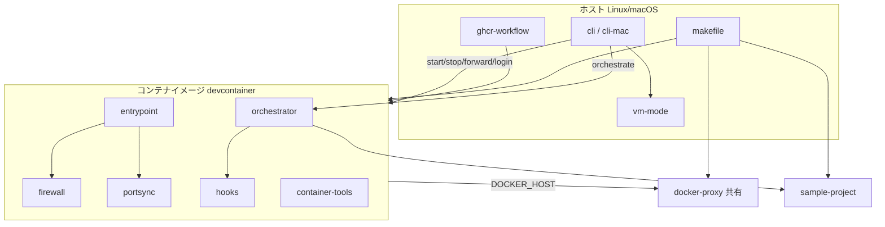
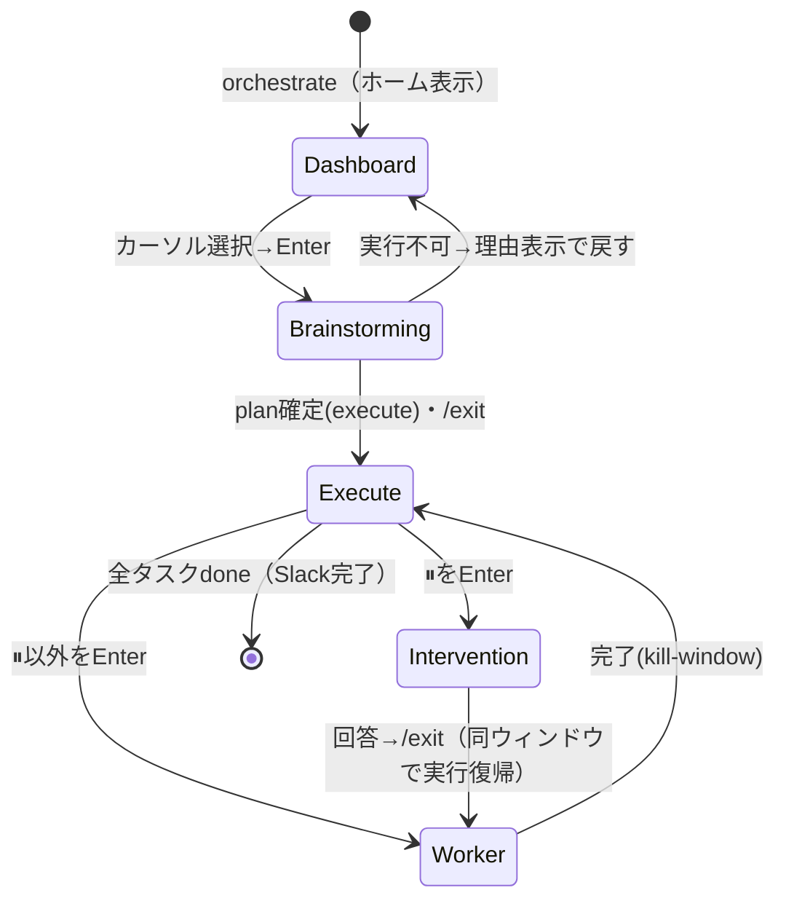
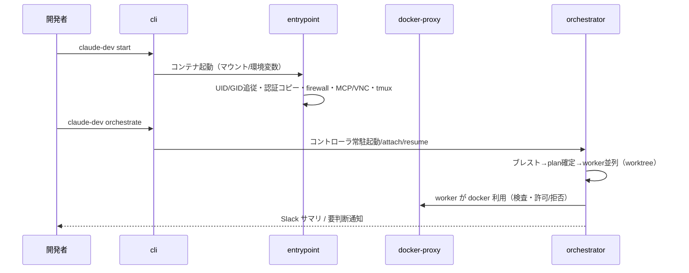

# 全体設計書:claude-dev-env

## 概要

Claude Code を隔離 Docker コンテナで動かす開発環境基盤（[core](../01-requirements/core.md)）と、その上で
複数エージェントを連携させる AIオーケストレーター（[orchestration](../01-requirements/orchestration.md)）を
実現する構造を定める。OS 依存はホスト CLI に閉じ、コンテナ内資産（イメージ・entrypoint・firewall・
docker-proxy）は OS 非依存に保つ。

## アーキテクチャ



- 開発者はホスト CLI（`cli`／macOS は `cli-mac`）で Claude コンテナのライフサイクルを操作する。
- コンテナ起動時は `entrypoint` が UID/GID 追従・認証コピー・`firewall` 起動・MCP/VNC 設定・tmux 開始を行う。
- コンテナ内 Docker は `docker-proxy`（共有）を介して制限付きで使う。重い案件は `vm-mode`。
- `orchestrator`（Go, コンテナ内常駐）が 2 モードで worker を並列制御する。`sample-project` で自己検証する。
- イメージは `makefile` でビルド、`ghcr-workflow` で GHCR 配布する。

## モジュール分割定義 ※この体系の要

| モジュール(slug) | 責務 | 対応する要件(領域/要件番号) | 依存モジュール | 詳細設計 | 03-impl |
|---|---|---|---|---|---|
| cli | ホスト CLI（Linux `claude-dev`）。start/stop/list/attach/forward/unforward/ports/login/logout/ssh-keys/orchestrate/code/upgrade 等 | core/1,3,4,6,11 orchestration/13(起動) | container-tools, hooks, portsync, devcontainer | なし | 03-impl/cli.md |
| cli-mac | macOS 版 `claude-dev-mac` の差分（SSH agent TCP ブリッジ・ポート直結・VM/KVM 非対応・arm64） | core/10 | cli | なし | 03-impl/cli-mac.md |
| makefile | ビルド・セットアップ・install/uninstall・login・upgrade・orch-sample 等の入口 | core/9(build),全般 | devcontainer, docker-proxy, orchestrator, sample-project | なし | 03-impl/makefile.md |
| entrypoint | `entrypoint-claude.sh`：UID/GID 追従・認証コピー・firewall 起動・MCP/VNC/Chrome・tmux・認証同期・portsync 起動 | core/2,3,5,11 | firewall, portsync | なし | 03-impl/entrypoint.md |
| firewall | `init-firewall-claude.sh`：iptables ファイアウォール | core/5 | — | なし | 03-impl/firewall.md |
| devcontainer | `Dockerfile.claude`(base/vnc 2ステージ)・`Dockerfile.docker-proxy`・`.devcontainer/tmux.conf` 等イメージ定義。各モジュールの資産をイメージへ同梱する | core/1,11,9 | — | なし | 03-impl/devcontainer.md |
| docker-proxy | Go 製 Docker API 検査プロキシ（危険操作拒否・/workspace bind 書換） | core/7 | — | なし | 03-impl/docker-proxy.md |
| orchestrator | Go 製コントローラ：2モード・外部制御ループ・worker並列・タスク単位介入・相互レビュー・TUI・Slack・状態保全 | orchestration/12〜19 | hooks(Slack通知) | なし | 03-impl/orchestrator.md |
| sample-project | `examples/orch-sample/`（Python+pytest 題材）・`workspace/orch-sample`・`scripts/orch-sample.sh`（scaffold）：自己検証 | orchestration/20 | orchestrator | なし | 03-impl/sample-project.md |
| vm-mode | `scripts/vm`・`vm-up.sh`・`vm-portsync.sh`・`vm-healthd.sh`・`VM_DEV.md.tmpl`：ゲスト VM とネイティブ Docker | core/8 | cli | なし | 03-impl/vm-mode.md |
| ghcr-workflow | `.github/workflows/ghcr-images.yml`：GHCR マルチアーキ日次配布 | core/9 | devcontainer | なし | 03-impl/ghcr-workflow.md |
| hooks | Claude Code フック（イメージ同梱・`cli` が settings に配線）：`save_prompt.sh`（プロンプト保存）・`sendslackmsg.sh`（Slack通知） | orchestration/18 core周辺 | — | なし | 03-impl/hooks.md |
| container-tools | コンテナ内でユーザが使う資産：`wait-limit-reset.sh`（レート制限リセット待ち）・`scripts/tmux.conf`（実行時に `~/.tmux.conf` へマウントする tmux 設定） | core/1(tmux),運用補助 | — | なし | 03-impl/container-tools.md |
| portsync | `dood-portsync.sh`：DooD 実行時ポート同期ヘルパ（Dockerfile 同梱・entrypoint が起動、`127.0.0.1:PORT`→ホスト転送） | core/6 | — | なし | 03-impl/portsync.md |

### 分割の根拠

- **物理配置と1対1**: 各モジュールはリポジトリの実体（1スクリプト／1 Go モジュール／1 Dockerfile 群／
  1 ワークフロー）に対応する（[structure steering](../_steering/structure.md)）。変更が起きる単位＝ファイル単位で切った。
- **OS 依存の局所化**: `cli` と `cli-mac` を分け、OS 差分を macOS 側に閉じる（D-10）。共通ロジックは `cli`。
- **補助スクリプトは「役割」で分ける**: 旧一括の scripts 群を、担う役割ごとに独立モジュール化した——
  `hooks`（Claude Code フック）／`container-tools`（コンテナ内でユーザが使う資産）／`portsync`（実行時
  ネットワークヘルパ）。`entrypoint`・`firewall`・VM 系スクリプトは元々独立し、`orch-sample.sh` は題材の
  scaffold として `sample-project` に属する。役割が違うものを1モジュールに混ぜない方針。
- **orchestrator は最大モジュール**: Go の単一プログラムだが責務が多い。詳細は 03-impl/orchestrator.md が担い、
  肥大化時は本表に `02-design/orchestrator.md`（詳細設計）を足す判断を /change で行う。
- **共有 vs プロジェクト単位**: `docker-proxy` は全 Claude コンテナで共有、他はプロジェクト/イメージ単位。

## モジュール間インターフェース(契約)

### cli → コンテナ/entrypoint（環境変数・マウント）

```
起動時に渡す主な契約:
  DOCKER_HOST = tcp://claude-dev-docker-proxy:2375     # docker-proxy 経由（既定 DooD）
  CLAUDE_DEV_DOOD_PORTSYNC = 0|1(既定1)                # dood-portsync 有効/無効
  CLAUDE_DEV_VM = 0|1                                  # VM モード連携フラグ
  CLAUDE_DEV_ALLOW_WORKSPACE_BINDS = 0|1(既定1)        # docker-proxy の /workspace bind 許可
  mount: <cwd> -> /workspace (RW), claude-dev-auth -> ~/.claude-shared (RW),
         claude-dev-config -> ~/.config-shared (RW), $SSH_AUTH_SOCK -> /tmp/ssh-agent.sock (RO)
```

### コンテナ → docker-proxy（HTTP Docker API）

```
GET/POST http://claude-dev-docker-proxy:2375/<docker-api>
  検査: POST /containers/create のボディ Binds/Privileged/NetworkMode/PidMode を検査し拒否 or 書換
  結果: 許可(透過) | 拒否(4xx) | /workspace 配下 bind を実ホストパスへ rewrite
```

### cli(orchestrate) → orchestrator（起動・復旧・設定）

```
claude-dev orchestrate [--fresh] ["<goal>"]           # コントローラ起動/attach/resume
  生存判定: コンテナ内の claude-orchestrator プロセス生存（pgrep 相当）で分岐
  設定: max_workers / stuck_limit / max_review_rounds / review_format_error_limit /
        worker_grace_seconds / merge_strategy / worker_permission_mode / reviewer_vendor
```

### orchestrator → worker / 対話Claude（プロンプト注入）

```
worker:     claude -p [--resume <session-id>] --model <opus|sonnet> --effort <high> ...
brainstorm/intervene: claude --append-system-prompt <brainstorming.md|intervene.md>
状態受け渡し: .orchestrator/{plan.json, control.json, state.json} + *.jsonl（機械のみ編集）
ORCHESTRATOR.md（あれば）を各プロンプト先頭へ前置
```

## UI設計 ※必須

本システムの UI はターミナル主体（Web GUI なし。ブラウザ確認は noVNC で提供するがアプリ UI ではない）。
接点は「ホスト CLI のコマンド体系」と「orchestrator の TUI」の 2 つ。

### 画面一覧

| 画面(slug) | 目的 | 主要項目 | 状態(loading/empty/error等) | 対応する要件 |
|---|---|---|---|---|
| cli-commands | コンテナ/認証/ポート/鍵の操作 | start/stop/list/attach/forward/unforward/ports/login/logout/ssh-keys/orchestrate | 起動中/未セットアップ/エラー案内 | core/1,3,4,6 |
| orch-dashboard | 実行モードの俯瞰・worker 選択 | goal, worker 一覧(状態), ⏸要判断一覧, 直近サマリ, 仮定/要判断件数 | 実行中/一時停止/空(worker なし) | orchestration/19 |
| orch-brainstorming | ゴール/仕様を対話で固める | 対話Claude TUI, 番号付き選択肢 | 対話中 | orchestration/12,19 |
| orch-worker | worker のライブ出力 | claude -p ログ tail | 実行中/レビュー待ち/⏸要判断 | orchestration/14,15 |
| orch-intervention | 要判断1件への回答 | 質問・番号付き選択肢（日本語） | 回答待ち | orchestration/15,19 |
| orch-endmenu | 引き渡し不明時の選択 | 続ける/実行(実行可時のみ)/終了 | メニュー | orchestration/12,19 |

### 画面遷移（orchestrator）



- **カーソル選択→Enter 確定でのみ移動**（数字キー即移動・全画面再描画は行わない、D-17/要件19）。
- **抜け方は全対話モードで統一＝対話 Claude を `/exit`**。モード遷移時に日本語バナーを印字する。

## データモデル(全体)

| エンティティ | 所有モジュール | 概要 |
|---|---|---|
| plan.json（タスク計画・各タスクの kind/completion/status/attempt/session-id） | orchestrator | 実行の中核状態。機械が読み書き |
| control.json（execute/continue_brainstorming/abort、answer 記録） | orchestrator | モード引き渡し・介入回答 |
| state.json / *.jsonl（audit/assumptions/interventions） | orchestrator | 運用状態・追記型ログ |
| 認証ファイル（.credentials.json / .claude.json） | entrypoint(共有はcli) | claude-dev-auth ボリューム経由で共有 |
| .claude-dev.yaml（ssh_keys） | cli | プロジェクト単位の SSH 鍵指定 |
| Docker リソース（claude-dev-net / 各ボリューム / イメージ） | cli, makefile, devcontainer | 命名は claude-dev- 接頭辞 |

## 主要フロー(モジュール横断)



## エラーハンドリング方針

- **docker-proxy**: 危険操作は 4xx で拒否し理由を返す。判定不能は安全側（拒否）。
- **orchestrator**: LLM 起因の失敗（レビュー format error 等）は要件17の打切り規則で介入へ回す。
  中断は要件16のクリーン終了（コード0・状態保存）。plan/履歴は自動削除しない。
- **cli**: 前提不足（未セットアップ・認証なし・`.claude-dev.yaml` なし）は停止せず日本語で案内する。
- **人間向け表示は日本語**（要件19）。ファイル直接編集を促さない。

## テスト戦略

### レベル別方針

| レベル | 対象 | ツール/実行環境 | 方針(テストデータ・範囲・実行タイミング) |
|---|---|---|---|
| 単体 | docker-proxy の検査ロジック / orchestrator の状態・レビュー・モデル選択等 | `go test`（docker-proxy）, `go test -mod=vendor`（orchestrator） | 各 Go モジュールで実装同梱。PR/変更時に実行（[tech steering](../_steering/tech.md)） |
| 結合 | コンテナ→docker-proxy 契約 / cli→orchestrator 起動契約 | go test（proxy 側で API ボディ検査）＋実機（コンテナ起動） | 契約ごとに担当モジュールの 03-impl テスト対応表へ（下表） |
| E2E | ユースケース（下のシナリオ一覧） | 実機（`claude-dev` 実操作）＋ orchestrator 自己検証（`make orch-sample` で題材を scaffold し `claude-dev orchestrate` で実走） | シェル系は自動テストなし＝実機確認。orchestrator は題材を用意して実走・観測 |

備考: core/7-5（compose プロジェクト名の一意化）はシェル系のため自動テスト対象外。実機確認は「異なる 2 プロジェクトで同時に `claude-dev start` → 各コンテナで `COMPOSE_PROJECT_NAME` が別値になり、`docker compose` の生成リソース（ネットワーク／コンテナ名）がプロジェクト間で衝突しない」ことを確認する（cli/cli-mac が `docker run` に `-e COMPOSE_PROJECT_NAME` を付与）。

備考: core/1-6（stop 時の compose 片付け, D-24 ライフサイクル）もシェル系のため自動テスト対象外。実機確認は「コンテナ内で `docker compose up` → ホストで `claude-dev stop` → ラベル `com.docker.compose.project=<正規化NAME>` のコンテナと当該プロジェクトの compose デフォルトネットワークが消え、名前付きボリュームと共有の `claude-dev-net`／docker-proxy は残る」ことを確認する。VM モードは compose がゲスト内で完結するため対象外。

### 結合テスト対象

| 契約(呼び出し元→呼び出し先) | 検証観点 | 担当モジュール |
|---|---|---|
| コンテナ → docker-proxy | 危険 bind/privileged/host mode 拒否・/workspace bind 書換・通常操作透過 | docker-proxy |
| cli(orchestrate) → orchestrator | 生存判定による attach/resume 分岐・設定受け渡し | orchestrator |
| entrypoint → firewall | 起動時に FW が適用される | entrypoint |

### E2Eシナリオ一覧

| シナリオID | 対応ユースケース | 検証するフロー | 優先度 |
|---|---|---|---|
| E2E-1 | UC-1 | `claude-dev start`（VNC あり/`--no-vnc`）→ /workspace マウント・認証・FW・tmux → claude 起動・再接続 | Must |
| E2E-2 | UC-2 | `claude-dev forward` → 8100〜割当・SSH トンネル → クライアントブラウザで表示・`ports` 確認 | Must |
| E2E-3 | UC-3 | コンテナ内 `docker run -v /:/host` 等 → docker-proxy が拒否／`/workspace` bind 許可／通常許可 | Must |
| E2E-4 | UC-4 | `orchestrate` → ブレスト→plan→worker 並列→要判断1件のみ待機・他継続→回答復帰→完了（`make orch-sample` で題材を scaffold し `claude-dev orchestrate` で実走） | Must |
| E2E-5 | UC-5 | 実行中に端末全終了→`orchestrate` 再実行→attach/resume・完了済み非再実行・plan/履歴保持 | Should |

## 設計判断と代替案

### 判断1:自作の外部制御ループ（Docker Agent 不採用）

- **採用:** コントローラがループを所有する外部制御ループ。L1 は claude から借りる。
- **却下した代替案:** Docker Agent（L1+L2 委譲配管）／Stop-hook 力技での連続走行。
- **理由:** 暴走しない・コンテキストを汚さない・再開可能。変化の速い依存を中核に据えると配布安定性にリスク（D-12）。

### 判断2:tmux 常駐（完全デーモン化しない）

- **採用:** コントローラを `orch-<project>-main:dashboard` で常駐。tmux サーバを「常駐の器」にする。
- **却下した代替案:** setsid の完全デーモン化。
- **理由:** 完全デーモン化はダッシュボード描画を別プロセス化し複雑。tmux なら 1 プロセスのまま端末破壊耐性を得る（D-14）。

### 判断3:認証はコピー＋同期（symlink 不採用）

- **採用:** 認証ファイル実体コピー＋30秒同期。
- **却下した代替案:** symlink 共有。
- **理由:** Claude Code のアトミック書き込み（tmp→rename）で symlink が壊れる（D-3）。

## 要件カバレッジ確認

| 要件(領域/番号) | 対応モジュール |
|---|---|
| core/1 コンテナ管理 | cli, entrypoint, devcontainer |
| core/2 UID/GID・共有 | entrypoint, cli |
| core/3 認証 | cli, entrypoint |
| core/4 SSH 鍵 | cli (mac 差分は cli-mac) |
| core/5 FW・ネットワーク | firewall, entrypoint, cli |
| core/6 ポートフォワード | cli, portsync |
| core/7 docker-proxy | docker-proxy, cli/cli-mac（7-5 compose プロジェクト名一意化） |
| core/8 VM モード | vm-mode |
| core/9 配布・ビルド | makefile, ghcr-workflow, devcontainer |
| core/10 macOS | cli-mac, makefile(install 判定) |
| core/11 ブラウザ確認 | entrypoint, devcontainer, container-tools(tmux) |
| orchestration/12〜19 | orchestrator, hooks(Slack) |
| orchestration/20 自己検証 | sample-project, orchestrator, makefile |
| core 非機能(セキュリティ/性能/保守/環境) | docker-proxy, devcontainer, cli/cli-mac |
| orchestration 非機能(耐障害/保守/性能/可観測) | orchestrator |

## 未解決事項(Open Questions)

- なし（要確認事項は decisions.md D-21〜D-23 に集約）
