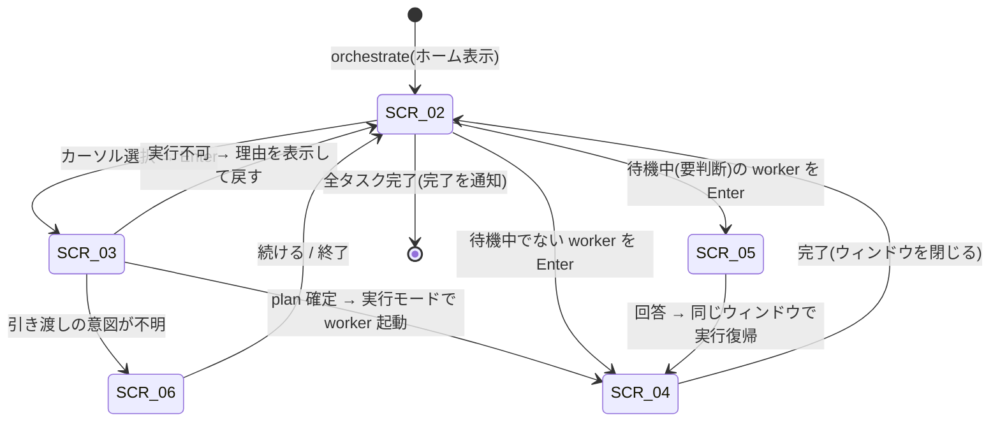

# モジュール分割・テスト戦略・UI設計

## モジュール分割定義

<!-- 29モジュール。CLI はサブコマンド単位で1モジュール(決定シート 論点3)。
     機能(relations)は83本で、その境界は docs/03-impl/features.md が持つ。 -->

| モジュールID | 責務 | 対応要件 | 依存 | 詳細設計 | relations の接頭辞 |
|---|---|---|---|---|---|
| MOD-cli-common | ホスト CLI の共有基盤。コンテナ名の導出、稼働・存在・イメージの判定、インフラ(ネットワーク・共有ボリューム)の用意、SSH 鍵の選択と保存、noVNC URL の組み立て、実行ユーザの解決、**共有資源を触る6コマンドの排他ロックの取得・解放・残骸の引き継ぎ**(`D0-env-08` 項6 / `DSN-env-02`) | FR-env-01, FR-env-02, FR-env-03, FR-env-04, FR-env-09, FR-env-10, FR-env-11, NFR-ops-02, NFR-ops-03, NFR-scale-01, SR-01, SR-10, SR-11, SR-12, SR-20 | — | なし | `MODULE-cli-common-*` |
| MOD-cli-setup | イメージをビルドし、ネットワークと共有ボリュームを作る初回セットアップ | FR-env-01, FR-env-09, SR-01 | MOD-cli-common | なし | `MODULE-cli-setup` |
| MOD-cli-start | 開発コンテナの起動(既定はブラウザ確認あり)。再接続・VM モード・認証受け渡し・鍵転送・ポート割当を含む | FR-env-01〜08, FR-env-11, FR-env-12, NFR-avail-02, NFR-scale-01, NFR-sec-01, NFR-ops-02, SR-04, SR-14, SR-20 | MOD-cli-common, MOD-entrypoint | なし | `MODULE-cli-start` |
| MOD-cli-stop | セッションの停止と compose 生成物の片付け。遊休なら docker-proxy と SSH ブリッジも停止する | FR-env-01, FR-env-07, NFR-ops-02, SR-20 | MOD-cli-common | なし | `MODULE-cli-stop` |
| MOD-cli-attach | 実行中コンテナの tmux セッションへ接続する | FR-env-01, NFR-ops-02, SR-20 | MOD-cli-common | なし | `MODULE-cli-attach` |
| MOD-cli-code | 新しい tmux ウィンドウで Claude Code を起動する | FR-env-01, FR-env-08, FR-env-12, NFR-ops-02, SR-20 | MOD-cli-common | なし | `MODULE-cli-code` |
| MOD-cli-list | 実行中セッションの一覧と noVNC URL を表示する | FR-env-01, FR-env-11, NFR-ops-02, SR-20 | MOD-cli-common | なし | `MODULE-cli-list` |
| MOD-cli-login | Claude の OAuth ログインをコンテナ内で実行し共有ボリュームへ保存する | FR-env-03, NFR-ops-02, SR-03, SR-15, SR-20 | MOD-cli-common | なし | `MODULE-cli-login` |
| MOD-cli-login-codex | Codex のデバイス認証を実行し共有ボリュームの `codex/` へ保存する | FR-env-03, FR-env-12, NFR-scale-02, NFR-ops-02, SR-03, SR-15, SR-20 | MOD-cli-common | なし | `MODULE-cli-login-codex` |
| MOD-cli-logout | Claude と Codex の認証情報を共有ボリュームごと削除する | FR-env-03, NFR-scale-02, NFR-ops-02, SR-20 | MOD-cli-common | なし | `MODULE-cli-logout` |
| MOD-cli-forward | 指定ポートのホスト側フォワードを動的に追加する | FR-env-06, NFR-scale-01, NFR-ops-02, SR-20 | MOD-cli-common | なし | `MODULE-cli-forward` |
| MOD-cli-unforward | 指定ポートのフォワードを解除する | FR-env-06, NFR-ops-02, SR-20 | MOD-cli-common | なし | `MODULE-cli-unforward` |
| MOD-cli-ports | フォワード一覧と noVNC URL を表示する | FR-env-06, FR-env-11, NFR-ops-02, SR-20 | MOD-cli-common | なし | `MODULE-cli-ports` |
| MOD-cli-ssh-keys | 使う SSH 鍵の対話選択・保存・初期化(`select` / `reset` のディスパッチを含む) | FR-env-04, NFR-ops-02, SR-20 | MOD-cli-common | なし | `MODULE-cli-ssh-keys*` |
| MOD-cli-firewall | コンテナ内のファイアウォールルールを表示する | FR-env-05, NFR-ops-02, SR-20 | MOD-cli-common | なし | `MODULE-cli-firewall` |
| MOD-cli-orchestrate | コンテナ内で orchestrator を起動する(ゴール指定・`--fresh` 対応、未起動時の自動起動) | FR-orch-01, FR-orch-02, NFR-avail-01, NFR-ops-02, SR-20 | MOD-cli-common, MOD-cli-start | なし | `MODULE-cli-orchestrate` |
| MOD-cli-pull | GHCR からビルド済みイメージを取得して以降の判定名へ付け替える | FR-env-09, NFR-ops-02, SR-20 | — | なし | `MODULE-cli-pull` |
| MOD-cli-upgrade | 全イメージをキャッシュ無しで再ビルドして更新する | FR-env-01, FR-env-09, NFR-ops-02, SR-20 | — | なし | `MODULE-cli-upgrade` |
| MOD-cli-reset | **管理ラベルを持つ Claude コンテナ**と、**本システムの固定名・固定接頭辞を持つ資源**(`fwd-*` 中継コンテナ / 共有ボリューム / イメージ / docker-proxy / `claude-dev-net`)を削除して初期状態へ戻す。**どちらで識別するかは資源の種類ごとに `CTR-cli-container` の規則A が定める**(管理ラベルを付けるのは Claude コンテナだけである)。**削除対象の列挙は、コンテナ・`fwd-*`・ボリューム・イメージについては実在するものだけを挙げ、共有 docker-proxy と `claude-dev-net` は遊休判定の結果に依存するため候補として常に挙げる**。**共有資源(docker-proxy / `claude-dev-net`)は遊休のときだけ削除し、他が稼働中なら残して「完全な初期化になっていない」ことを表示する**(`D0-env-08` 項2 / `FR-env-01` 受入基準9) | FR-env-01, FR-env-03, NFR-ops-02, SR-20 | MOD-cli-common | なし | `MODULE-cli-reset` |
| MOD-makefile | ビルド・セットアップ・CLI の導入/除去・ログイン・更新・自己検証題材の配置といった入口 | FR-env-01, FR-env-03, FR-env-07, FR-env-09, FR-env-10, FR-env-11, FR-env-12, FR-orch-01, FR-orch-09, NFR-ops-03, SR-10, SR-20, SR-30 | — | なし | `MODULE-makefile-*` |
| MOD-entrypoint | コンテナ起動時の初期化(UID/GID 追従・認証コピー・既定設定の生成/補完・ファイアウォール起動・MCP/VNC/Chrome・tmux・同期ループ・ポート同期の起動) | FR-env-02, FR-env-03, FR-env-05〜08, FR-env-11, FR-env-12, NFR-avail-02, NFR-avail-03, NFR-ops-02, NFR-scale-02, SR-02, SR-20 | MOD-firewall, MOD-portsync, MOD-vm-mode | なし | `MODULE-entrypoint-claude` |
| MOD-firewall | コンテナ内のブラックリスト型ファイアウォールの構成 | FR-env-05, NFR-sec-01, NFR-avail-03, SR-02, SR-20 | — | なし | `MODULE-firewall-init` |
| MOD-docker-proxy | Docker API を検査・書き換えして透過中継する常駐プロキシ | FR-env-07, NFR-sec-01, SR-02, SR-04, SR-21, SR-31 | — | なし | `MODULE-docker-proxy-serve` |
| MOD-portsync | DooD 環境で公開ポートを検出し転送する | FR-env-06, FR-env-07, SR-20 | — | なし | `MODULE-portsync-dood` |
| MOD-vm-mode | ゲスト VM の起動・provision・ポート同期・資源逼迫の監視と操作ヘルパー | FR-env-06, FR-env-08, NFR-avail-03, SR-14, SR-20 | — | なし | `MODULE-vm-mode-*` |
| MOD-orchestrator | 2モードの制御ループ、worker の並列実行と分離、タスク単位の介入、相互レビュー、TUI、通知、状態保全 | FR-orch-01〜FR-orch-08, NFR-perf-03, NFR-avail-01, NFR-avail-03, NFR-sec-03, NFR-ops-04, SR-21, SR-22, SR-31 | — | なし | `MODULE-orchestrator-*` |
| MOD-hooks | エージェントのフックからプロンプトを保存し、通知を送る | FR-orch-07, NFR-sec-03, NFR-avail-03 | — | なし | `MODULE-hooks-*` |
| MOD-container-tools | コンテナ内で利用者が使う補助資産(レート制限の解除待ちなど) | FR-env-01, SR-20 | — | なし | `MODULE-container-tools-*` |
| MOD-sample-project | 自己検証題材の配置と、題材そのもの | FR-orch-09, SR-23 | — | なし | `MODULE-sample-project-*` |

**分割定義に含めないもの**: コンテナイメージの定義(`Dockerfile.*`)と GHCR 配布ワークフローは
モジュールではなく、**イメージの作り方は `03-impl/environments/images.md`、GHCR への公開構成は
`03-impl/infra/local/ghcr.md`** が持つ(理由は `DSN-mod-05`)。

**どのモジュールにも属さない要件(8件)とその担い手**。上の表の「対応要件」に現れないのはこの8件
だけであり、いずれも「振る舞いを実装するモジュール」が原理的に存在しない種類の要件である
(割り当て漏れではない)。下の「要件カバレッジ確認」にも同じ担い手を書く。

| 要件 | 担い手 | なぜモジュールでないか |
|---|---|---|
| NFR-perf-01, NFR-perf-02 | `03-impl/environments/images.md`, `03-impl/infra/local/ghcr.md` | イメージのレイヤー構成とビルド設定が決める性能であり、実行される入口を持たない(`DSN-mod-05`) |
| SR-13(マルチアーキ), SR-24(マルチステージ), SR-33(CI 日次実行) | 同上 | 同上。ビルド・配布の構成そのもの |
| SR-05(信頼できる社内開発用途に限る) | `00-requests/request.md`「やらないこと」2 | 利用の前提条件であり、実装物を持たない |
| SR-32(Bash に自動テストを設けない) | 本書「テスト戦略」`DSN-test-01` | 「作らない」ことの宣言であり、実装物を持たない |
| SR-34(Codex を confinement を緩めずに実行) | `02-design/environments.md`「Codex実行設定」 | 外部エージェントの実行設定であり、製品コードのモジュールではない |

## 分割の根拠

### DSN-mod-01 モジュールは「利用者から見た入口」と1対1にする

- 判断: ホスト CLI をサブコマンド単位で1モジュールに割り、Makefile・スクリプト・Go プログラムも
  それぞれ入口の単位で割る。全 29 モジュール。
- 理由: 変更が起きる単位が入口(サブコマンド・ターゲット・常駐プロセス)であり、影響範囲を
  「どのコマンドが変わるか」で説明できる。旧構成では `cli` が1モジュールで 18 サブコマンドを
  抱えており、`start` の変更と `ports` の変更が同じ影響範囲に見えていた。
- 却下した案: ファイル単位で割る(旧構成) — 1ファイルに 18 の入口が同居し、影響範囲が引けない。
  機能グループ(認証系・ポート系など)で割る — 境界が主観的になり、コードとの1対1が崩れる。

### DSN-mod-02 macOS 実装は同名サブコマンドのモジュールへ相乗りさせる

- 判断: macOS 版(`claude-dev-mac`)を独立モジュール群にせず、同名サブコマンドのモジュールに
  `impl` パスとして相乗りさせる。旧 `cli-mac` モジュールは解体する。
- 理由: `claude-dev-mac` は同じコマンド面の別 OS 実装であり、サブコマンド単位で割ると同一ロジックの
  モジュールが 18 本増えて依存表が読めなくなる。OS 差分は「同じ入口の別実装」として1箇所で
  対比できる方がよい。
- 却下した案: `MOD-cli-mac-*` を 18 本立てる — モジュール数が倍になり、対応要件も重複する。
  旧構成のまま `cli-mac` を1モジュールで残す — `DSN-mod-01` の1対1と矛盾する。

### DSN-mod-03 共有基盤は1モジュールに集約する

- 判断: ホスト CLI の先頭にある定数・ヘルパー関数群を `MOD-cli-common` として独立させる。
- 理由: 全サブコマンドがここへファンインする(実測で 25 関数、最大ファンイン 10)。集約しないと
  18 モジュールが同じ実装パスを重複して持ち、実装とドキュメントの 1 対 1 が崩れる。
- 却下した案: 各サブコマンドのモジュールに複製して書く — 重複により整合検査が落ちる。
  共有基盤を作らず呼び出し関係だけで表す — 境界の無いコードが機能表から漏れる。

### DSN-mod-04 共有するものとプロジェクト単位のものを分ける

- 判断: `docker-proxy` は全 Claude コンテナで共有し、それ以外はプロジェクト単位(またはイメージ単位)
  とする。共有ボリュームは認証・シェル設定・履歴の3本に限る。
- 理由: 共有すると常駐が1つで済む一方、プロジェクト間の干渉が起きうる。干渉が問題になるもの
  (セッション・Chrome プロファイル・運用状態)はプロジェクト単位に置く。
- 却下した案: すべてをプロジェクト単位にする — docker-proxy がプロジェクト数だけ常駐する。
  すべてを共有する — セッションと運用状態が混ざる。

### DSN-mod-05 コールグラフに入口を持たない資産はモジュールにしない

- 判断: コンテナイメージの定義(`Dockerfile.*`)と GHCR 配布ワークフロー(GitHub Actions)は
  モジュール分割定義から外し、`03-impl/environments/`(仕組み)と `03-impl/infra/local/`(構成値)
  に置く。
- 理由: この2つは実行される関数の入口を持たないため、コールグラフに現れない。モジュールとして
  機能表に載せると、機械検査 FT1(入口がコールグラフに存在するか)が重大度「高」で落ち、FT1 は
  落ちると以降の検査を打ち切るゲートであるため、CG1〜CG7 まで含めた機械検査が丸ごと無効になる。
  記述内容は `environments/` と `infra/` が保持するため失われない(`.claude/directions/03-impl.md`
  の「仕組みは environments/、具体的な構成値は infra/」に合致する)。
- 却下した案: モジュールとして残す — 上記のとおり機械検査が無効になる。Dockerfile と GitHub
  Actions のコールグラフ抽出器を作る — このキットの範囲外(`/kit-improve` 案件)。

### DSN-mod-06 モジュールあたりの機能数の上限を超えている2モジュールを許容する

- 判断: `MOD-orchestrator`(19機能)と `MOD-makefile`(19機能)は、1モジュールあたり 15 本という
  分割見直しの目安を超えるが、分割しない。
- 理由: `MOD-orchestrator` は入口が1つ(単一バイナリ)で 219 シンボルを持ち、ファイル境界=責務境界で
  機能へ昇格させた結果が 19 本である。これを1機能に畳むと「1機能=1バイナリ」になり境界が消える。
  逆にモジュールを分けると、単一バイナリが複数モジュールにまたがることになり `DSN-mod-01` の
  1対1が崩れる。`MOD-makefile` も同様に、入口(ターゲット)が 19 個ある単一ファイルである。
- 却下した案: Makefile のターゲットを用途別に束ねる — 束ねた内部に境界が埋没し、記述量は減らない。
  orchestrator を複数モジュールへ割る — 物理配置との1対1が崩れる。

## 要件カバレッジ確認

| 要件 ID | 割り当てモジュール | 備考 |
|---|---|---|
| FR-env-01 | MOD-cli-start, MOD-cli-stop, MOD-cli-attach, MOD-cli-list, MOD-cli-code, MOD-cli-setup, MOD-cli-upgrade, MOD-cli-reset, MOD-cli-common, MOD-makefile, MOD-container-tools | 起動・再接続・停止・一覧 |
| FR-env-02 | MOD-entrypoint, MOD-cli-start, MOD-cli-common | UID/GID 追従は entrypoint が実施 |
| FR-env-03 | MOD-cli-login, MOD-cli-login-codex, MOD-cli-logout, MOD-cli-start, MOD-cli-reset, MOD-cli-common, MOD-entrypoint, MOD-makefile | 保存は CLI、コピーと同期は entrypoint |
| FR-env-04 | MOD-cli-ssh-keys, MOD-cli-start, MOD-cli-common | macOS の TCP ブリッジも同モジュール群 |
| FR-env-05 | MOD-firewall, MOD-entrypoint, MOD-cli-start, MOD-cli-firewall | 適用は firewall、起動は entrypoint、表示は CLI |
| FR-env-06 | MOD-cli-forward, MOD-cli-unforward, MOD-cli-ports, MOD-portsync, MOD-vm-mode, MOD-entrypoint | VM 経路のポート同期は vm-mode |
| FR-env-07 | MOD-docker-proxy, MOD-cli-start, MOD-cli-stop, MOD-portsync, MOD-makefile | compose 名の一意化は start |
| FR-env-08 | MOD-vm-mode, MOD-cli-start, MOD-cli-code, MOD-entrypoint | 起動判定は start、常駐は vm-mode |
| FR-env-09 | MOD-cli-pull, MOD-cli-setup, MOD-cli-upgrade, MOD-cli-common, MOD-makefile | 配布側の構成は `03-impl/infra/local/ghcr.md` |
| FR-env-10 | MOD-makefile(install/uninstall), MOD-cli-common, 各 MOD-cli-*(macOS 実装の相乗り) | `DSN-mod-02` |
| FR-env-11 | MOD-entrypoint, MOD-cli-start, MOD-cli-list, MOD-cli-ports, MOD-cli-common, MOD-makefile | イメージ側の同梱は `03-impl/environments/images.md` |
| FR-env-12 | MOD-entrypoint, MOD-cli-start, MOD-cli-code, MOD-cli-login-codex, MOD-makefile | 同梱そのものは `03-impl/environments/images.md` |
| FR-orch-01 | MOD-orchestrator, MOD-cli-orchestrate, MOD-makefile | |
| FR-orch-02 | MOD-orchestrator, MOD-cli-orchestrate | |
| FR-orch-03 | MOD-orchestrator | worker・worktree・統合 |
| FR-orch-04 | MOD-orchestrator | 介入キューとハンドオフ |
| FR-orch-05 | MOD-orchestrator | 状態の永続化と再開 |
| FR-orch-06 | MOD-orchestrator | レビューと改訂ループ |
| FR-orch-07 | MOD-orchestrator, MOD-hooks | 通知の発信源はコントローラに一本化 |
| FR-orch-08 | MOD-orchestrator | ダッシュボード・端末制御・整形 |
| FR-orch-09 | MOD-sample-project, MOD-makefile, MOD-orchestrator | |
| NFR-perf-01, NFR-perf-02 | (モジュール外)`03-impl/environments/images.md`, `03-impl/infra/local/ghcr.md` | レイヤー構成とビルド設定が担う |
| NFR-perf-03 | MOD-orchestrator | worker の割り当て粒度と文脈の絞り込み |
| NFR-avail-01 | MOD-orchestrator, MOD-cli-orchestrate | |
| NFR-avail-02 | MOD-cli-start, MOD-entrypoint | |
| NFR-avail-03 | MOD-entrypoint, MOD-firewall, MOD-orchestrator, MOD-hooks, MOD-vm-mode | 補助機能の失敗を主機能へ波及させない |
| NFR-sec-01 | MOD-docker-proxy, MOD-firewall, MOD-cli-start, MOD-cli-common | |
| NFR-sec-03 | MOD-orchestrator, MOD-hooks | |
| NFR-ops-02 | MOD-cli-common, 各 MOD-cli-*, MOD-entrypoint | OS 依存をホスト CLI に閉じる |
| NFR-ops-03 | MOD-makefile, MOD-cli-common | `make help` と CLI のヘルプ |
| NFR-ops-04 | MOD-orchestrator | |
| NFR-scale-01 | MOD-cli-start, MOD-cli-common, MOD-cli-forward | 命名・ポート割当・プロファイル分離 |
| NFR-scale-02 | MOD-cli-login-codex, MOD-cli-logout, MOD-entrypoint | |

**システム要件(`SR-nn`)の割り当て**。SR は「システムが満たす振る舞い」ではなく**技術前提と制約**
であるため、モジュールが実装するとは限らない。担い手がモジュールでないものは、その制約を保持する
02 のドキュメントを担い手として書く(空欄を作らないための規約)。

| 要件 ID | 割り当てモジュール / 担い手 | 備考 |
|---|---|---|
| SR-01 | MOD-cli-common, MOD-cli-setup | 前提コマンドの検査とインフラ作成が Docker の存在に依存する |
| SR-02 | MOD-entrypoint, MOD-firewall, MOD-docker-proxy, (モジュール外)`03-impl/environments/images.md` | OS 依存はホスト CLI 側に閉じる(`DSN-mod-02`) |
| SR-03 | MOD-cli-login, MOD-cli-login-codex, MOD-cli-common, (モジュール外)`03-impl/environments/images.md` | 認証は共有ボリューム経由のみ。イメージへ焼き込まない |
| SR-04 | MOD-cli-start, MOD-docker-proxy, (担い手)`02-design/environments.md`「Codex実行設定」 | `--security-opt` を付けない=既定の confinement を維持する |
| SR-05 | (担い手)`00-requests/request.md`「やらないこと」2 | 利用前提。設計上の実装物を持たない |
| SR-10 | MOD-cli-common, MOD-makefile | 前提コマンド検査と `make setup` の対象環境 |
| SR-11 | MOD-cli-common | Docker API の版に依存する判定を持つ |
| SR-12 | MOD-cli-common | 不足コマンドを列挙して導入方法を案内する |
| SR-13 | (モジュール外)`03-impl/infra/local/ghcr.md` | マルチアーキ配布は CI が担う(`DSN-mod-05`) |
| SR-14 | MOD-vm-mode, MOD-cli-start | `/dev/kvm` の有無で分岐する。macOS では提供しない |
| SR-15 | MOD-cli-login, MOD-cli-login-codex | 認証方式の選択そのもの |
| SR-20 | MOD-cli-common, 各 MOD-cli-*, MOD-makefile, MOD-portsync, MOD-vm-mode, MOD-entrypoint, MOD-firewall, MOD-container-tools | Bash 実装のモジュール群 |
| SR-21 | MOD-docker-proxy, MOD-orchestrator | Go 実装の2モジュール |
| SR-22 | MOD-orchestrator | TUI のみ外部依存を許容し vendor へ同梱する |
| SR-23 | MOD-sample-project | Python + pytest の自己検証題材 |
| SR-24 | (モジュール外)`03-impl/environments/images.md` | マルチステージと終端レイヤー(`DSN-dist-01` / `DSN-mod-05`) |
| SR-30 | MOD-makefile | 単一の入口 |
| SR-31 | MOD-docker-proxy, MOD-orchestrator | 実コマンドは `environments.md` が正 |
| SR-32 | (担い手)本書「テスト戦略」`DSN-test-01` | 自動テストを設けないという明示的な割り切り |
| SR-33 | (モジュール外)`03-impl/infra/local/ghcr.md` | GitHub Actions の日次実行 |
| SR-34 | (担い手)`02-design/environments.md`「Codex実行設定」 | legacy landlock で confinement を緩めずに実行する |

**要件を持たないモジュールは無い**(全 29 モジュールが上表のいずれかに現れる)。
**割り当て先の無い要件も無い**(FR 21 件・NFR 13 件・SR 21 件がすべて上の3表に現れる)。

## テスト戦略

### レベル別方針

#### DSN-test-01 自動テストは Go の2モジュールに集中させ、シェル系は実機確認で担保する

- 判断: 単体テストは Go(docker-proxy / orchestrator)と自己検証題材(Python)に置く。Bash と
  Makefile には自動テストランナーを設けず、実機確認と E2E で担保する。結合テストは契約ごとに
  **観測可能な側**へ責任を割り当てる。
- 理由: Bash 実装に自動テストランナーを導入すると、実行環境(Docker・tmux・実 SSH)を用意する
  仕掛けが本体より大きくなる。一方、検査ロジックと状態遷移という間違えやすい部分は Go 側に
  集中しており、そこは機械検証できる。「本物のバイナリで通す E2E は、モックでは見つからない
  欠陥を捕まえる」という実測経験も、この配分の根拠である。
- 却下した案: bats 等で Bash の単体テストを整備する — 実行環境の用意が本体より重い。
  すべてを E2E に寄せる — 失敗時の切り分けができない。

| レベル | 方針 | ツール | 実行環境 | データ | 実行タイミング |
|---|---|---|---|---|---|
| 単体 | 検査ロジック・状態遷移・レビュー判定・プロンプト生成を機械検証する | `go test`(各 Go モジュール)、`pytest`(題材) | ホストまたはコンテナ内。外部サービスに接続しない | テスト内で組み立てる。一時ディレクトリを使い後始末する | 変更時と PR |
| 結合 | モジュール間の全5契約を、観測可能な側から検証する | `go test`(docker-proxy の API ボディ検査、orchestrator のプロンプト生成と制御ファイル検知)+ 実機確認 | Go は単体と同じ。実機分はコンテナ起動を伴う | 契約ごとに下表の担当モジュールが用意する | 変更時。実機分はリリース前 |
| E2E | ユースケースを実操作で通す。オーケストレーターは自己検証題材で実走する | 実機(`claude-dev` の実操作)+ `make orch-sample` | 実際のホストとコンテナ。実 tmux・実エージェント | 自己検証題材(使い捨ての作業コピー) | リリース前と、関係する変更のたび |

### 結合テスト対象

| 契約 ID | 契約の当事者 | テストを持つ責任モジュール |
|---|---|---|
| CTR-cli-container(**起動側**) | MOD-cli-start → MOD-entrypoint | MOD-entrypoint(呼び出し元はシェルで自動テストを持てないため観測側が担当。手段は実機確認) |
| CTR-cli-container(**破壊的操作の対象の識別**) | MOD-cli-start(管理ラベルの発行側)→ MOD-cli-stop / MOD-cli-logout / MOD-cli-reset(読み手) | **MOD-cli-stop / MOD-cli-logout / MOD-cli-reset**(読み手が観測側。`D0-env-08`。**発行側がラベルを付けるのをやめると読み手の削除対象が空になる**ため、契約の遵守は読み手の側でしか観測できない)。全モジュールがシェル実装で自動テストを持てないため、手段は**実機確認 = E2E-01 手順8**(`FR-env-01` 受入基準 9・14〜21 / `FR-env-03` 受入基準 14〜23) |
| CTR-entrypoint-firewall | MOD-entrypoint → MOD-firewall | MOD-entrypoint(手段は実機確認) |
| CTR-docker-api | Claude コンテナ → MOD-docker-proxy | MOD-docker-proxy(観測側。`go test` で機械検証) |
| CTR-cli-orchestrator | MOD-cli-orchestrate → MOD-orchestrator | MOD-orchestrator(観測側。実 tmux と実エージェントを要するため手段は実機確認=E2E-04 / E2E-05) |
| CTR-orchestrator-prompt | MOD-orchestrator → worker / 対話 Claude | MOD-orchestrator(生成と検知は `go test`。実プロセスとの結合は実機確認=E2E-04) |

**`CTR-cli-container` を2行に分けた理由**: この契約は当事者の異なる2つの取り決めを持つ。
起動時に渡す環境変数・オプション(`MOD-cli-start` → `MOD-entrypoint`)と、
**破壊的操作が削除対象を決めるための管理ラベル・遊休判定・ロックキー**
(`MOD-cli-start` が付け、`MOD-cli-stop` / `-logout` / `-reset` が読む)である。
後者は `MOD-entrypoint` を一切通らないため、1行目の責任モジュールでは観測できない。

### E2Eシナリオ一覧

| E2E ID | 対応 UC | シナリオ | 対象/対象外(理由) |
|---|---|---|---|
| E2E-01 | UC-01 | `claude-dev start`(ブラウザ確認あり / `--no-vnc`)→ `/workspace` マウント・認証・ファイアウォール・tmux → `claude` 起動 → 再実行での再接続。**続けて破壊的操作が「自分が作った資源」にだけ効くことを確認する**: 管理ラベルの付与 / 遊休判定がイメージに依存しないこと / 排他ロックと残骸の引き継ぎ / ラベルを持たない既存コンテナを巻き込まないこと / compose 資源が別プロジェクトを巻き込まないこと / `stop` が受理しない名前 / `logout` がプロジェクト配下の認証コピーを消すこと / 確認と非対話時の中止 / 削除失敗の列挙(`FR-env-01` 受入基準 9・14〜21 / `FR-env-03` 受入基準 14〜23) | 対象(Must) |
| E2E-02 | UC-02 | `claude-dev forward` → 8100 番台の割当と SSH トンネル → クライアントのブラウザで表示 → `claude-dev ports` で確認 | 対象(Must) |
| E2E-03 | UC-03 | コンテナ内で危険な `docker run` → 拒否 / `/workspace` bind の許可 / 通常操作の透過 | 対象(Must) |
| E2E-04 | UC-04 | `orchestrate` → ブレインストーミング → plan 確定 → worker 並列 → 要判断1件のみ待機・他は継続 → 回答で復帰 → 完了(`make orch-sample` で題材を配置して実走) | 対象(Must) |
| E2E-05 | UC-05 | 実行中に端末を全終了 → `orchestrate` 再実行 → 合流/再開・完了済みの非再実行・plan と履歴の保持 | 対象(Should) |
| E2E-06 | UC-06 | `claude-dev login-codex` → デバイス認証 → 別プロジェクトで `start` → 再ログイン不要で `codex` が起動し、**シェルコマンドが成功して `/workspace` を読み書きできる**。landlock の疎通確認が通り、読み取り専用の明示指定で読み取りが成功する。トークン更新が次のコンテナへ引き継がれる | 対象(Must) |

**全 UC がカバーされている**(UC-01〜UC-06 → E2E-01〜E2E-06)。上流の UC を持たない E2E シナリオは
作らない。

## UI設計

本システムの UI はターミナル主体である(Web GUI は無い。ブラウザ確認は noVNC で提供するが、
これは本システムのアプリ UI ではなく、利用者が開発中の Web アプリを見るための窓である)。
接点は「ホスト CLI のコマンド体系」と「オーケストレーターの TUI」の2つ。

### 画面一覧

#### DSN-ui-01 UI はターミナル主体とし、Web GUI を持たない

- 判断: 利用者との接点をホスト CLI と TUI の2つに限る。下表の6画面で全操作を賄う。
- 理由: 利用者は開発者であり、作業の場が端末と SSH の中にある。Web GUI を足すと、ホストへ新たな
  待ち受けを開くことになり(`NFR-sec-01`)、認証も別途必要になる。
- 却下した案: Web ダッシュボードを提供する — ポート公開と認証の追加が必要で、隔離方針と衝突する。

| 画面ID | 画面名 | 目的 | 関連 UC |
|---|---|---|---|
| SCR-01 | cli-commands | コンテナ・認証・ポート・鍵の操作 | UC-01, UC-02, UC-03, UC-06 |
| SCR-02 | orch-dashboard | 実行モードの俯瞰と worker の選択 | UC-04, UC-05 |
| SCR-03 | orch-brainstorming | ゴール・仕様を対話で固める | UC-04 |
| SCR-04 | orch-worker | worker のライブ出力 | UC-04 |
| SCR-05 | orch-intervention | 要判断1件への回答 | UC-04 |
| SCR-06 | orch-endmenu | 引き渡しの意図が判別できないときの選択 | UC-04 |

### 画面遷移

#### DSN-ui-02 移動はカーソル選択と Enter 確定でのみ行う

- 判断: ダッシュボードからの移動は、カーソル選択(↑↓/jk)と Enter 確定でのみ発生させる。
  数字キーでの即時移動と全画面再描画は行わない。対話モードからの抜け方は全モードで統一する。
- 理由: 選択と確定を分離しないと、カーソルを動かしただけで画面が飛び、利用者が現在地を見失う。
  全画面再描画はちらつきの原因になる。TUI と子プロセスが同じ端末を共有するため、描画の主導権を
  一箇所に持たせる必要もある。
- 却下した案: 数字キーで即時移動する(旧実装) — 誤操作で意図しないウィンドウへ飛ぶ。
  全消去・全再描画 — ちらつく。

```mermaid
stateDiagram-v2
  [*] --> SCR_02: orchestrate(ホーム表示)
  SCR_02 --> SCR_03: カーソル選択 → Enter
  SCR_03 --> SCR_02: 実行不可 → 理由を表示して戻す
  SCR_03 --> SCR_06: 引き渡しの意図が不明
  SCR_06 --> SCR_02: 続ける / 終了
  SCR_03 --> SCR_04: plan 確定 → 実行モードで worker 起動
  SCR_02 --> SCR_04: 待機中でない worker を Enter
  SCR_02 --> SCR_05: 待機中(要判断)の worker を Enter
  SCR_05 --> SCR_04: 回答 → 同じウィンドウで実行復帰
  SCR_04 --> SCR_02: 完了(ウィンドウを閉じる)
  SCR_02 --> [*]: 全タスク完了(完了を通知)
```

### 画面ごとの項目と状態

#### SCR-01 cli-commands

| 項目 | 型・制約 | 必須 | 備考 |
|---|---|---|---|
| サブコマンド | 18 種の列挙 | 必須 | 未知の語とヘルプ要求は使い方を表示する |
| 対象セッション名 | 文字列(省略時はカレントディレクトリから導出)。**`stop <name>` に限り `[A-Za-z0-9._-]` のみ受理する** | 任意 | `stop` / `ports` / `forward` など。**受理文字集合の制約は `stop` だけに掛かる**: `stop` は名前をそのまま排他ロックのキー=パス要素として使うため(`FR-env-01` 受入基準18)。受理できない文字を含む場合は**何も削除せず**理由を表示して終了コード 1 で終わる。`ports` / `forward` などにはこの制約が掛からない(ロックを取らないため) |
| フラグ | `--no-vnc` / `--kvm` / `--vm` / `--vm-fresh` / `--fresh` / **`--yes`** | 任意 | 非対応の組み合わせは実行前に拒否する。**`--yes` は破壊的操作(`logout` / `reset`)の確認プロンプトを飛ばす**(`D0-env-08` 項3)。端末を持たない環境で破壊的操作を実行する唯一の手段であり、指定が無ければ中止する |

状態: **初期**=使い方の表示 / **実行中**=進捗行(イメージ名・バージョン・待機の経過)/
**エラー**=日本語の原因と次の操作の案内 / **空**=対象セッションが無い旨 /
**完了**=接続 URL とアタッチ。

**破壊的操作の状態**(`logout` / `reset`): **確認**=削除対象の名前を1行ずつ列挙して同意を求める /
**中止**=同意が得られない、または端末が無く `--yes` も無い旨と `--yes` の指定方法 /
**一部失敗**=消えなかった資源を1件ずつ列挙(成功時の文言は出さない)/
**残した資源**=管理ラベルを持たないため削除しなかったコンテナの名前と、停止中のものは
列挙していない旨。

**排他待ちで中止の状態**(`start` / `stop` / `logout` / `reset` / `login` / `login-codex` の
**6コマンド共通**): 保持している操作の名前とプロセス ID と再実行の方法を表示し、終了コード 1 で
終わる(`FR-env-01` 受入基準16)。**破壊的操作だけの状態ではない**: 共有ボリュームまたは
docker-proxy を触る6コマンドすべてがこの状態を持つ。

#### SCR-02 orch-dashboard

| 項目 | 型・制約 | 必須 | 備考 |
|---|---|---|---|
| ゴール | 文字列 | 必須 | plan 未確定なら未設定と表示する |
| worker 一覧 | タスクID・状態・カーソル選択 | 必須 | 状態は実行中/レビュー中/待機(要判断)/完了/失敗/ブロック |
| 要判断の件数 | 整数 | 必須 | 0 件でも項目は表示する |
| 直近サマリ・仮定の件数 | 文字列・整数 | 任意 | 取得に失敗しても描画を止めない |

状態: **初期**=ホーム表示 / **読込中**=状態の読み取り中 / **エラー**=補助情報の取得失敗を
警告として表示(描画は継続) / **空**=worker が無い(ブレインストーミングへ誘導) /
**完了**=全タスク完了の表示。

#### SCR-03 orch-brainstorming / SCR-04 orch-worker / SCR-05 orch-intervention / SCR-06 orch-endmenu

| 項目 | 型・制約 | 必須 | 備考 |
|---|---|---|---|
| 対話本文 | エージェントの TUI をそのまま表示 | 必須 | SCR-03 / SCR-05 |
| 番号付き選択肢 | 1 から始まる連番 | 必須(選択を求めるとき) | 番号での回答を受理する |
| ライブ出力 | 整形済みのログ | 必須 | SCR-04 |
| メニュー項目 | 続ける / 実行する(実行可能なときのみ)/ 終了する | 必須 | SCR-06 |

状態: **初期**=モード遷移のバナー(日本語)/ **対話中**=エージェントの応答待ち /
**回答待ち**=要判断の質問を表示 / **エラー**=理由を日本語で表示 / **完了**=ウィンドウを閉じて
ダッシュボードへ戻る。

### デザイン方針

- 人間の判断・入力を求める表示はすべて日本語にする。選択肢には必ず番号を付ける。
- 利用者に運用状態ファイルの直接編集を促さない(修正は対話へ誘導する)。
- 前提不足(未セットアップ・未認証・設定ファイルが無い)は、止めずに次の操作を案内する。
  止めざるを得ない場合は、原因と復旧手段を日本語1行で示してから終了する。
- 端末が対話的でない場合は、選択を求めずに既定値で進む。

## 未解決事項

- なし
