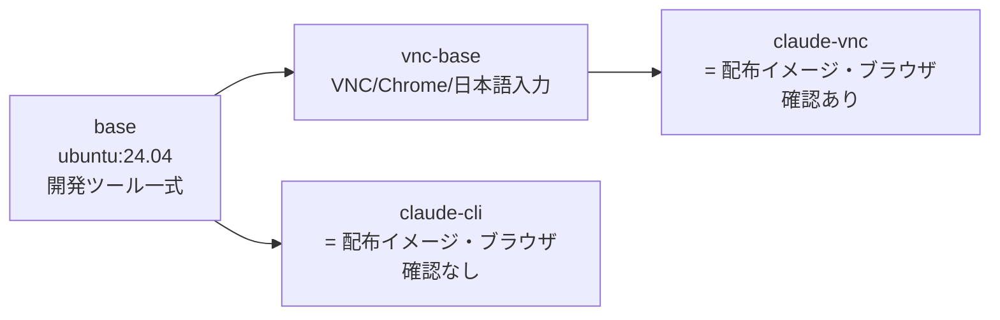
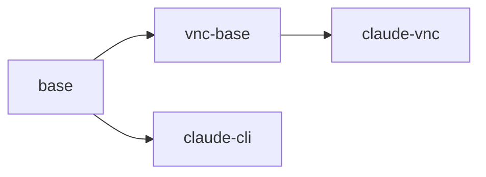

<!-- 2026-08-04 /doc-check ssot task-impl-depth(新しい実行): **合格証を再発行した(1.0.0)。**
     直前に削除した理由(source の docs/02-design/environments.md が未検証)は解消した。
     本文には問題を見つけていない。★本実行は独立レンズが1つも走っていない。 -->

# コンテナイメージのビルドの実装仕様

## 何をどう制御しているか

配布するイメージは1つの Dockerfile(`.devcontainer/Dockerfile.claude`)から作る。ステージは4つで、
**共通の重い層を `base` に集め、ブラウザ確認資産を `vnc-base` に積み、配布する2つの終端ステージで
エージェント CLI と同梱外部バイナリだけを最後に載せる**(`DSN-dist-01`)。

- `base` が `ubuntu:24.04` の上に開発ツール(Go・Python・各種 CLI)を積む。
  **`ENV container=docker` はここで焼き込む**ので、`vnc-base` も終端ステージも継承する
  (`D0-env-06`)。
- `vnc-base` が `FROM base` で VNC・Chrome・日本語入力を積む。
- 終端ステージ `claude-cli` と `claude-vnc` が、それぞれ `FROM base` /
  `FROM vnc-base` で**最後にエージェント CLI と同梱外部バイナリだけを入れる**。
  この2つが配布物である。

エージェント CLI の導入を終端に置くのは、更新のたびに失効するレイヤーを CLI のバイナリ層だけに
限定するためである。`vnc-base` は `base` に連なるため、`base` の途中を失効させると VNC の高コスト層
まで巻き込んで再ビルド・再取得になる(`DSN-dist-01` / `NFR-perf-01`)。同梱外部バイナリの設置層も
同じ理由で終端に置く(次の節)。

## 同梱外部バイナリの設置(externals/)

`FR-env-13` の実体である。**保守者がリポジトリ直下の `externals/` へ手で置いたファイルを、
ビルドが `/usr/local/bin` へ設置する**。ビルドは外部から何も取得しない。

**`externals/` の規約(この節が正)**

| 置き場 | 入るイメージ |
|---|---|
| `externals/` 直下のファイル | **すべてのアーキテクチャ**の配布イメージ2種 |
| `externals/amd64/` 直下のファイル | **amd64** の配布イメージ2種にだけ追加で入る |
| `externals/arm64/` 直下のファイル | **arm64** の配布イメージ2種にだけ追加で入る |
| `externals/README.md` | **入らない**(この仕組みの説明であり同梱物ではない) |

- 対象は**各ディレクトリの直下のファイルだけ**である(`-maxdepth 1 -type f`)。
  アーキテクチャ名以外のサブディレクトリを置いても、その中身は設置されない。
- **アーキテクチャの判定は、設置を行うステージの中で `dpkg --print-architecture` が返す値**
  (`amd64` / `arm64`)で行い、その値と同じ名前のサブディレクトリを見る。
  **ディレクトリ名を独自に写像しない。**
- **設置先は `/usr/local/bin`、権限は 0755、所有者は `root:root`**。
  `PATH` に既定で入っており、対話シェル・非対話シェル・`docker exec` のどれからも解決できる。
- **同名のファイルが `externals/` 直下とアーキテクチャ別ディレクトリの両方に在る場合、
  アーキテクチャ別のものが後に設置されて上書きする**(設置の順序が直下 → アーキテクチャ別で
  固定されているため)。
- **`externals/` に対象ファイルが1件も無くてもビルドは成功する**(`FR-env-13-4`)。
  `externals/README.md` だけが在る状態がこの仕組みの初期状態である。
- **設置に失敗したらビルドを失敗させる**(`FR-env-13-6`)。設置の処理は `set -eu` の下で走り、
  1件でも設置が失敗すれば `RUN` が非0で終わる(**実測: `xargs` の終了コード 123 が伝播して
  ビルドが落ちる**。2026-08-18 に設置先を書き込めないパスへ差し替えて確認した)。
- **`externals/` の中身は丸ごとイメージに残る。** 設置は `COPY externals/ /tmp/externals/` で
  ビルド文脈を持ち込んでから行うので、**同じ `RUN` の中で `/tmp/externals` を消しても、
  COPY 層に置かれたデータはイメージから消えない**(レイヤーの性質)。したがってイメージは
  「`externals/` の全内容」+「設置した分」を持つ。**使わないアーキテクチャ向けのファイルも
  この分に含まれる。** 実測(2026-08-18、amd64 と arm64 の 8.5MB の実行ファイル各1本):
  配布イメージ1本あたり約 25MB の増加で、8GB 規模のイメージに対して無視できる。
  **`externals/` に置く総量が数百 MB の規模になったら、この持ち込み方を見直す。**

**置く位置**: 両方の終端ステージ(`claude-cli` / `claude-vnc`)の**最終レイヤー**、
すなわち codex 共通ランチャーを作る `RUN` より後ろである(`SR-24` / `DSN-dist-01`)。
両ステージへ同じ処理を重複して書く — 共通化のために中間ステージを挟むと、その層が共有チェーンへ
入って「終端配置」の意味を失う(エージェント CLI の導入が既に同じ扱いであり、その理由は
`Dockerfile.claude` の配布ステージ直前のコメントが持つ)。

**既知の限界**: **`/usr/local/bin` への書き込みを完全に防ぐものではない。** コンテナ内の利用者は
`NOPASSWD:ALL` の sudo を持つ(`Dockerfile.claude` の非 root ユーザー作成部)ので、
設置した同梱物を意図的に置き換えられる。0755・`root:root` が保証するのは
**非特権の操作では書き換わらない**ことまでで、`FR-env-13-2` の受入基準もその範囲で書かれている。

**実装上の判断(標準委任)**

- [DS-05] 同梱外部バイナリの設置層を、エージェント CLI の導入層より**後ろ**の最終レイヤーに置く — 理由: `DSN-dist-01` の一般原則(失効の波及範囲を最小化できる終端に置く)の適用であり、保守者による差し替えの頻度はエージェント CLI の更新より読めないため、波及を受けない側へ置く。前に置くと差し替えのたびに CLI の層まで失効して利用者の `docker pull` が増分でなくなる(`NFR-perf-01`)/ 見直す条件: 同梱外部バイナリがエージェント CLI の動作に必要になり、CLI の導入より先に在る必要が生じたとき
- [DS-05] 設置を**両方の終端ステージへ等しく**行い、中間ステージへ共通化しない — 理由: 片方のステージにだけ置くと `NFR-perf-02` の「ブラウザ確認ありイメージだけが持つ追加層にビルド済み成果物が現れない」に当たって不合格になる。共通化のために中間ステージを挟むとその層が `base` → `vnc-base` の共有チェーンに入り、終端配置の意味を失う / 見直す条件: ブラウザ確認ありのイメージにだけ同梱したいものが出てきたとき
- [DS-04] 設置する同梱物の権限を **0755**、所有者を **`root:root`** にする — 理由: `FR-env-13-2` が求める「実行でき、非特権の操作では書き換えられない」を満たす最小の権限であり、`/usr/local/bin` にある既存の同梱物(`codex` ランチャー・`terraform`・`init-firewall.sh`)と同じ扱いである / 見直す条件: 利用者が書き換える前提の資産を同梱したくなったとき
- [DS-06] アーキテクチャの判定に **`dpkg --print-architecture`** を使い、BuildKit の自動 ARG `TARGETARCH` を使わない — 理由: この Dockerfile は既に同じコマンドを5箇所で使っており(apt のリポジトリ定義2件・Go・Terraform・GUI ブラウザの分岐 各1件)、返す語彙(`amd64` / `arm64`)も `TARGETARCH` と一致する。`TARGETARCH` はレガシービルダー(BuildKit を使わない `docker build`)では空文字になり、アーキテクチャ別ディレクトリの選択が黙って効かなくなる / 見直す条件: `dpkg` を持たないベースイメージへ移ったとき

## 関係するファイル

| ファイル | 役割 |
|---|---|
| `.devcontainer/Dockerfile.claude` | 配布イメージ2つ(と中間ステージ1つ)の定義 |
| `.devcontainer/Dockerfile.docker-proxy` | docker-proxy イメージの定義 |
| `.devcontainer/tmux.conf` | コンテナ内の tmux 設定(イメージへ同梱し、起動時に読み取り専用でマウントする) |
| **`externals/`** | **同梱外部バイナリの置き場(`FR-env-13`)。保守者が手で置く。ビルド文脈に含まれる必要があるためリポジトリにコミットする(`.gitignore` に入れない)** |
| **`externals/README.md`** | **`externals/` の規約の案内。ディレクトリを空のままリポジトリに残す役目も兼ねる。設置の対象からは除外される** |
| `Makefile` | ビルドの入口(`MODULE-makefile-build*`)。**ビルド文脈がリポジトリルートなので、`externals/` を渡すための変更を持たない** |
| `.github/workflows/ghcr-images.yml` | CI からのビルドと公開。構成値は `infra/local/ghcr.md` が正。**`context: .` なので `externals/` の受け渡しのための変更を持たない** |
| `scripts/entrypoint-claude.sh` | イメージの ENTRYPOINT(実装仕様は `MODULE-entrypoint-claude`) |
| `scripts/init-firewall-claude.sh` | `/usr/local/bin/init-firewall.sh` として同梱(`MODULE-firewall-init`) |
| `scripts/dood-portsync.sh` / `scripts/wait-limit-reset.sh` | コンテナ内で使う資産として同梱(それぞれ機能間連携仕様書を持つ) |

## 使い方(実際のコマンド)

| やりたいこと | コマンド | 備考 |
|---|---|---|
| 全イメージをビルド | `make build` | `claude` + `claude-vnc` + `docker-proxy` |
| 個別ビルド | `make build-claude` / `make build-claude-vnc` / `make build-docker-proxy` | `claude-vnc` は `base` に続けてビルドする |
| キャッシュ無しで作り直す | `make upgrade` | 全イメージ |
| エージェント CLI だけ更新 | `make update-claude` | キャッシュを使い終端レイヤーだけを作り直す |
| 配布イメージを取得 | `claude-dev pull` | GHCR から取得して以降の判定名へ付け替える |
| **同梱外部バイナリを足す / 差し替える** | `externals/`(全アーキ共通)または `externals/amd64/` `externals/arm64/`(アーキテクチャ別)へファイルをコピーし、`make build` | **公開イメージへ焼くならコミットする**(`D0-dist-05` 項2)。設置されたかは `docker run --rm --entrypoint /bin/sh claude-dev-claude -lc '<コマンド名>'` で確かめる(**`--entrypoint` を挟まないと ENTRYPOINT が待機に入り、渡したコマンドは実行されない**) |

## 依存サービスと起動順

| サービス | 起動条件 | ヘルスチェック |
|---|---|---|
| ビルド | `make build` 実行時。ネットワーク到達性が必要(パッケージ・CLI の取得) | ビルドの終了コード |
| 取得 | `claude-dev pull` 実行時。GHCR への到達性が必要 | 取得の終了コード |

## 環境変数(ビルド引数)

| 変数 | 用途 | 既定値 | 必須 | 定義箇所 |
|---|---|---|---|---|
| `USERNAME` | コンテナ内ユーザー名 | `devuser` | 任意 | `.devcontainer/Dockerfile.claude` の `base` ステージ冒頭 |
| `USER_UID` / `USER_GID` | ビルド時のユーザー ID(起動時に entrypoint がホストへ追従させる) | `1500` / `1500` | 任意 | 同上 |
| `IMAGE_VERSION` | イメージのラベルに入れる版(タイムスタンプ) | `local` | 任意 | 同上 |
| `GO_VERSION` | 同梱する Go | `1.26.1` | 任意 | `base` ステージの Go 導入部 |
| `PYTHON_VERSION` | 同梱する Python | `3.13` | 任意 | `base` ステージの pyenv 導入部 |
| `CLAUDE_VERSION` | 同梱する Claude Code。**CI が具体バージョンへ解決して渡す** | `latest` | 実質必須(CI から) | 配布ステージ `claude-cli` / `claude-vnc` の冒頭 |
| `CODEX_VERSION` | 同梱する Codex CLI。**CI が具体バージョンへ解決して渡す** | `latest` | 実質必須(CI から) | 同上 |
| `container`(ENV) | コンテナ内であることのマーカー | `docker` | 必須 | `base` ステージのコンテナ設定部 |

**同梱外部バイナリの設置はビルド引数を1つも増やさない。** アーキテクチャの判定は
`dpkg --print-architecture` で行うため、`--build-arg` も BuildKit の自動 ARG も要らない。

## 落とし穴

| 事象 | 原因 | 回避方法 |
|---|---|---|
| 同梱エージェント CLI が更新されない | `CLAUDE_VERSION=latest` / `CODEX_VERSION=latest` のまま渡すと**文字列が変わらずキャッシュキーとして機能せず**、導入層が永久にヒットして中身だけ凍結する(2026-07 に実際に発生) | CI の prepare ジョブで具体バージョンへ解決してから build-arg で渡す(`infra/local/ghcr.md`) |
| 取得が毎回フルダウンロードになる | 時刻由来の値をレイヤーチェーンに入れると、内容が変わらない日も全層が失効する | レイヤーチェーンに入れてよいのは**内容由来**の値だけ(`DSN-dist-01`)。時刻はラベルに置く |
| VNC 層まで再ビルドされる | エージェント CLI の導入や同梱外部バイナリの設置を `base` の途中に置くと、`FROM base` の `vnc-base` まで失効が波及する | 導入・設置は終端ステージの最終レイヤーにのみ置く |
| ローカルビルドと配布イメージで版が違う | ローカルは `latest` の既定のまま解決されるため、ビルドした時点の版が焼かれる | チームで揃えるときは `claude-dev pull` を使う |
| **`externals/` が無いと `COPY` の時点でビルドが失敗する** | `COPY externals/ ...` はビルド文脈にそのパスが無いと失敗する。**`.gitignore` に入れると CI の `actions/checkout` 後のツリーに存在しない** | `externals/README.md` を必ずコミットしておく(ディレクトリが空でも存在する状態を保つ)。`.dockerignore` を新設する場合も `externals/` を除外しない |
| **片方の配布イメージにしか同梱物が入らない** | 設置の `RUN` を一方の終端ステージにしか書かなかった | 両方の終端ステージに同じ処理を書く。`FR-env-13-1` を満たさないだけでなく、`NFR-perf-02` の「ブラウザ確認ありイメージだけが持つ追加層にビルド済み成果物が現れない」にも当たる |
| **同梱物を差し替えた日に利用者の `docker pull` が増分でなくなる** | 設置層はファイルの内容がキャッシュキーなので、差し替えれば必ず失効する。**これは仕様である**(`NFR-perf-01` の目標値は「同梱エージェント CLI と同梱外部バイナリのどちらも変わらない日」を条件にしている) | 差し替えの頻度そのものを抑える。設置層を最終レイヤーに置いてあるので、失効はその1層に留まる |
| **`externals/` を大きくするとイメージが2倍のペースで太る** | 設置は `COPY` でビルド文脈を持ち込んでから行うため、**COPY 層に置かれた全内容がイメージに残る**(同じ `RUN` で消しても層は消えない)。使わないアーキテクチャ向けのファイルもここに含まれる | 総量が数百 MB の規模になったら持ち込み方を見直す。実測では 8.5MB の実行ファイル2本(amd64 / arm64)で配布イメージ1本あたり約 25MB の増加に留まる |
| **実行ビットを付け忘れたファイルがそのまま動く / 逆に意図せず実行可能になる** | 設置は権限を **0755 に付け直す**ため、ホスト側のファイルの権限は結果に影響しない | 実行ファイル以外を `externals/` に置かない(用語集「同梱外部バイナリ」の含まない例) |
