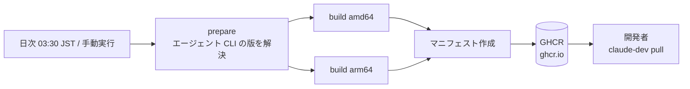

# ローカル(配布)のインフラ構成 — GHCR

本システムはサーバとしてデプロイされる製品ではないため、インフラと呼べる構成は
**配布イメージの公開先(GHCR)だけ**である。`dev` / `prod` 環境は存在しない。

## 構成図

## リソース一覧

| リソース | 種別・サイズ | 用途 | 定義箇所 |
|---|---|---|---|
| ワークフロー | GitHub Actions | 日次ビルドと公開 | `.github/workflows/ghcr-images.yml` |
| `prepare` ジョブ | ジョブ | エージェント CLI の版を具体バージョンへ解決する | `.github/workflows/ghcr-images.yml:46`〜`:78` |
| ビルドジョブ | マトリクス(アーキテクチャごと) | イメージのビルドと push | `:127`〜`:140` |
| レジストリ | `ghcr.io` | 配布先 | `:29` |
| 配布イメージ | 2種(ブラウザ確認あり/なし) | 開発者が取得する | `.devcontainer/Dockerfile.claude` の終端ステージ |

## ネットワーク

| 項目 | 値 |
|---|---|
| 公開範囲 | **公開(認証なしで取得できる)。** `ghcr.io/<owner>/claude-dev-claude` / `-claude-vnc` / `-docker-proxy` の**3パッケージすべて**が GHCR の匿名トークンで取得できる(2026-08-18 に3件それぞれの `tags/list` が 200 を返すことを個別に確認した)。**パッケージの可視性は GHCR 側で個別に設定されるもので、リポジトリの可視性が自動的に伝わるわけではない** — 変えるときは GHCR のパッケージ設定を直接見る |
| ホストへの公開ポート | 無し(配布はレジストリ経由のみ) |

**この公開範囲は `D0-dist-05` 項2 の前提である**: 同梱外部バイナリは公開イメージへ焼かれるので、
`externals/` に置いたものは `docker pull` した誰もが取り出せる。

## 権限・ロール

| 主体 | 権限 | 付与理由 |
|---|---|---|
| GitHub Actions のワークフロー | GHCR への `packages: write` | イメージを push するため |
| 開発者 | GHCR からの read | イメージを取得するため |

## シークレットの置き場所

| シークレット | 保管場所 | 参照方法 |
|---|---|---|
| GHCR への認証 | GitHub Actions が発行する一時トークン | ワークフロー内の標準の仕組みで参照する(値をリポジトリに置かない) |

**API キー・OAuth の資格情報はイメージにもワークフローにも置かない**(`SR-03`)。
**この禁止は `externals/` にも掛かる**(`D0-dist-05` 項3): 同梱外部バイナリの置き場は
公開リポジトリにコミットされ公開イメージへ焼かれるので、認証情報・秘密鍵・API キーを
置いてはならない。

## 環境変数

| 変数 | 値の出どころ | 既定値 | 必須 |
|---|---|---|---|
| `REGISTRY` | ワークフローの環境変数 | `ghcr.io` | 必須 |
| `CLAUDE_VERSION` | `prepare` ジョブが `latest` チャネルから解決。手動実行時は入力で上書きできる | 解決値 | 必須 |
| `CODEX_VERSION` | `prepare` ジョブが npm registry から解決。手動実行時は入力で上書きできる | 解決値 | 必須 |
| `CHROME_DEVTOOLS_MCP_VERSION` | `prepare` ジョブが npm registry から解決。手動実行時は入力で上書きできる | 解決値 | 必須 |
| `IMAGE_VERSION` | **CI は渡さない**(Dockerfile 側の既定 `local` のまま)。ビルド時刻(JST)から作るタイムスタンプは `labels` 入力でイメージのラベルへ直接付ける — build-arg にするとレイヤーチェーンが毎日失効するため(`ghcr-images.yml` の `labels:` の直上コメント) | `local`(Dockerfile の既定) | 使わない |

## デプロイ手順

1. 日次スケジュール(`cron: '30 18 * * *'` = 03:30 JST)で自動実行される。
2. 切り戻し・臨時ビルドは手動実行(`workflow_dispatch`)で行い、必要ならエージェント CLI と
   ブラウザ操作用 MCP サーバーのバージョンを入力で指定する。

| やりたいこと | コマンド |
|---|---|
| 取得 | `claude-dev pull` |
| ローカルで作り直す(配布に依存しない) | `make build` |
| 切り戻し | ワークフローを手動実行し、`claude_version` / `codex_version` / `chrome_devtools_mcp_version` に既知の良い版を指定する |

### 取得(pull)が失敗したときの切り分け

**取得側(`MODULE-cli-pull`)は失敗の理由を区別せず、3イメージのどれが落ちても同じ1行
`⚠️ <参照> の取得に失敗（存在しない/未ログイン/権限？）` を出す。** タイムアウト・再試行・
バックオフの設定も持たない(`docker pull` 1回に委ねる)。したがって切り分けは**利用者が
`docker pull` を直接実行して**行う。

| 症状(`docker pull` を直接実行したときの出力) | 実際の原因 | 対処 |
|---|---|---|
| `unauthorized` / `denied` | 未ログイン、またはパッケージへの read 権限が無い | `docker login ghcr.io` を実行する(組織のパッケージ可視性も確認する) |
| `manifest unknown` | **そのタグが存在しない**(日次ビルドが失敗して当日のタグが無い場合を含む) | `latest` で取り直すか、GHCR のパッケージ一覧から実在するタグを指定する |
| `toomanyrequests` / HTTP 429 | レート制限 | 時間をおいて再実行する。**自動では待ち直さない** |
| `no such host` / `i/o timeout` / `connection reset` | 通信断・DNS 失敗・プロキシ | ネットワークを確認する。**自動では再試行しない** |
| `no matching manifest for linux/<arch>` | そのアーキテクチャのマニフェストが publish されていない | ワークフローのマトリクスの結果を確認する |

**部分取得(3イメージのうち一部だけ成功)は失敗として扱われない。** 取得できたものだけが
`:latest` へ retag され、`claude-dev pull` は 0 で終わる。**残りは次の `start` が
ローカルビルドで補う**ため、**GHCR 版とローカルビルド版・別日のタグが同居しうる**。
バージョンの一致は `claude-dev start` が起動時に表示するイメージのバージョン表記
(`org.opencontainers.image.version` ラベル)で確認する。

## 他環境との差異

| 項目 | この環境 | 他環境 | 差異の理由 |
|---|---|---|---|
| 環境の数 | local のみ | `dev` / `prod` は**存在しない** | 本システムは開発者の手元で動く開発環境であり、サーバとしてデプロイしない |

## 既知の制限・運用上の注意

| 事項 | 影響 | 関連 issue |
|---|---|---|
| CI 成果物の自動検証が無い | マニフェストのアーキテクチャ・タグ・同梱バージョンの一致は人が確認する(`tests/images.md`) | なし(閾値の外: `tests/images.md` が人による確認手順として追跡している) |
| 日次ビルドが失敗しても通知の仕組みが無い | 更新が滞っていることに気づきにくい。**取得側は「タグが無い」と「権限が無い」を区別しないため、ビルド失敗が未ログインに見える** | なし(閾値の外: 取得時に `manifest unknown` として**その場で気づける**) |
| 取得側が失敗理由を区別せず、再試行もしない | レート制限・一時的な通信断でも同じ案内が出る。切り分けは利用者が `docker pull` を直接実行して行う | なし(閾値の外: 失敗そのものは警告行と非0終了で**その場で気づける**) |
| 部分取得が成功として扱われる | 3イメージのバージョンが揃わないまま起動しうる | なし(閾値の外: **`MODULE-cli-pull` の実装上の判断2(`D0-scope-02`)がそう決めており**、`start` が使用イメージのバージョンを表示する) |
| `use_legacy_landlock` が撤去された版を引く可能性 | 監査・QA の codex 呼び出しが壊れる。イメージ更新後は疎通確認を再実行する(`02-design/environments.md`) | なし(閾値の外: `02-design/environments.md` が疎通確認の手順として追跡している) |
| **`externals/` に置いたものは、公開イメージから誰でも取り出せる** | 同梱外部バイナリは公開リポジトリにコミットされ、公開パッケージへ焼かれる。**非公開リポジトリで作った社内ツールでも、同梱した時点で公開配布になる。** 一度公開したものは回収できない(次の日次ビルドで `externals/` から外しても、既に取得されたイメージには残る) | なし(閾値の外: **`D0-dist-05` 項2 で人間が承知のうえ受容した設計上の帰結**であり、欠陥ではない) |
| **同梱物の再配布の可否を機械で確かめていない** | ライセンス上再配布できないものを `externals/` へ置いても、ビルドも CI も止めない。確認は置く側の手作業に委ねている | なし(閾値の外: **`D0-dist-05` 項3 が置く側のガードレールとして定めており**、検証手段を設けないことは同項の範囲内である) |
