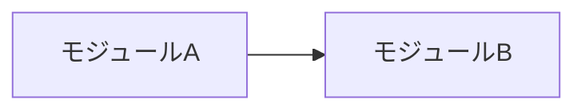
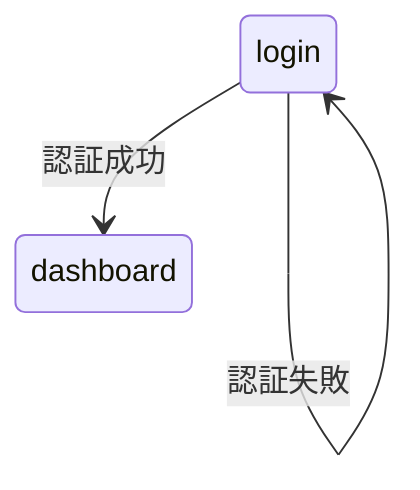
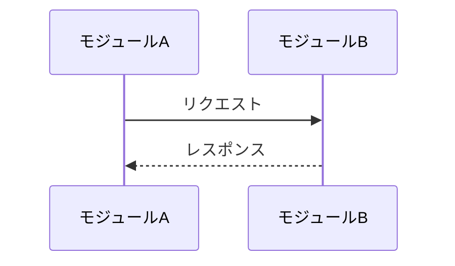

# 全体設計書:<システム名>

<!--
置き場所: docs/02-design/system.md(必須)。
この階層で決めること: 要件をどう実現するかの「構造」。
  アーキテクチャ / **モジュール分割の定義**(この体系で最も重要な設計成果物。
  03-impl と実装のファン アウト単位はここで決まる) / モジュール間インターフェース(契約) /
  データモデル / 主要フロー / エラーハンドリング方針 /
  テスト戦略(3レベルの方針・結合テストの担当・E2Eシナリオ一覧) / 設計判断の理由。
決めないこと: 1行1行のコード、関数の内部実装。
ただし「契約」はコードレベルで書いてよい(API形状、スキーマ、CLIフラグ、環境変数名)。
ロジックの実装スニペットは書かない。設計判断には必ず「なぜ選んだか」「何を捨てたか」を書く。
モジュールが大きく本ファイルが4,000語を超える場合は、そのモジュールの詳細
(コンポーネント内部構造、詳細フロー等)を docs/02-design/<module-slug>.md に
切り出してよい(このテンプレートを流用し、id をモジュールスラッグ、source に本ファイルを指定)。
-->

## 概要

(設計の全体像。上流: [要件定義](../01-requirements/))

## アーキテクチャ



(構成の説明。どの要件群がどこで満たされるか)

## モジュール分割定義 ※この体系の要

<!-- 03-impl と実装はこの表の単位でファン アウトする。
     ここにないモジュールの 03-impl を作ってはならない。
     分割の変更(追加・統合・分割)はこの表の変更であり、/change の origin_layer: design 案件 -->

| モジュール(slug) | 責務 | 対応する要件(領域/要件番号) | 依存モジュール | 詳細設計 | 03-impl |
|---|---|---|---|---|---|
| (例: auth) | 認証・セッション管理 | core/要件1〜3 | なし | なし | 03-impl/auth.md |
| (例: billing) | 課金・請求 | billing/要件1〜5 | auth | 02-design/billing.md | 03-impl/billing.md |

### 分割の根拠

(なぜこの単位で切ったか。結合度・変更頻度・チーム分担などの観点)

## モジュール間インターフェース(契約)

<!-- モジュールをまたぐ呼び出し・イベント・データ受け渡しの契約。型つきで -->

### <呼び出し元> → <呼び出し先>

```
methodName(param: Type) -> ReturnType
```

## UI設計 ※必須(UIがないシステムは「UIなし(理由)」と明記)

<!-- 画面の分割・構成は「構造」でありモジュール分割と同じく設計の成果物。ここが画面構成のSSOT。
     ピクセルレベルの見た目(細かなレイアウト・装飾)はここでは規定しない:
     steering/product.md のデザイン原則・トークンに従いAIの実装に委ねる。
     画面数が多い場合は 02-design/frontend.md(このテンプレート流用)に切り出してよい。
     フロントエンドモジュールの 03-impl にはルーティング表・コンポーネント構成・状態管理を書く -->

### 画面一覧

| 画面(slug) | 目的 | 主要項目 | 状態(loading/empty/error等) | 対応する要件 |
|---|---|---|---|---|
| (例: login) | 認証 | メール、パスワード、MFAコード(有効時) | loading / auth-error / locked | core/要件1 |

### 画面遷移



## データモデル(全体)

<!-- システム横断のエンティティと所有モジュール。詳細は各モジュールの詳細設計/03-implへ -->

| エンティティ | 所有モジュール | 概要 |
|---|---|---|
| | | |

## 主要フロー(モジュール横断)



## エラーハンドリング方針

(システム共通の方針。要件の IF...THEN 基準との対応)

## テスト戦略

<!-- 単体・結合・E2E の3レベルすべてについて方針を決める(このセクションもテスト設計のSSOT)。
     曖昧語禁止はここにも適用: ツール・実行環境・テストデータ・実行タイミングを具体名で書く。
     対象外とするレベルは「対象外(理由)」と明記(空欄のまま残さない)。
     - 単体テストの個別ケースはここに書かない(各モジュール03-implのテスト対応表が担う)
     - 結合テストは契約ごとに「担当モジュール」を決める(そのモジュールの03-implに載る)
     - E2Eシナリオは01のユースケースから導出する。ここにないE2Eテストを実装してはならない
       (シナリオ追加は /change。導出元のユースケース追加なら origin は requirements) -->

### レベル別方針

| レベル | 対象 | ツール/実行環境 | 方針(テストデータ・範囲・実行タイミング) |
|---|---|---|---|
| 単体 | モジュール内(受け入れ基準単位) | | |
| 結合 | モジュール間契約 | | |
| E2E | ユースケース(下のシナリオ一覧) | | |

### 結合テスト対象

<!-- 「モジュール間インターフェース(契約)」の全契約を列挙し、結合テストの担当モジュール
     (どちらの03-implのテスト対応表に載せるか)を決める。原則は呼び出し元が担当 -->

| 契約(呼び出し元→呼び出し先) | 検証観点 | 担当モジュール |
|---|---|---|
| | | |

### E2Eシナリオ一覧

<!-- 01の全ユースケースをカバーすること。カバーしないUCは「対象外(理由)」の行として残す。
     このシナリオIDを docs/03-impl/e2e.md のテスト対応表が参照する -->

| シナリオID | 対応ユースケース | 検証するフロー(画面遷移・主要フローとの対応) | 優先度 |
|---|---|---|---|
| E2E-1 | UC-1 | (例: login → dashboard → 帳票出力) | Must |

## 設計判断と代替案

### 判断1:<採用した選択>

- **採用:**
- **却下した代替案:**
- **理由:**

## 要件カバレッジ確認

<!-- 全業務領域の全要件(非機能含む)がいずれかのモジュールに対応していること -->

| 要件(領域/番号) | 対応モジュール |
|---|---|
| core/要件1 | |
| core/非機能(性能) | |

## 未解決事項(Open Questions)

-
