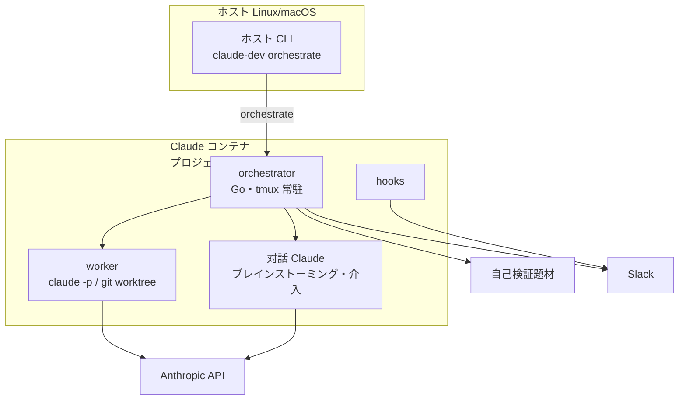
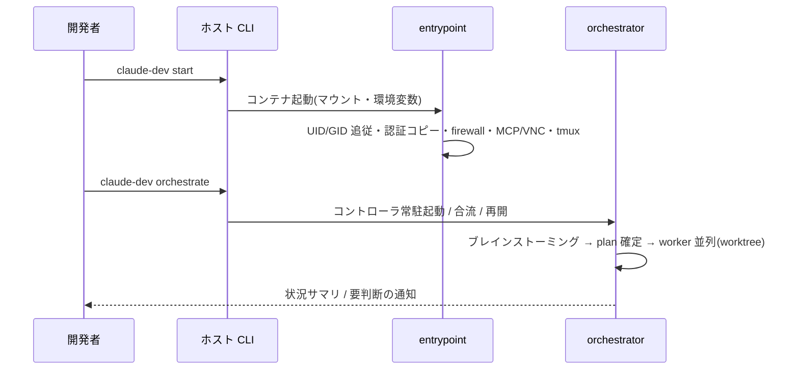
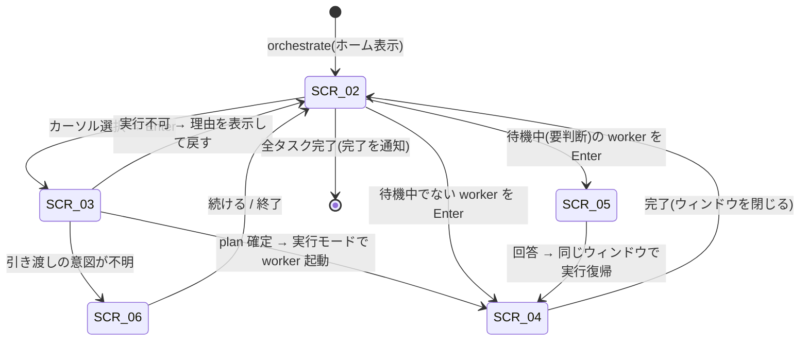

# オーケストレーター 基本設計(抽出)

> **この文書の位置づけ**
> `claude-dev-env` の仕様ドキュメント(SSOT)から、**オーケストレーターに関わる設計だけ**を
> 原文のまま抜き出した**抽出物**である。SSOT ではないので `verified`(検証済み記録)を持たない。
> ID(`DSN-*` / `MOD-*` / `CTR-*` / `PLAN-*` / `SCR-*` / `E2E-*`)は**抽出元と同一**である。
> 上流は [00.md](00.md) と [01.md](01.md)。
> 最後の「## 分離時に切れる依存」に、開発環境側へ残る依存を全件並べてある。

## 全体構成(オーケストレーター周辺)

- `orchestrator`(Go、コンテナ内常駐)が 2 モードで worker を並列制御する。
- オーケストレーターの起動は**コンテナ起動の後段に固定**する(`DSN-arch-03`)。
- 運用状態は `/workspace/.orchestrator/` に置き、機械だけが読み書きする。

## コンポーネントの責務

| コンポーネント | 責務 | 対応要件 |
|---|---|---|
| claude-dev(ホスト CLI)の `orchestrate` | コンテナ内で orchestrator を起動・合流させる | FR-orch-01, FR-orch-02 |
| orchestrator | 2モードの制御ループ・worker 並列・介入・レビュー・TUI・通知・状態保全 | FR-orch-01〜FR-orch-08 |
| hooks | エージェントのイベントを受けてプロンプト保存と通知を行う | FR-orch-07 |
| 自己検証題材 | オーケストレーターを実走させて振る舞いを確認するための題材 | FR-orch-09 |

## データの流れ

1. **ソースコード**: worker は `/workspace` 内の git worktree で作業し、**統合はコントローラが
   直列に**行う。
2. **運用状態**: オーケストレーターの plan・制御・状態・追記型ログは `/workspace/.orchestrator/` に
   置き、機械だけが読み書きする。

## 外部システムとの境界

| 外部システム | 何を渡すか | 何を受け取るか | 失敗時の方針 |
|---|---|---|---|
| Anthropic API | プロンプト(worker / 対話 Claude 経由) | 応答 | エージェント側の失敗として扱う。実行ループは停止条件に従う |
| Slack | 通知本文(**コントローラのみ**) | なし | 失敗しても実行を止めない。**トークンは worker へ渡さない** |

## 設計判断(アーキテクチャ級)

### DSN-arch-02 の該当部分 — 運用状態の置き場

永続する状態のうち、オーケストレーターが所有するのは**運用状態**(`/workspace/.orchestrator/`)である。
plan・制御・状態・追記型ログを置き、**機械のみが読み書きする**。

| エンティティ | 置き場所 | 所有 | 共有範囲 |
|---|---|---|---|
| plan / control / state / 追記型ログ | 運用状態 | orchestrator | プロジェクト固有 |

- 理由: 「共有すべきもの(認証)」と「共有してはならないもの(セッション・運用状態)」を置き場所で
  分けると、同期ループも片付け操作も分岐を持たずに済む。
- 影響する要件: FR-orch-05

### DSN-arch-03 主要フロー(起動から自律実行まで)

- 判断: 利用者の操作から自律実行までを次の一本道に固定し、途中に別経路を作らない。

- 理由: オーケストレーターの起動をコンテナ起動の後段に固定すると、認証・ネットワーク・ポートの
  前提が整った状態から始められる。
- 却下した案: オーケストレーターをホスト側で動かす — レビュー前コードをホストで実行することになり、
  隔離の目的に反する。
- 影響する要件: FR-env-01, FR-orch-01, FR-orch-02

### DSN-orch-01 自作の外部制御ループ(コントローラがループを所有する)

- 判断: 継続/停止の判定をコードが持つ外部制御ループを自作し、推論ループは `claude -p` / 対話 Claude
  から借りる。
- 理由: 暴走しない・コンテキストを汚さない・再開可能。変化の速い依存を中核に据えると配布の安定性に
  リスクがある。
- 却下した案: Docker Agent 方式(推論と委譲の配管を任せる) — 変化が速く中核に据えられない。
  Stop-hook による力技の連続走行 — 停止条件を LLM の裁量に委ねることになる。
- 影響する要件: FR-orch-02, FR-orch-03, FR-orch-05

### DSN-orch-02 コントローラは tmux セッションに常駐させる

- 判断: コントローラを `orch-<project>-main` セッションの `dashboard` ウィンドウで常駐させ、
  worker とブレインストーミングを同セッションの独立ウィンドウにする。**生存判定はプロセスの存在で行う。**
- 理由: クライアント端末が壊れても tmux サーバがセッションを保持するため、再接続で復旧できる。
  完全デーモン化より単純で、ダッシュボードの描画を別プロセスに分けずに済む。セッションの存在で
  生存を判定すると、空き殻を生存と誤判定して二重起動や合流不能を招く。
- 却下した案: `setsid` による完全デーモン化 — 描画の別プロセス化が必要で複雑になる。
  常駐しない — 端末を閉じると実行が失われる。
- 影響する要件: FR-orch-02(受け入れ基準2・4), NFR-avail-01

## モジュール分割定義(該当分)

| モジュールID | 責務 | 対応要件 | 依存 | relations の接頭辞 |
|---|---|---|---|---|
| MOD-cli-orchestrate | コンテナ内で orchestrator を起動する(ゴール指定・`--fresh` 対応、未起動時の自動起動) | FR-orch-01, FR-orch-02, NFR-avail-01, NFR-ops-02, SR-20 | MOD-cli-common, MOD-cli-start | `MODULE-cli-orchestrate` |
| MOD-orchestrator | 2モードの制御ループ、worker の並列実行と分離、タスク単位の介入、相互レビュー、TUI、通知、状態保全 | FR-orch-01〜FR-orch-08, NFR-perf-03, NFR-avail-01, NFR-avail-03, NFR-sec-03, NFR-ops-04, SR-21, SR-22, SR-31 | — | `MODULE-orchestrator-*` |
| MOD-hooks | エージェントのフックからプロンプトを保存し、通知を送る | FR-orch-07, NFR-sec-03, NFR-avail-03 | — | `MODULE-hooks-*` |
| MOD-sample-project | 自己検証題材の配置と、題材そのもの | FR-orch-09, SR-23 | — | `MODULE-sample-project-*` |

<!-- MOD-makefile は開発環境側と共有のモジュールだが、orch-sample / orch-sample-clean /
     build-orchestrator の3ターゲットを持つ。抽出には含めていない(分離先で Makefile を
     作り直すため)。 -->

### 分割の根拠(該当分)

#### DSN-mod-01 モジュールは「利用者から見た入口」と1対1にする

- 判断: ホスト CLI をサブコマンド単位で1モジュールに割り、Makefile・スクリプト・Go プログラムも
  それぞれ入口の単位で割る。
- 理由: 変更が起きる単位が入口(サブコマンド・ターゲット・常駐プロセス)であり、影響範囲を
  「どのコマンドが変わるか」で説明できる。
- 却下した案: ファイル単位で割る — 1ファイルに複数の入口が同居し、影響範囲が引けない。
  機能グループで割る — 境界が主観的になり、コードとの1対1が崩れる。

#### DSN-mod-06 モジュールあたりの機能数の上限を超えている2モジュールを許容する

- 判断: `MOD-orchestrator`(19機能)は、1モジュールあたり 15 本という分割見直しの目安を超えるが、
  分割しない。
- 理由: `MOD-orchestrator` は入口が1つ(単一バイナリ)で 219 シンボルを持ち、ファイル境界=責務境界で
  機能へ昇格させた結果が 19 本である。これを1機能に畳むと「1機能=1バイナリ」になり境界が消える。
  逆にモジュールを分けると、単一バイナリが複数モジュールにまたがることになり `DSN-mod-01` の
  1対1が崩れる。
- 却下した案: orchestrator を複数モジュールへ割る — 物理配置との1対1が崩れる。

## 要件カバレッジ確認(該当分)

**`充足` はこの設計がその条項を覆っているか**を言う(4値: `完全` / `部分(P-nn)` / `対象外(理由)` / `-`)。
1条項につき主担当モジュールはちょうど1つ。

| 受入基準 ID | 割り当てモジュール | 充足 | 根拠 |
|---|---|---|---|
| FR-orch-01-1 | MOD-cli-orchestrate | 完全 | -(設計判断を要さない) |
| FR-orch-01-2 | MOD-orchestrator | 完全 | -(設計判断を要さない) |
| FR-orch-01-3 | MOD-orchestrator | 完全 | -(設計判断を要さない) |
| FR-orch-01-4 | MOD-orchestrator | 完全 | DSN-arch-02 |
| FR-orch-01-5 | MOD-orchestrator | 完全 | -(設計判断を要さない) |
| FR-orch-01-6 | MOD-orchestrator | 完全 | DSN-ui-01 |
| FR-orch-01-7 | MOD-orchestrator | 完全 | -(設計判断を要さない) |
| FR-orch-02-1 | MOD-orchestrator | 完全 | DSN-orch-01 |
| FR-orch-02-2 | MOD-orchestrator | 完全 | DSN-orch-02 |
| FR-orch-02-3 | MOD-orchestrator | 完全 | DSN-prompt-03 |
| FR-orch-02-4 | MOD-cli-orchestrate | 完全 | DSN-orch-02 |
| FR-orch-02-5 | MOD-cli-orchestrate | 完全 | -(設計判断を要さない) |
| FR-orch-03-1 〜 FR-orch-03-11 | MOD-orchestrator | 完全 | -(設計判断を要さない) |
| FR-orch-04-1 〜 FR-orch-04-9 | MOD-orchestrator | 完全 | -(設計判断を要さない) |
| FR-orch-05-1 | MOD-orchestrator | 完全 | DSN-log-02 |
| FR-orch-05-2 〜 FR-orch-05-10 | MOD-orchestrator | 完全 | -(設計判断を要さない) |
| FR-orch-06-1 | MOD-orchestrator | 完全 | -(設計判断を要さない) |
| FR-orch-06-2 | MOD-orchestrator | 完全 | DSN-prompt-02 |
| FR-orch-06-3 〜 FR-orch-06-7 | MOD-orchestrator | 完全 | -(設計判断を要さない) |
| FR-orch-07-1 〜 FR-orch-07-4 | MOD-orchestrator | 完全 | -(設計判断を要さない) |
| FR-orch-07-5 | MOD-hooks | 完全 | -(設計判断を要さない) |
| FR-orch-07-6 | MOD-hooks | 完全 | -(設計判断を要さない) |
| FR-orch-08-1 | MOD-orchestrator | 完全 | DSN-ui-02 |
| FR-orch-08-2 〜 FR-orch-08-4 | MOD-orchestrator | 完全 | -(設計判断を要さない) |
| FR-orch-08-5 | MOD-orchestrator | 完全 | DSN-prompt-01 |
| FR-orch-08-6 〜 FR-orch-08-8 | MOD-orchestrator | 完全 | -(設計判断を要さない) |
| FR-orch-09-1 | MOD-sample-project | 完全 | -(設計判断を要さない) |
| FR-orch-09-2 | MOD-orchestrator | 完全 | -(設計判断を要さない) |
| FR-orch-09-3 〜 FR-orch-09-6 | MOD-sample-project | 完全 | -(設計判断を要さない) |
| NFR-perf-03 | MOD-orchestrator | 完全 | DSN-prompt-03 |
| NFR-avail-01 | MOD-orchestrator, MOD-cli-orchestrate | 完全 | DSN-orch-02 |
| NFR-avail-03 | MOD-entrypoint, MOD-firewall, **MOD-orchestrator, MOD-hooks**, MOD-vm-mode | 完全 | DSN-fw-01(ファイアウォール分。**他の補助機能の失敗許容は各契約のエラーケースが定める**) |
| NFR-sec-03 | MOD-orchestrator, MOD-hooks | 完全 | -(設計判断を要さない) |
| NFR-ops-04 | MOD-orchestrator | 完全 | -(設計判断を要さない) |
| SR-21 | MOD-docker-proxy, **MOD-orchestrator** | - | 技術前提。充足は適用外。Go 実装 |
| SR-22 | MOD-orchestrator | - | 技術前提。充足は適用外。TUI のみ外部依存を許容し vendor へ同梱する |
| SR-23 | MOD-sample-project | - | 技術前提。充足は適用外。Python + pytest の自己検証題材 |
| SR-31 | MOD-docker-proxy, **MOD-orchestrator** | - | 技術前提。充足は適用外 |

<!-- 抽出元では FR-orch-03-1〜11 のように1条項1行で書かれている。ここでは根拠がすべて同じ
     「-(設計判断を要さない)」である連続区間だけをまとめた。条項 ID の集合は変えていない。 -->

## 契約1: CTR-cli-orchestrator(ホスト CLI(orchestrate) → orchestrator)

- 当事者: MOD-cli-orchestrate → MOD-orchestrator
- 対応要件: FR-orch-01, FR-orch-02, FR-orch-05
- 責任モジュール(結合テスト): MOD-orchestrator

### 呼び出しの形

| 項目 | 内容 |
|---|---|
| 契機 | 利用者が `claude-dev orchestrate [--fresh] ["<ゴール>"]` を実行したとき |
| 実行場所 | コンテナ内(CLI はコンテナへ入って起動する) |
| 引数 | ゴール文字列(省略可能)、`--fresh`(状態を退避して新規に始める) |
| 生存判定 | コントローラの**プロセスの存在**で分岐する(セッションの存在では判定しない) |
| 分岐 | 生存 → 合流 / 不在でセッションだけ残る → 空き殻として作り直す / 何も無い → 新規起動 |

### 受け渡す設定

設定は **4段でマージ**する(弱い順): 組込既定 → ユーザー設定(`~/.config/claude-dev.yaml` の
`orchestrator:` 節)→ プロジェクト設定(`<workspace>/.orchestrator/config.yaml`)→ 環境変数。
**環境変数の段は Slack の資格情報にのみ適用する**(他のキーを環境変数で上書きすることはできない)。

| キー | 型 | 必須 | 既定値 | 受理する値 | 不正値のときの扱い |
|---|---|---|---|---|---|
| `max_workers` | 整数 | 任意 | `5` | 1 以上 | **黙って無視**し、より弱い段の値を保つ |
| `stuck_limit` | 整数 | 任意 | `3` | 1 以上 | 同上。**0 以下を設定に書いても採用されない**(内部値が 0 以下になるのは別経路のみ) |
| `max_review_rounds` | 整数 | 任意 | `10` | 1 以上 | 同上 |
| `review_format_error_limit` | 整数 | 任意 | `2` | 1 以上 | 同上 |
| `worker_grace_seconds` | 整数 | 任意 | `10` | **0 以上**(0 は「猶予なし」を意味する有効値) | 同上 |
| `merge_strategy` | 文字列 | 任意 | `merge` | `merge` / `rebase` | **列挙の検証をしない。** 未知の値は `merge` として扱う |
| `worker_permission_mode` | 文字列 | 任意 | `bypassPermissions` | 任意の文字列。**空文字は「フラグを渡さない」を意味する有効値** | 検証しない |
| `SLACK_BOT_TOKEN`(環境変数) | 文字列 | 任意 | なし | 任意 | 未設定なら通知を行わない |
| `SLACK_CHANNEL`(環境変数) | 文字列 | 任意 | `U5SJG0XEK` | 任意 | 空文字は無視して既定を保つ |

#### 設定ファイルの字句規則

設定ファイルは **YAML の部分集合**として解釈する(汎用の YAML パーサではない)。契約として
定めるのは次のとおり。

| 項目 | 規則 |
|---|---|
| 1行の形 | **最初の `:` でキーと値に分ける。** キーと値の前後の空白は落とす。`:` の直後の空白は**任意**(`max_workers:5` も受理する) |
| 値に含まれる `:` | **2つ目以降の `:` は値の一部**として保つ |
| 空行 / 行頭 `#` の行 / `:` を含まない行 / キーが空の行 | 無視する |
| 行末コメント | **落とす。** 値が `"` / `'` で始まらないとき、最初の「空白 + `#`」以降を捨てる |
| 引用符 | **値の前後の `"` と `'` を落とす。** `''` は空文字として扱う(`worker_permission_mode` に空文字を渡す書き方) |
| リスト(`- 値`) | `:` を含まないので無視する |
| 重複キー | **後の行が勝つ** |
| 未知のキー | 無視する(警告は出さない) |
| ユーザー設定(`~/.config/claude-dev.yaml`) | **`orchestrator:` セクションの直下(インデントされた行)だけ**を読む。インデントの無い行はセクションの切り替え判定に使う |
| プロジェクト設定(`<workspace>/.orchestrator/config.yaml`) | **セクション無しの平坦な並び**として読む。インデントは落とすため、`orchestrator:` 配下に書いても同じ結果になる |

**入れ子構造(2段以上)・複数行の値・アンカー等の YAML 機能は解釈しない。**

**不正値を黙って無視する**という共通規則の意味: 値が受理できない場合、その段の指定は**無かったこと**に
なる。**組込既定へ戻るとは限らない**(より弱い段で有効な値が指定されていればそれが残る)。
警告もログも出さないため、**利用者は設定が効いていないことに気づけない**。

**設定に含めないもの**:

- **モデルと effort**。1箇所のポリシー表で工程別に決める(`FR-orch-07` / `NFR-ops-04`)。
  互換のため `worker_model` キーは解析されるが、**選択には使われない**。
- **レビュアのベンダー**。`reviewer_vendor` キーは解析されて保持されるが、**選択には使われない**
  (レビュアの選択はこの契約の範囲外である)。異種ベンダーのレビュアーを常用へ昇格する判断は
  `D0-orch-17` が未決として持ち、実装の予定は `docs/issues/007-future-heterogeneous-vendor-reviewer.md`、
  設定が効かないという実装側の事実は
  `docs/issues/012-modify-reviewer-vendor-setting-has-no-effect.md` が追跡する。

### エラーケース

| 条件 | 期待する振る舞い |
|---|---|
| コンテナが起動していない(Linux) | 自動で起動してから続行する |
| コンテナが起動していない(macOS) | 起動を促して終了コード 1 で終わる |
| セッションはあるがコントローラが不在 | 空き殻として作り直す。run は状態から再開される |
| 未完了の plan が残っている | `--fresh` が無い限り、その run を継続する |
| 設定ファイルが存在しない | エラーにしない。その段を飛ばす |
| 設定ファイルが読めない(権限・破損) | エラーにしない。その段を飛ばす |
| 設定値が型として解釈できない、または受理する値域の外 | 上表のとおり黙って無視し、起動を止めない |
| 設定ファイルに未知のキーがある | 無視する。警告は出さない |

### 設計判断: DSN-orch-02 の適用

生存判定をプロセスの存在で行うのはこの契約の要点である(理由は上の `DSN-orch-02`)。
セッション名を呼び出し側に推測させないため、セッション名は orchestrator 側から提示できるようにする。

**既知の未適合(設計意図ではなく実装の遅れ)**: macOS 版(`claude-dev-mac`)はこの契約の
「生存判定」「分岐」を満たしておらず、したがって `FR-env-10`(OS によらず同じ観測可能な結果)も
**macOS では現状満たされていない**。**この契約は Linux 実装を正とし、macOS を追随させる方針を
維持する。** 追跡は `docs/issues/003-future-macos-orchestrator-scope.md`。
**未適合の中身(何がどう違うか)は 03-impl 側が持つ。**

### 順序性・冪等性・並行性の背景

- **冪等**: 実行中に再度呼んでも二重に run を起こさない(合流する)。
- **並行**: 同一プロジェクトで同時に2つの run を持たない。異なるプロジェクトの run は独立する。
- **順序**: コンテナ起動 → オーケストレーター起動。逆順は成立しない。

### 認可の考え方

コンテナ内で実行できる利用者だけが起動できる。運用状態(`.orchestrator/`)は機械の所有物とし、
人間による直接編集を前提にしない。

## 契約2: CTR-orchestrator-prompt(orchestrator → worker / 対話 Claude)

- 当事者: MOD-orchestrator → worker(非対話のエージェント)/ 対話 Claude
- 対応要件: FR-orch-01, FR-orch-03, FR-orch-04, FR-orch-05, FR-orch-06, FR-orch-08
- 責任モジュール(結合テスト): MOD-orchestrator

### 渡すもの

#### worker へのプロンプト(構成要素の順序は固定)

プロンプトは**下表の順に連結した1本の文字列**である。任意の要素は、条件を満たさないとき
**その見出しごと出力しない**(空の見出しを残さない)。

| # | 要素 | 見出し | 必須 | 出力する条件 | 中身 |
|---|---|---|---|---|---|
| 1 | VM モードの前置 | `# VM モード` | 任意 | VM モードで動作しているとき | `docker` の向き先と bind mount の制約 |
| 2 | プロジェクト方針の前置 | `# プロジェクト固有の判断基準（ORCHESTRATOR.md）` | 任意 | リポジトリルートに `ORCHESTRATOR.md` があり、内容が空でないとき | そのファイルの全文 |
| 3 | プランのゴール | `# Goal` | **必須** | 常に | plan のゴール(文脈。**採点基準ではない**) |
| 4 | プランの完了条件 | `# Completion criteria` | **必須** | 常に | plan の完了条件 |
| 5 | タスク | `# Task: <タイトル>` | **必須** | 常に | タスクの説明 |
| 6 | タスクの完了条件 | `# This task's completion criteria (scope-limited; deliver exactly this)` | 任意 | タスクの完了条件が空白のみでないとき | このタスクだけの受入基準 |
| 7 | 先行タスクの文脈 | `# Context from prerequisite tasks` | 任意 | 依存タスクのうち**完了して結果の要約を持つもの**が1件以上あるとき | `- <タスクID>: <要約>` の行の並び |
| 8 | 前回試行のフィードバック | `# Feedback from previous attempt (try a different approach)` | 任意 | 呼び出し側がフィードバックを渡したとき(再試行・差し戻し) | レビューの重大指摘の要約、または再試行の理由 |
| 9 | 結果スキーマの指示 | (見出しなし) | **必須** | 常に | 下記「受け取るもの」の JSON スキーマと、判断規則(下記4区分に当たらない判断は仮定を置いて進む / 人間へ上げるのは4区分だけ)・逐次コミットの義務・不可逆操作の禁止 |

**タスクの完了条件(#6)は空を許さない。** 空のまま実行段階へ入ることは plan の検査で拒否する
(レビューの唯一の採点基準がこれであるため)。

| 起動時の引数 | 型 | 必須 | 既定値 | 意味 |
|---|---|---|---|---|
| 作業ディレクトリ | パス | **必須** | なし | そのタスク専用の git worktree。worker はここでのみ作業しコミットする |
| モデル | 文字列 | **必須** | ポリシー表が決める | 設定ではなくポリシー表で工程別に決める(`FR-orch-07`) |
| reasoning effort | `low`/`medium`/`high`/`xhigh`/`max` | **必須** | ポリシー表が決める | 同上 |
| 権限モード | 文字列 | 任意 | `bypassPermissions` | 空文字なら**指定しない**。ヘッドレスでは対話的な権限応答ができないため、非対話で通るモードを既定にする |
| セッション ID | UUID v4 | 任意 | 新規発行 | 新規試行では新しい ID を発行する |
| 再開指定 | 真偽 | 任意 | 偽 | 真なら**同一 Attempt の継続**として同じセッション ID で再開する。偽なら新規セッション |
| 猶予秒 | 整数(0 以上) | 任意 | `worker_grace_seconds` | 中断時に強制終了までに与える猶予。0 は猶予なし |

#### レビュアへのプロンプト

worker と同じ #1・#2 の前置に続き、**レビュー対象のタスク**・**このタスクの完了条件(唯一の
採点基準)**・**プランのゴール(文脈のみ。採点基準にしない)**・出力形式の指示を連結する。
レビュアは「実装者ではない独立のレビュア」として振る舞い、**このタスクの完了条件を満たすかどうか
だけ**で `critical` / `major` を付ける(他タスクの責務・プロジェクト全体の網羅性を理由に
重大指摘を出さない)。

#### 対話 Claude(ブレインストーミング / 介入)への指示

| 要素 | 渡し方 | 必須 | 出力する条件 |
|---|---|---|---|
| 差し戻しの申し送り | システムプロンプト追記の先頭 | 任意 | 直前の実行が plan 検査で差し戻され、申し送りが残っているとき。**読んだら削除する(1回だけ消費)** |
| VM モードの前置 / プロジェクト方針の前置 | 同上 | 任意 | worker と同じ条件 |
| 指示テンプレート | 同上 | **必須** | 常に。**イメージ同梱**のテンプレートを読む。読めなければ空文字として扱い、起動そのものは止めない |
| 介入の質問 | 初回プロンプト | **必須**(介入のとき) | 1件ずつ解決する経路では対象1件の質問、まとめて解決する経路では未解決の全件を区切って連結する |

### 受け取るもの

**「必須」列の意味**: この列は **worker / レビュア / 対話 Claude に課す義務**であって、
**受け側が検証する項目ではない**。受け側は欠けているフィールドを**エラーにせず既定値で埋める**
(「既定値」列がその値である)。したがって「必須」は「**欠けていても停止しないが、
欠けていれば既定値として扱われる期待**」を意味する。**唯一の例外は `done`** で、これは
結果の行を選ぶ条件そのものなので、`done` を欠く出力は「結果ではない」と判定される
(下の「エラーケース」の該当行)。検証を行わない根拠は `D0-orch-15`(★2026-08-04 改め。
**スキーマ強制はツールでは行わない**)である。

#### worker の結果(1行の JSON オブジェクト)

worker は出力の**最終行に1個の JSON オブジェクトだけ**を出す。

| フィールド | 型 | 必須 | 既定値 | 制約 |
|---|---|---|---|---|
| `done` | 真偽 | **必須** | なし | このフィールドの存在が「結果の行である」ことの判定に使われる |
| `summary` | 文字列 | **必須** | `""` | 後続タスクへ渡す文脈になる。空文字なら後続へ渡さない |
| `changes` | 文字列の配列 | **必須** | `[]` | 変更点の列挙 |
| `assumptions` | 文字列の配列 | 任意 | `[]` | **`needs_human` の4区分に当たらない判断は、仮定を置いてここに記録し進む**(人間へ上げない)。監査ログへ追記される |
| `needs_human` | オブジェクト または `null` | 任意 | `null` | 非 `null` かつ `done=false` のときだけ介入を起こす |
| `needs_human.reason` | 列挙 | **必須**(親が非 `null` のとき) | なし | `critical_decision` / `ambiguity` / `policy_branch` / `prerequisite_broken` の4つだけ。**この4つ以外は介入を起こさない**(下の「エラーケース」参照) |
| `needs_human.question` | 文字列 | **必須**(同上) | なし | 人間に見せる質問文 |
| `needs_human.options` | 文字列の配列 | 任意 | `[]` | 選択肢の候補 |
| `usage` | オブジェクト または `null` | 任意 | `null` | 非 `null` のとき監査ログへ追記する |
| `usage.input_tokens` / `usage.output_tokens` | 整数 | **必須**(親が非 `null` のとき) | `0` | トークン計上(ベストエフォート) |

#### レビュアの結果(1行の JSON オブジェクト)

| フィールド | 型 | 必須 | 既定値 | 制約 |
|---|---|---|---|---|
| `findings` | オブジェクトの配列 | **必須** | `[]` | **空配列は「受入を妨げるものが無い」を意味する**(合格) |
| `findings[].severity` | 列挙 | **必須** | なし | `critical` / `major` / `minor`。**`critical` と `major` だけが差し戻しを起こす** |
| `findings[].file` | 文字列 | **必須** | なし | 指摘箇所のパス |
| `findings[].message` | 文字列 | **必須** | なし | 指摘の内容 |
| `findings[].aspect` | 文字列 | **必須** | なし | 観点。`requirements` / `security` を主に使う |
| `usage` | オブジェクト または `null` | 任意 | `null` | worker と同じ |

#### 制御ファイル(対話 Claude → コントローラ)

機械のみが読み書きする。対話 Claude が終了する前に**原子的に**書き、コントローラが前面に
戻ったときに**読んで削除する**(1回だけ消費)。

| フィールド | 型 | 必須 | 既定値 | 制約 |
|---|---|---|---|---|
| `request` | 列挙 | **必須** | なし | `execute` / `resume` / `continue_brainstorming` / `abort` / `accept` の5つだけ。**これ以外は「ファイルが無い」と同じ扱い**にしてファイルを削除する |
| `intervention_id` | 文字列 | 任意 | `""` | 介入への回答のとき、どの介入かを指す |
| `ts` | RFC3339 の文字列 | 任意 | `""` | 書いた時刻 |

介入の回答本文は制御ファイルではなく**介入ごとの回答ファイル**に書く(制御ファイルは
「どう進むか」だけを運ぶ)。

### エラーケース

| 条件 | 期待する振る舞い |
|---|---|
| worker のプロセスが非 0 で終了した | その試行を失敗として扱い、結果の解釈を試みない |
| worker の出力に解釈可能な結果 JSON が無い | **失敗として扱う**(成功と解釈しない)。部分的に一致する JSON を推測で補完しない |
| worker の結果 JSON に `done` が無い | 「結果の行ではない」と判定する。他に候補が無ければ上と同じ扱い |
| worker の結果 JSON に `done` 以外の「必須」フィールドが無い | **検証しない。**「既定値」列の値として扱い、警告も出さない(`summary` → `""` / `changes` → 空 / `usage` → 未計上)。検証を行わないことの根拠は `D0-orch-15`(スキーマ強制はツールでは行わない)である |
| `needs_human.reason` が4つの列挙以外 | **介入を起こさない**(発火判定は4つの列挙だけを見る)。`done=false` なら通常の失敗として次の試行に回り、試行回数が上限に達したときだけ行き詰まりとして介入へ回る。**worker の申告そのものは失われる**(`docs/issues/015`) |
| レビュアが構造化出力で返らない | **1回だけ再整形を試みる**。再整形は散文を JSON へ写すだけで、**判定内容は変えない**。成功すれば通常の判定として扱う |
| 再整形しても解釈できない | フォーマットエラーを1回数える。**worker は再実行しない**(実装は完了しているため、レビューだけをやり直す) |
| 同一フォーマットエラーが `review_format_error_limit`(既定 2)回続いた | 自動リトライを打ち切り、**ゲートの不具合**として介入へ回す。ここでも worker は再実行しない |
| 解釈できた判定が1回でも返った | フォーマットエラーの連続回数を 0 に戻す |
| レビューの往復が `max_review_rounds`(既定 10)に達した | 差し戻しを続けず打ち切る。最後の重大指摘を残して行き詰まりとして扱う |
| 古い制御ファイルが残っている | 対話を起こす**直前に破棄する**(古い指示を誤って消費しない) |
| 制御ファイルが壊れている / 読めない | 「無い」と同じ扱いにし、**ファイルを削除して**から人間に端末で確認する。壊れたファイルで以後の実行が詰まらないようにする |
| 対話 Claude が制御ファイルを書かずに終了した | 「無い」と同じ扱い。人間に端末で確認する |
| 指示テンプレートがイメージに無い | 空文字として扱い、起動は止めない |
| `ORCHESTRATOR.md` が読めない / 空 | 前置を省いて続行する(完全な no-op) |
| 通知トークン等の秘密情報 | 子プロセスの環境から**除去する**(worker・レビュア・対話 Claude のいずれへも渡さない) |

### 設計判断

#### DSN-prompt-01 指示テンプレートはイメージへ同梱し、プロジェクト側に置かない

- 判断: ブレインストーミング・介入・worker・レビューの指示テンプレートをイメージに同梱し、プロジェクトの
  リポジトリには置かない。プロジェクト固有の方針だけを `ORCHESTRATOR.md` として前置する。
- 理由: テンプレートをプロジェクトに置くと、プロジェクトごとに古い版が残り、挙動が揃わなくなる。
  一方でプロジェクト固有の方針は必要なので、前置という限定した口を1つだけ開ける。
- 却下した案: すべてプロジェクト側に置く — 版が揃わない。前置の口も設けない — プロジェクト固有の
  制約を伝えられない。

#### DSN-prompt-02 採点基準はタスクの完了条件のみとする

- 判断: レビューの採点をタスクの完了条件だけで行い、プラン全体のゴールへフォールバックしない。
- 理由: 基準が曖昧になると差し戻しが恣意的になり、改訂ループが終わらない。
- 却下した案: ゴールでも採点する — 個々のタスクでは達成しえない基準で不合格が出る。

#### DSN-prompt-03 worker へ渡す文脈は「必要な最小限」を選ぶことで絞り、長さの上限は課さない

- 判断: プロンプトに載せるのは **plan のゴール・完了条件・当該タスクの説明と完了条件・
  完了した依存タスクの結果要約・前回試行のフィードバック**だけとする。
  **文字数やトークン数の上限は設けず、切り詰めも行わない。**
- 理由: 依存タスクの成果物そのものではなく**要約だけ**を渡すことで文脈は実用上の範囲に収まる。
  一方で上限を設けると、上限に触れた瞬間に**どの情報を落とすかという判断**が必要になり、
  落とし方を誤ると worker が前提を失って失敗する(切り詰めの誤りは無音の劣化になる)。
  上限に達した場合はエージェント CLI 側がエラーを返し、その試行の失敗として観測できる。
- 却下した案: 文字数上限で機械的に切り詰める — 落とす情報の選択を機械に委ねることになる。
  依存タスクの成果物を全文渡す — 文脈が急速に膨らみ、上限に達しやすくなる。
- 由来: `NFR-perf-03` 第2文(「コンテキストウィンドウに収まる範囲に絞る」)は目標値も測定方法も
  持たず、実装も上限を検出しないため、**2026-08-04 に要件から外して本設計判断へ降ろした**
  (`docs/issues/035`)。

### 順序性・冪等性・並行性の背景

- **並行**: worker は並行に走る。統合(マージ)はコントローラが直列に行う。
- **順序**: 介入の突合は実行中の実体に対して行う(ディスクの別コピーに対して行うと乖離して
  実行が恒久停止する)。
- **冪等**: 同一 Attempt の再開は、完了済みのタスクを再実行しない。

### 認可の考え方

プロンプトを組み立てるのはコントローラだけである。worker と対話 Claude は指示の受け手であり、
通知や状態更新の発信源にはしない(`NFR-sec-03`)。

## 想定機能連携(該当分)

| PLAN-ID | モジュール | kind | sync | 呼び出し元 | 呼び出す先 | 契約 | 対応要件 | 概要 |
|---|---|---|---|---|---|---|---|---|
| PLAN-cli-orchestrate | MOD-cli-orchestrate | tool | sync | なし | PLAN-cli-common-container-name, PLAN-cli-common-is-running, PLAN-cli-common-require-setup, PLAN-cli-common-resolve-container-user, PLAN-cli-start | CTR-cli-orchestrator | FR-orch-01, FR-orch-02 | コンテナ内で orchestrator を起動する(ゴール指定・--fresh 対応) |
| PLAN-orchestrator-main | MOD-orchestrator | tool | sync | なし | 同一モジュール内部で完結(03 側では複数の機能へ展開される。粒度差であって連携の欠落ではない) | CTR-cli-orchestrator | FR-orch-01, FR-orch-02, FR-orch-05 | フラグを解釈し実行環境を組み立てて制御ループを起動する |
| PLAN-hooks-save-prompt | MOD-hooks | tool | sync | なし | なし | なし | FR-orch-07 | Claude Code フックから渡されたプロンプトを一時ファイルへ保存する |
| PLAN-hooks-send-slack-message | MOD-hooks | tool | sync | なし | なし | なし | FR-orch-07 | Claude Code フックの通知をプロンプト文脈つきで Slack へ送る |
| PLAN-sample-project-scaffold | MOD-sample-project | tool | sync | なし | なし | なし | FR-orch-09 | サンプルプロジェクトと seed plan を作業領域へ配置する |
| PLAN-makefile-orch-sample | MOD-makefile | tool | sync | なし | なし | なし | FR-orch-09 | orchestrator 自己検証用のサンプルプロジェクトを配置する |
| PLAN-makefile-orch-sample-clean | MOD-makefile | tool | sync | なし | なし | なし | FR-orch-09 | サンプルプロジェクトの生成物を削除する |
| PLAN-makefile-build-orchestrator | MOD-makefile | tool | sync | なし | なし | なし | FR-orch-01 | orchestrator をローカルでビルドしテストする |

<!-- MOD-orchestrator の内部関数(18本)は「同一モジュール内部で完結する private helper」として
     02 には書かない取り決めである(機能の総数は 03 の機能表が持つ)。 -->

### PLAN-orchestrator-main(連携の詳細)

- 目的: 2モードの制御ループを起動し、以降の自律実行を担う。
- 契機と前提条件: `PLAN-cli-orchestrate` から起動されたとき。コンテナが起動しており、
  `/workspace` が git リポジトリであること。
- 呼び出す先ごとの期待: 同一モジュール内部で完結する(制御ループ・状態・レビュー・TUI)。
  外部との連携は、worker/対話 Claude へのプロンプト注入(`CTR-orchestrator-prompt`)と通知に限る。
- 順序性・冪等性・並行性: 未完了の plan が残っていれば再開する(新規実行にしない)。
  worker は並行、統合は直列。
- 対応する設計判断: DSN-orch-01, DSN-orch-02

## テスト戦略

### DSN-test-01(該当部分)自動テストは Go に集中させる

- 判断: 単体テストは Go(orchestrator)と自己検証題材(Python)に置く。Bash と Makefile には
  自動テストランナーを設けず、実機確認と E2E で担保する。結合テストは契約ごとに
  **観測可能な側**へ責任を割り当てる。
- 理由: 検査ロジックと状態遷移という間違えやすい部分は Go 側に集中しており、そこは機械検証できる。
  「本物のバイナリで通す E2E は、モックでは見つからない欠陥を捕まえる」という実測経験も、
  この配分の根拠である。
- 却下した案: bats 等で Bash の単体テストを整備する — 実行環境の用意が本体より重い。
  すべてを E2E に寄せる — 失敗時の切り分けができない。

| レベル | 方針 | ツール | 実行環境 | データ | 実行タイミング |
|---|---|---|---|---|---|
| 単体 | **状態遷移・レビュー判定・プロンプト生成**を機械検証する | `go test`(orchestrator)、`pytest`(題材) | ホストまたはコンテナ内。外部サービスに接続しない | テスト内で組み立てる。一時ディレクトリを使い後始末する | 変更時と PR |
| 結合 | モジュール間の契約を、観測可能な側から検証する | `go test`(**orchestrator のプロンプト生成と制御ファイル検知**)+ 実機確認 | Go は単体と同じ。実機分はコンテナ起動を伴う | 契約ごとに下表の担当モジュールが用意する | 変更時。実機分はリリース前 |
| E2E | ユースケースを実操作で通す。オーケストレーターは自己検証題材で実走する | 実機(`claude-dev` の実操作)+ `make orch-sample` | 実際のホストとコンテナ。実 tmux・実エージェント | 自己検証題材(使い捨ての作業コピー) | リリース前と、関係する変更のたび |

### 結合テスト対象(該当分)

| 契約 ID | 契約の当事者 | テストを持つ責任モジュール |
|---|---|---|
| CTR-cli-orchestrator | MOD-cli-orchestrate → MOD-orchestrator | MOD-orchestrator(観測側。実 tmux と実エージェントを要するため手段は実機確認=E2E-04 / E2E-05) |
| CTR-orchestrator-prompt | MOD-orchestrator → worker / 対話 Claude | MOD-orchestrator(生成と検知は `go test`。実プロセスとの結合は実機確認=E2E-04) |

### E2E シナリオ(該当分)

| E2E ID | 対応 UC | シナリオ | 対象/対象外 |
|---|---|---|---|
| E2E-04 | UC-04 | `orchestrate` → ブレインストーミング → plan 確定 → worker 並列 → 要判断1件のみ待機・他は継続 → 回答で復帰 → 完了(`make orch-sample` で題材を配置して実走) | 対象(Must) |
| E2E-05 | UC-05 | 実行中に端末を全終了 → `orchestrate` 再実行 → 合流/再開・完了済みの非再実行・plan と履歴の保持 | 対象(Should) |

## UI設計

本システムの UI はターミナル主体である(Web GUI は無い)。オーケストレーターの接点は TUI である。

### DSN-ui-01 UI はターミナル主体とし、Web GUI を持たない

- 判断: 利用者との接点をホスト CLI と TUI の2つに限る。
- 理由: 利用者は開発者であり、作業の場が端末と SSH の中にある。Web GUI を足すと、ホストへ新たな
  待ち受けを開くことになり(`NFR-sec-01`)、認証も別途必要になる。
- 却下した案: Web ダッシュボードを提供する — ポート公開と認証の追加が必要で、隔離方針と衝突する。

### 画面一覧(該当分)

| 画面ID | 画面名 | 目的 | 関連 UC |
|---|---|---|---|
| SCR-02 | orch-dashboard | 実行モードの俯瞰と worker の選択 | UC-04, UC-05 |
| SCR-03 | orch-brainstorming | ゴール・仕様を対話で固める | UC-04 |
| SCR-04 | orch-worker | worker のライブ出力 | UC-04 |
| SCR-05 | orch-intervention | 要判断1件への回答 | UC-04 |
| SCR-06 | orch-endmenu | 引き渡しの意図が判別できないときの選択 | UC-04 |

<!-- SCR-01(cli-commands)はホスト CLI の 18 サブコマンドの画面であり、開発環境側なので
     抽出していない。分離先が独自の CLI を持つなら、その入口の画面を新たに定義すること。 -->

### DSN-ui-02 移動はカーソル選択と Enter 確定でのみ行う

- 判断: ダッシュボードからの移動は、カーソル選択(↑↓/jk)と Enter 確定でのみ発生させる。
  数字キーでの即時移動と全画面再描画は行わない。対話モードからの抜け方は全モードで統一する。
- 理由: 選択と確定を分離しないと、カーソルを動かしただけで画面が飛び、利用者が現在地を見失う。
  全画面再描画はちらつきの原因になる。TUI と子プロセスが同じ端末を共有するため、描画の主導権を
  一箇所に持たせる必要もある。
- 却下した案: 数字キーで即時移動する(旧実装) — 誤操作で意図しないウィンドウへ飛ぶ。
  全消去・全再描画 — ちらつく。

### 画面ごとの項目と状態

#### SCR-02 orch-dashboard

| 項目 | 型・制約 | 必須 | 備考 |
|---|---|---|---|
| ゴール | 文字列 | 必須 | plan 未確定なら未設定と表示する |
| worker 一覧 | タスクID・状態・カーソル選択 | 必須 | 状態は実行中/レビュー中/待機(要判断)/完了/失敗/ブロック |
| 要判断の件数 | 整数 | 必須 | 0 件でも項目は表示する |
| 直近サマリ・仮定の件数 | 文字列・整数 | 任意 | 取得に失敗しても描画を止めない |

状態: **初期**=ホーム表示 / **読込中**=状態の読み取り中 / **エラー**=補助情報の取得失敗を
警告として表示(描画は継続) / **空**=worker が無い(ブレインストーミングへ誘導) /
**完了**=全タスク完了の表示。

#### SCR-03 orch-brainstorming / SCR-04 orch-worker / SCR-05 orch-intervention / SCR-06 orch-endmenu

| 項目 | 型・制約 | 必須 | 備考 |
|---|---|---|---|
| 対話本文 | エージェントの TUI をそのまま表示 | 必須 | SCR-03 / SCR-05 |
| 番号付き選択肢 | 1 から始まる連番 | 必須(選択を求めるとき) | 番号での回答を受理する |
| ライブ出力 | 整形済みのログ | 必須 | SCR-04 |
| メニュー項目 | 続ける / 実行する(実行可能なときのみ)/ 終了する | 必須 | SCR-06 |

状態: **初期**=モード遷移のバナー(日本語)/ **対話中**=エージェントの応答待ち /
**回答待ち**=要判断の質問を表示 / **エラー**=理由を日本語で表示 / **完了**=ウィンドウを閉じて
ダッシュボードへ戻る。

### デザイン方針

- 人間の判断・入力を求める表示はすべて日本語にする。選択肢には必ず番号を付ける。
- 利用者に運用状態ファイルの直接編集を促さない(修正は対話へ誘導する)。
- 前提不足(未セットアップ・未認証・設定ファイルが無い)は、止めずに次の操作を案内する。
  止めざるを得ない場合は、原因と復旧手段を日本語1行で示してから終了する。
- 端末が対話的でない場合は、選択を求めずに既定値で進む。

## ログ戦略・ログ仕様(該当分)

オーケストレーターが持つのは2系統である: **利用者向けの端末出力**(tmux ウィンドウ)と、
**機械が読む追記型ログ**(運用状態)。

### ログレベルの定義と使い分け

| レベル | 何を出すか | 出さないもの |
|---|---|---|
| ERROR | 処理を続けられず終了する失敗。原因と、利用者が次に取るべき操作をセットで出す | 想定内の分岐 |
| WARN | 主機能は続くが、期待した状態になっていないこと(補助情報の取得失敗、通知の送信失敗) | 正常な省略 |
| INFO | 利用者が状況を追うために必要な進捗(モード遷移、待機の経過) | 内部の関数呼び出し |
| DEBUG | 開発時の調査用。既定では出さない | 常時出力 |

**利用者向けの端末出力は日本語**とする(`FR-orch-08` の受け入れ基準3)。追記型ログは機械可読性を優先する。

### 出力先と保持期間

| 対象 | 出力先 | 形式 | 保持期間 |
|---|---|---|---|
| orchestrator(利用者向け) | tmux ウィンドウ | テキスト(日本語) | セッションの寿命と同じ |
| orchestrator(運用状態) | `/workspace/.orchestrator/*.jsonl` | JSON Lines(1行1イベント) | **自動削除しない**(片付け時も `history/<run_id>/` へ退避する。`D0-orch-13`) |

### 必須フィールド

追記型ログ(JSON Lines)にのみ適用する。端末出力には課さない。

| フィールド | 意味 | 例 |
|---|---|---|
| `ts` | 発生時刻 | ISO 8601 |
| `event` | 出来事の種別 | `dispatch` / `result` / `assumption` / `intervention` |
| `task_id` | 対象タスク | plan 内で一意 |
| `attempt` | 何回目の試行か | 整数 |
| `detail` | 種別ごとの内容 | 構造化された値 |

`run_id` はファイルの置き場所(`history/<run_id>/`)が担うため、行には持たせない。

### 出してはならない情報

- 認証情報の中身: OAuth の資格情報、API キー、**通知トークン**。
  存在するかどうか・どこに置いたかは出してよいが、値は出さない。
- **利用者のソースコードそのもの**(worker のライブ出力に現れる差分は端末のみで、追記型ログには
  結果の要約だけを残す)。

### 主要イベントのログ仕様(該当分)

| イベント | レベル | 出力内容 | 対応要件 |
|---|---|---|---|
| タスクの委譲 | (追記型) | `dispatch`。task_id / attempt / モデル | **なし**(下の注記) |
| 実行結果 | (追記型) | `result`。成否と要約 | **なし**(下の注記) |
| 仮定の記録 | (追記型) | `assumption`。置いた仮定と理由 | FR-orch-04(受け入れ基準4) |
| 介入の発生と回答 | (追記型) | `intervention`。トリガー種別と回答の要約 | FR-orch-04(受け入れ基準4) |
| 通知の送信失敗 | WARN | 失敗した旨のみ(トークンは出さない) | FR-orch-07(受け入れ基準5) |

**`dispatch` と `result` の「対応要件」が「なし」である理由**: この2種を根拠づける非機能要件が
01 に存在しない。**実装はこの2種を出力し続けている**ので、ログ仕様の行は残し、要件の裏付けが
無いという事実をここに明示する(行ごと消すと「02 に無いログを実装が出す」状態を隠すことになる)。
この状態そのものは `docs/issues/061` が追跡する。

### 監視・アラート

本システムは常時監視の対象ではない(開発者の手元で動く開発環境である)。人間への非同期の
通知だけを持つ。

| 条件 | 通知先 | 対応の期待 |
|---|---|---|
| 要判断が発生した | Slack(設定されている場合) | 利用者が戻って回答する。未設定なら通知しない |
| 全タスクが完了した | Slack(同上) | 成果を確認する |
| 完了条件の未充足の可能性 | Slack(同上) | 助言であり、実行はブロックしない |

### DSN-log-01 ログ基盤を統一せず、性格ごとに出力先を分ける

- 判断: 端末出力・常駐プロセスのログ・追記型ログを、それぞれ別の出力先・別の形式で扱う。
  共通のログライブラリや集約基盤を持たない。
- 理由: 3種類は寿命も読み手も違う。端末出力は人間が今読むもの、追記型ログは機械が再開・監査に
  使うものである。統一すると、人間向けの日本語出力に構造化の制約がかかり、逆に追記型ログに
  装飾が混ざる。
- 却下した案: 全ログを JSON で統一する — 利用者向けの案内が読みにくくなる。集約基盤へ送る —
  開発者の手元で動く環境に常時稼働の依存を増やすことになる。

### DSN-log-02 追記型ログは削除せず退避する

- 判断: 運用状態の追記型ログを自動削除しない。片付け時も `history/<run_id>/` へ退避する。
- 理由: 中断・再開でやり直しを起こさないことが本ツールの価値であり、その根拠になる記録を
  自動処理で失ってはならない(`D0-orch-13`)。
- 却下した案: 一定期間で削除する — 再開の根拠を失う。実削除は利用者の明示操作にのみ委ねる。

## 開発環境(該当分)

### lint・テストコマンド

| 用途 | コマンド | 備考 |
|---|---|---|
| lint | `go vet ./...` | `orchestrator/` ディレクトリで実行する |
| 単体テスト(orchestrator) | `cd orchestrator && go test -mod=vendor ./...` | 制御ループ・状態・レビュー・プロンプト生成など |
| 単体テスト(自己検証題材) | `cd examples/orch-sample && pytest` | 題材プロジェクト |
| build | `make build-orchestrator` | orchestrator をローカルでビルドしテストする |
| 自己検証題材の配置 / 初期化 | `make orch-sample` / `make orch-sample-clean` | — |
| E2Eテスト | 自動テストランナーは無い。`make orch-sample` で題材を配置し `claude-dev orchestrate` で実走する | 手順は 03-impl のテスト仕様 |

- `-mod=vendor` は `SR-22`(TUI の外部依存をリポジトリへ同梱する)の帰結である。

### コールグラフ抽出設定(該当分)

| 項目 | 値 |
|---|---|
| internal_roots | `orchestrator/` / `examples/orch-sample/` |
| 有効な言語 | go / python |
| Tier | go=2 / python=2 |
| 除外するパス | `orchestrator/vendor/` / `.orchestrator/` |

## 未解決事項

- なし。

## 分離時に切れる依存(開発環境側に残るもの)

オーケストレーターだけを別プロジェクトにすると、**下の依存は分離先に存在しなくなる**。
いずれもこの抽出物の本文に書かれている前提であり、**分離先で代替を用意するか、記述を書き換えるかの
どちらかが必要**である(ここでは決めていない — 外から見えて後戻りしにくい判断であるため)。

| # | 依存している相手 | 抽出物のどこに現れるか | 分離先で必要になること |
|---|---|---|---|
| 1 | `MOD-cli-start` / `MOD-cli-common`(コンテナの起動・名前導出・稼働判定) | `PLAN-cli-orchestrate` の「呼び出す先」全件、`CTR-cli-orchestrator` のエラーケース「コンテナが起動していない」 | 起動の入口を自前で持つか、外部コマンドとして呼ぶかの選択 |
| 2 | `MOD-entrypoint`(認証のコピーと書き戻し、tmux の開始) | `DSN-arch-03` のシーケンス、`CTR-cli-orchestrator` の「実行場所」 | Claude / Codex の認証をどう得るか([00.md](00.md) 分離時に決めること #3) |
| 3 | コンテナイメージ(指示テンプレートの同梱先) | `DSN-prompt-01`、`CTR-orchestrator-prompt`「指示テンプレート」 | **テンプレートの同梱先を決め直す。** 「プロジェクト側に置かない」という判断は、イメージという同梱先があって初めて成立する |
| 4 | `/workspace` というマウント先 | `FR-orch-03-1`(worktree)、`DSN-arch-02`(運用状態 `/workspace/.orchestrator/`)、`PLAN-orchestrator-main` の前提条件 | 作業ディレクトリと運用状態の置き場の規約 |
| 5 | VM モード(`MOD-vm-mode`) | `CTR-orchestrator-prompt` の worker プロンプト要素 #1「VM モードの前置」、`FR-orch-08-7`(VM のヘルス取得失敗) | **VM モードが無くなるなら、前置 #1 とヘルス取得の記述を削ること**(残すと存在しない機能への参照になる) |
| 6 | `MOD-makefile` | `FR-orch-09-1` / `-3`(`make orch-sample` / `make orch-sample-clean`)、`PLAN-makefile-*` | 自己検証題材の配置コマンドの入口 |
| 7 | ファイアウォール(`MOD-firewall`) | `NFR-avail-03` の担い手、外部依存表の「Anthropic API はファイアウォールで許可する」 | Anthropic API への到達性の前提を書き直す |
| 8 | `NFR-sec-01` への参照 | `DSN-ui-01` の理由(「ホストへ新たな待ち受けを開くことになり」) | Web GUI を持たない理由を、分離先の文脈で書き直す |
| 9 | 開発環境側の `docs/issues/*` | `D0-orch-15` / `CTR-cli-orchestrator` / `CTR-orchestrator-prompt` / ログ仕様が計8件を参照(003 / 007 / 012 / 015 / 035 / 058 / 059 / 061) | **未解決の欠陥を分離先へ持ち越すか、元プロジェクトに残すかを決める。** 参照だけ残して実体が無い状態にしないこと |
