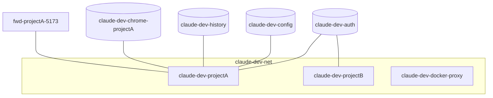

<!-- change: add。id: local-docker-resources / source: docs/02-design/architecture.md -->

# ローカルのインフラ構成 — Docker リソース

開発者のホスト上に作られる Docker リソースの一覧と命名規則。**すべて `claude-dev-` 接頭辞を持つ**
(`DSN-arch-02`)。

## 構成図

## リソース一覧

| リソース | 種別 | 用途 | 誰が作るか |
|---|---|---|---|
| `claude-dev-net` | ネットワーク | Claude コンテナと docker-proxy の通信。**全プロジェクトで共有**(分離しない) | `MODULE-cli-common-ensure-infrastructure` / `MODULE-makefile-network` |
| `claude-dev-auth` | ボリューム | 認証の共有(Claude 直下 / Codex は `codex/` サブディレクトリ) | 同上 / `MODULE-makefile-volumes` |
| `claude-dev-config` | ボリューム | シェル設定の共有 | 同上 |
| `claude-dev-history` | ボリューム | コマンド履歴の永続化 | 同上 |
| `claude-dev-chrome-<name>` | ボリューム | Chrome プロファイル。**コンテナごとに分離**(共有すると同時起動でプロファイルが壊れる) | `MODULE-cli-start` |
| `claude-dev-vm-<name>` | ボリューム | VM モードのゲストディスク | `MODULE-cli-start`(`--vm` 時) |
| `claude-dev-<project>` | コンテナ | プロジェクトごとの Claude コンテナ | `MODULE-cli-start` |
| `claude-dev-docker-proxy` | コンテナ | Docker API の検査プロキシ。**全プロジェクトで共有** | `MODULE-cli-start`(必要時に起動) |
| `fwd-<name>-<port>` | コンテナ | ポート中継(使い捨て) | `MODULE-cli-forward` |
| `claude-dev-claude` / `claude-dev-claude-vnc` / `claude-dev-docker-proxy` | イメージ | 配布・ビルド成果物 | `MODULE-makefile-build*` / `MODULE-cli-pull` |

## ネットワーク

| 項目 | 値 |
|---|---|
| ネットワーク名 | `claude-dev-net`(共有。プロジェクトごとに分離しない) |
| docker-proxy の公開 | **ホストへ公開しない**。`claude-dev-net` 内でのみ到達可能 |
| Claude コンテナの公開ポート | 既定は無し。ブラウザ確認ありのときだけ noVNC を 6080 番台から動的に割り当てる |
| フォワードのホスト側ポート | 8100〜8999 から動的に割り当てる |
| compose のプロジェクト名 | コンテナ名を compose 互換へ正規化した値(`COMPOSE_PROJECT_NAME`)。共有ネットワークは分離しない |

## 権限・ロール

| 主体 | 権限 | 付与理由 |
|---|---|---|
| Claude コンテナ | `NET_ADMIN` / `NET_RAW` | コンテナ内でファイアウォールを適用するため |
| Claude コンテナ | `--security-opt` を**付けない** | Docker 既定の seccomp / AppArmor を有効に保つ(`NFR-sec-01`) |
| docker-proxy | ホストの Docker ソケットへの読み書き | 検査済みのリクエストを中継するため。**Claude コンテナには渡さない** |

## シークレットの置き場所

| シークレット | 保管場所 | 参照方法 |
|---|---|---|
| Claude / Codex の認証 | ボリューム `claude-dev-auth` | 起動時にコンテナローカルへコピーし、30 秒ごとに書き戻す(`CTR-cli-container`) |
| SSH 秘密鍵 | **ホスト側に置いたまま**。コンテナへは渡さない | プロジェクト専用 ssh-agent のソケットのみ転送する |

値そのものはどのドキュメントにも書かない。

## 環境変数

コンテナへ渡す環境変数の一覧と既定値は `docs/03-impl/contracts/cli-container.md` が正。

## デプロイ手順

| やりたいこと | コマンド |
|---|---|
| リソースを作る | `make setup`(または `claude-dev setup`) |
| ネットワーク/ボリュームだけ作る | `make network` / `make volumes` |
| 状態を見る | `make status` / `claude-dev list` |
| 1プロジェクト分を片付ける | `claude-dev stop <name>` |
| 全部消して初期化する | `claude-dev reset`(または `make clean`) |

## 他環境との差異

| 項目 | この環境 | 他環境 | 差異の理由 |
|---|---|---|---|
| macOS | ポートは直結(SSH トンネル不要)。VM モードは非対応 | Linux はフォワード + SSH トンネル、VM モードあり | Docker Desktop の仕組みと KVM の有無による(`FR-env-10`) |

## 既知の制限・運用上の注意

| 事項 | 影響 | 関連 issue |
|---|---|---|
| コンテナ名がディレクトリ名だけで決まる | 別パスの同名ディレクトリが同一セッション扱いになる | なし |
| 空きポートの選定から起動までが原子的でない | 同時起動でポート競合が起きうる(再試行で吸収する) | なし |
| `claude-dev-net` を共有している | プロジェクト間でネットワーク的な到達性がある(単一共有 docker-proxy 前提の帰結。`D0-env-05`) | なし |
| `logout` / `reset` は共有ボリューム全体を空にする | Claude と Codex の認証が同時に消える(`D0-auth-01` の帰結) | なし |
