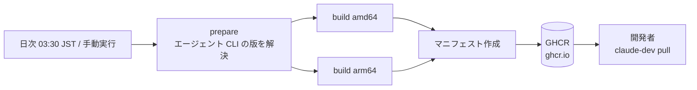

<!-- change: add。id: local-ghcr / source: docs/02-design/architecture.md
     IaC(ワークフロー定義)が正で、ここは索引である。値そのものが秘密のものは置き場所だけ書く。 -->

# ローカル(配布)のインフラ構成 — GHCR

本システムはサーバとしてデプロイされる製品ではないため、インフラと呼べる構成は
**配布イメージの公開先(GHCR)だけ**である。`dev` / `prod` 環境は存在しない。

## 構成図

## リソース一覧

| リソース | 種別・サイズ | 用途 | 定義箇所 |
|---|---|---|---|
| ワークフロー | GitHub Actions | 日次ビルドと公開 | `.github/workflows/ghcr-images.yml` |
| `prepare` ジョブ | ジョブ | エージェント CLI の版を具体バージョンへ解決する | `.github/workflows/ghcr-images.yml:46`〜`:78` |
| ビルドジョブ | マトリクス(アーキテクチャごと) | イメージのビルドと push | `:127`〜`:140` |
| レジストリ | `ghcr.io` | 配布先 | `:29` |
| 配布イメージ | 2種(ブラウザ確認あり/なし) | 開発者が取得する | `.devcontainer/Dockerfile.claude` の終端ステージ |

## ネットワーク

| 項目 | 値 |
|---|---|
| 公開範囲 | GHCR 上のリポジトリの可視性に従う(組織内) |
| ホストへの公開ポート | 無し(配布はレジストリ経由のみ) |

## 権限・ロール

| 主体 | 権限 | 付与理由 |
|---|---|---|
| GitHub Actions のワークフロー | GHCR への `packages: write` | イメージを push するため |
| 開発者 | GHCR からの read | イメージを取得するため |

## シークレットの置き場所

| シークレット | 保管場所 | 参照方法 |
|---|---|---|
| GHCR への認証 | GitHub Actions が発行する一時トークン | ワークフロー内の標準の仕組みで参照する(値をリポジトリに置かない) |

**API キー・OAuth の資格情報はイメージにもワークフローにも置かない**(`SR-03`)。

## 環境変数

| 変数 | 値の出どころ | 既定値 | 必須 |
|---|---|---|---|
| `REGISTRY` | ワークフローの環境変数 | `ghcr.io` | 必須 |
| `CLAUDE_VERSION` | `prepare` ジョブが `latest` チャネルから解決。手動実行時は入力で上書きできる | 解決値 | 必須 |
| `CODEX_VERSION` | `prepare` ジョブが npm registry から解決。手動実行時は入力で上書きできる | 解決値 | 必須 |
| `IMAGE_VERSION` | ビルド時刻(JST)から作るタイムスタンプ | — | 必須 |

## デプロイ手順

1. 日次スケジュール(`cron: '30 18 * * *'` = 03:30 JST)で自動実行される。
2. 切り戻し・臨時ビルドは手動実行(`workflow_dispatch`)で行い、必要ならエージェント CLI の
   バージョンを入力で指定する。

| やりたいこと | コマンド |
|---|---|
| 取得 | `claude-dev pull` |
| ローカルで作り直す(配布に依存しない) | `make build` |
| 切り戻し | ワークフローを手動実行し、`claude_version` / `codex_version` に既知の良い版を指定する |

## 他環境との差異

| 項目 | この環境 | 他環境 | 差異の理由 |
|---|---|---|---|
| 環境の数 | local のみ | `dev` / `prod` は**存在しない** | 本システムは開発者の手元で動く開発環境であり、サーバとしてデプロイしない |

## 既知の制限・運用上の注意

| 事項 | 影響 | 関連 issue |
|---|---|---|
| CI 成果物の自動検証が無い | マニフェストのアーキテクチャ・タグ・同梱バージョンの一致は人が確認する(`tests/images.md`) | なし |
| 日次ビルドが失敗しても通知の仕組みが無い | 更新が滞っていることに気づきにくい | なし |
| `use_legacy_landlock` が撤去された版を引く可能性 | 監査・QA の codex 呼び出しが壊れる。イメージ更新後は疎通確認を再実行する(`02-design/environments.md`) | なし |
