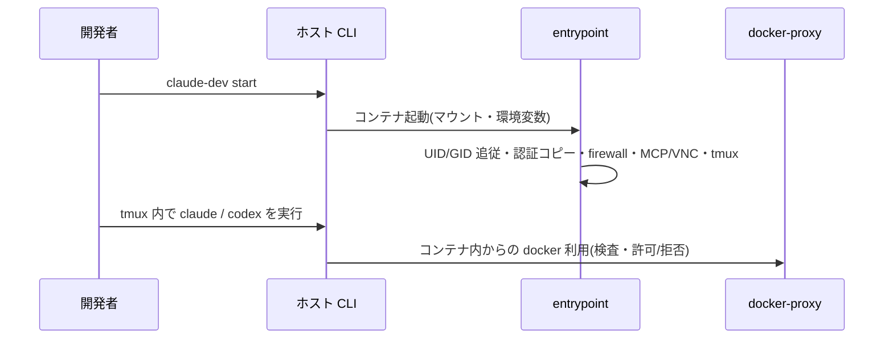
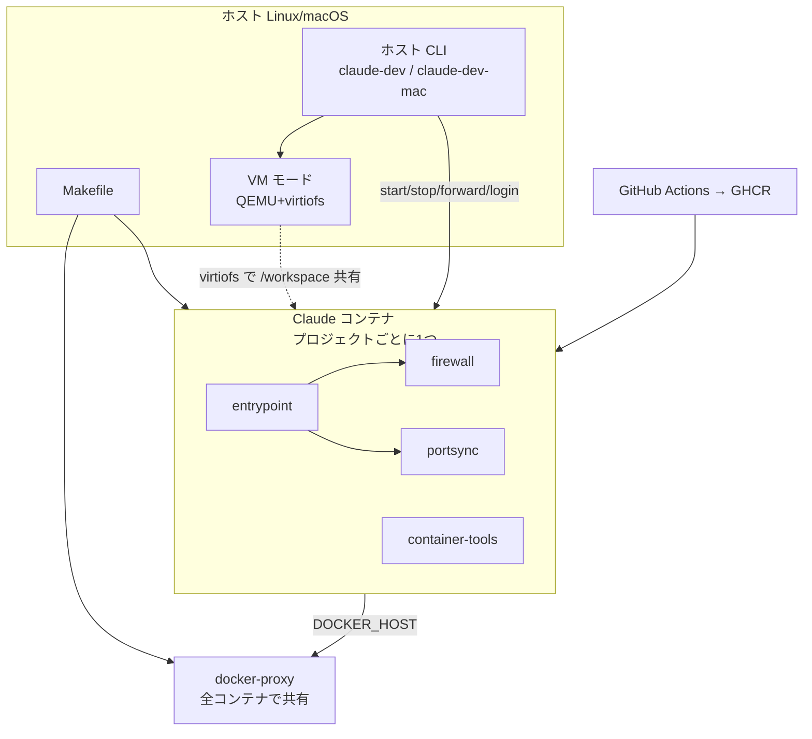

<!-- 改名する子見出しは、親を `sections` に載せたまま親本文へ入れ子にすると
     `compose-changeset.py` の merge_existing が「親本文経由の新規子見出し」として拒否するため、
     ここへ出してある。反映位置は frontmatter の anchors が決める。
     `.claude/directions/change-set.md` §2「Renaming is an explicit old-child deletes: plus
     that independently anchored new child」。 -->

### DSN-arch-02 状態は「共有ボリューム」と「プロジェクトディレクトリ」の2箇所にだけ置く

- 判断: 永続する状態を次の2種類に限定する。
  1. **共有ボリューム**(`claude-dev-auth` / `claude-dev-config` / `claude-dev-history`): 認証・
     シェル設定・コマンド履歴。全コンテナで共有する。
  2. **プロジェクトディレクトリ**(`/workspace`): ソースコード、`.claude-dev.yaml`、
     **認証・設定の実体**(`/workspace/.claude/` `/workspace/.codex/`。コンテナのホームからは
     symlink で参照する。下の表と `DSN-auth-01` を参照)。

  | エンティティ | 置き場所 | 所有 | 共有範囲 |
  |---|---|---|---|
  | 認証ファイル(Claude / Codex) | 共有ボリューム → **プロジェクトディレクトリ配下(`/workspace/.claude/` `/workspace/.codex/`)へコピー**。ホームからは symlink で参照 | entrypoint(コピーは CLI) | 全コンテナ |
  | セッション・設定(`settings.json` / `config.toml` 等) | プロジェクトディレクトリ | entrypoint | コンテナ固有 |
  | `.claude-dev.yaml`(SSH 鍵の指定) | プロジェクトディレクトリ | ホスト CLI | プロジェクト固有 |
  | Docker リソース(ネットワーク・ボリューム・イメージ) | ホストの Docker | ホスト CLI / Makefile | `claude-dev-` 接頭辞で命名 |
  | **セッション由来の Docker リソース**(コンテナ・ネットワーク) | ホストの Docker | **docker-proxy**(作成要求の中継時に所有者ラベルを付ける) | **名前ではなく所有者ラベルで識別する**(`claude-dev.role=spawned` / `claude-dev.owner-project-dir`。名前は利用者が決めるので接頭辞の規則を課せない。`DSN-env-04`) |
- 理由: 「共有すべきもの(認証)」と「共有してはならないもの(セッション)」を置き場所で
  分けると、同期ループも片付け操作も分岐を持たずに済む。
- 却下した案: すべてをプロジェクトディレクトリに置く — プロジェクトごとに再ログインが必要になる。
  すべてを共有ボリュームに置く — セッションが混ざり、複数プロジェクトの同時利用が壊れる。
- 影響する要件: FR-env-03

### DSN-arch-03 主要フロー(起動から開発開始まで)

- 判断: 利用者の操作から開発を始められる状態までを次の一本道に固定し、途中に別経路を作らない。

- 理由: 認証・ネットワーク・ポートの前提が整った状態からエージェントを使い始められるようにすると、
  利用者が起動後に追加の準備をしなくて済む。
- 却下した案: エージェントをホスト側で動かす — レビュー前コードをホストで実行することになり、
  隔離の目的に反する。
- 影響する要件: FR-env-01, FR-env-03, FR-env-07

## 全体構成

- 開発者はホスト CLI で Claude コンテナのライフサイクルを操作する。OS 差分はホスト CLI に閉じる。
- コンテナ起動時は `entrypoint` が UID/GID 追従・認証コピー・ファイアウォール起動・MCP/VNC 設定・
  tmux 開始を行う。
- コンテナ内 Docker は共有の `docker-proxy` を介して制限付きで使う。重い案件は VM モード。
- イメージは Makefile でビルドし、GitHub Actions で GHCR へ配布する。

## コンポーネントの責務

| コンポーネント | 責務 | 対応要件 |
|---|---|---|
| claude-dev(ホスト CLI) | コンテナのライフサイクル・ポート・認証・SSH 鍵の操作 | FR-env-01, FR-env-03, FR-env-04, FR-env-06 |
| Makefile | ビルド・セットアップ・CLI の導入/除去 | FR-env-09, FR-env-10 |
| コンテナイメージ | 開発ツール・エージェント CLI・ブラウザ確認資産を同梱した実行基盤 | FR-env-09, FR-env-11, FR-env-12 |
| entrypoint | コンテナ起動時の初期化(UID/GID・認証・既定設定・ファイアウォール・VNC・tmux・同期ループ) | FR-env-02, FR-env-03, FR-env-05, FR-env-11, FR-env-12 |
| firewall | コンテナ内の外向き通信制御 | FR-env-05 |
| docker-proxy | Docker API の検査・書き換え・拒否。全コンテナで共有。**あわせてコンテナ作成要求とネットワーク作成要求へ所有者ラベルを注入し、セッション由来の資源に「誰が後で片付けてよいか」の印を付ける**(`DSN-env-04`。**印を読んで削除するのはホスト CLI 側**である) | FR-env-01, FR-env-07, NFR-sec-01 |
| portsync | 公開ポートの検出と転送(DooD / VM の両経路) | FR-env-06 |
| container-tools | コンテナ内で利用者が使う補助資産(レート制限の待機など) | FR-env-01 |
| VM モード | ゲスト VM の起動・provision・ポート同期・資源逼迫の監視 | FR-env-08 |

## データの流れ

1. **認証**: 利用者がホストでログイン → 一時コンテナが認証ファイルを共有ボリュームへ書く →
   `start` 時にプロジェクトディレクトリ配下へコピー → コンテナ内の同期ループが 30 秒ごとに
   変更を共有ボリュームへ書き戻す。**ホストのホームディレクトリの認証情報は読まない。**
2. **ソースコード**: カレントディレクトリを `/workspace` にマウントする(ライブ反映)。
   VM モードでは同じパスを virtiofs でゲストにも共有する。
3. **Docker 操作**: コンテナ内の `docker` → `DOCKER_HOST` → docker-proxy が検査 →
   **許可(透過)/ 書き換えて許可 / 所有者ラベルを付与して許可 / 拒否** → ホストの Docker Engine。
   検査の対象はコンテナ作成要求・**ネットワーク作成要求**・コマンド実行(exec)作成要求のボディと
   要求パスである(判定の正は `CTR-docker-api`「通信の形」と「検査する要素と判定」)。
   **付与された所有者ラベルは、あとで `stop` / `reset` が片付ける対象を決めるために読まれる**
   (`CTR-cli-container` の `DSN-env-04`)。
4. **公開**: 既定ではポートを公開しない。`forward` のときだけ中継コンテナを立ててホスト側ポートを
   割り当てる。ブラウザ確認ありの場合は noVNC ポートのみ起動時に公開する。

## 外部システムとの境界

| 外部システム | 何を渡すか | 何を受け取るか | 失敗時の方針 |
|---|---|---|---|
| Anthropic API | プロンプト(Claude Code 経由) | 応答 | エージェント側の失敗として扱う |
| OpenAI API | プロンプト(codex 経由) | 応答 | codex を使わない利用者の起動を妨げない |
| GHCR | 認証(CI 側) | 配布イメージ | 取得失敗は非0終了。ローカルビルドで代替できる |
| npm registry / Claude Code リリース配布 | なし | 最新バージョン文字列(CI の prepare) | CI の失敗として扱う。手動バージョン指定で回避する |
| GitHub Meta API | なし | 許可する IP レンジ | 名前解決へフォールバックし、それも失敗した場合は当該通信が不許可になる |
| ホストの Docker Engine | 検査済みの Docker API リクエスト | 応答 | 中継失敗は 502 を返す |

## 設計判断

### DSN-arch-01 ホスト CLI + 隔離コンテナ + 共有 docker-proxy + 任意のゲスト VM の4層構成

- 判断: 開発環境を「ホスト側の CLI」「プロジェクトごとの隔離コンテナ」「全コンテナで共有する
  docker-proxy」「オプトインのゲスト VM」の4つに分ける。利用者の操作はすべてホスト CLI を通り、
  コンテナ内資産は OS を意識しない。
- 理由: 隔離境界をコンテナ/ホスト間の1本に集約でき(`D0-sec-06`)、OS 依存をホスト CLI に閉じられる
  (`NFR-ops-02`)。docker-proxy を共有にすると、プロジェクトが増えてもホスト側の常駐は1つで済む。
- 却下した案: コンテナごとに docker-proxy を立てる — 常駐が増え、ホストのリソースを浪費する。
  ホスト CLI を持たず `docker run` を直接使わせる — マウント・環境変数・鍵の受け渡しを利用者が
  毎回組み立てることになり、構成が揃わない。
- 影響する要件: FR-env-01, FR-env-07, FR-env-10, NFR-ops-02

### DSN-arch-04 配布はマルチアーキ日次ビルドの GHCR 公開に一本化する

- 判断: 配布経路を GHCR のみとし、GitHub Actions の日次ビルドでタイムスタンプタグと `latest` を
  push する。利用者は `claude-dev pull` で取得する。ローカルビルド(`make build`)は開発・
  切り戻し用に残す。
- 理由: チーム全員が同一構成を得るには、配布物が1箇所にあり自動更新されている必要がある。
- 却下した案: 配布せず各自ビルド — 構成が揃わない。手動 push — 更新が滞る。
- 影響する要件: FR-env-09, NFR-perf-01

### DSN-auth-01 認証はコピーと定期書き戻しで共有する(ホームからの参照は symlink)

- 判断: 認証ファイルは起動時に**プロジェクトディレクトリ配下へ**コピーし(ホームからは symlink で参照する)、30 秒ごとの同期ループで共有ボリュームへ
  書き戻す。Claude Code と Codex CLI で同一方式・同一の同期ループを使う。
- 理由: Claude Code は認証ファイルをアトミックに書き込む(一時ファイル → rename)ため symlink が
  壊れる。Codex の `auth.json` はその場書き換えで symlink でも壊れないが、**方式を2つ持たない**
  ことを優先する(同期ループ・`logout`・`reset` の分岐を増やさない)。トークンリフレッシュで内容が
  変わる点は双方に共通で、書き戻しはどちらにも必要。
- 却下した案: symlink 共有 — 壊れる。ホストの認証ファイルを直接マウント — ホストの資格情報を
  コンテナへ渡す経路を作ることになる。同期せず起動時コピーのみ — リフレッシュされたトークンが
  失われ、次回起動で再ログインになる。
- 影響する要件: FR-env-03(受け入れ基準2・3・7・8)

### DSN-dist-01 エージェント CLI の導入は「内容由来キー」で配布ステージの終端レイヤーに置く

- 判断: イメージを4ステージに分ける——重い共通層の `base`、ブラウザ確認資産を積む
  `vnc-base`(`FROM base`)、配布する2つの終端ステージ(`FROM base` / `FROM vnc-base`)。
  Claude Code と Codex CLI の導入は**終端ステージの最終レイヤーにのみ**置き、キャッシュキーには
  CI が解決した具体バージョンを使う。
- 理由: `vnc-base` は `base` に連なるため、`base` 途中の層を失効させるとブラウザ確認資産の高コスト層
  (VNC 一式・Chrome)まで巻き込んで再ビルド・再 push・再 pull になる。終端レイヤーへ移すと失効の
  波及先がエージェント CLI の層だけになり、鮮度(`FR-env-09` 受け入れ基準3・4)と取得の増分性
  (`NFR-perf-01`)を同時に満たせる。
- 却下した案: `base` の途中で導入し日次タイムスタンプで無効化する — 新版が無い日も毎日失効する。
  `base` の途中で導入しバージョンで無効化する — 波及範囲が VNC 層まで及ぶ。実行時に自動更新させる —
  ファイアウォール下・オフライン起動で不確定になり「同一構成の保証」を失う。
- 一般原則: レイヤーチェーンに入れてよいのは**内容由来**の値(実バージョン等)だけであり、時刻など
  内容と無関係に動く値を入れてはならない。内容由来であっても、失効の波及範囲を最小化できる位置
  ——依存される側ではなく終端——に置く。
- 影響する要件: FR-env-09, FR-env-12, NFR-perf-01, NFR-perf-02

### DSN-dist-02 Codex サンドボックスは既定で無効化し、読み取り専用用途だけ landlock で生かす

- 判断: entrypoint が既定3鍵(`sandbox_mode = "danger-full-access"` / `approval_policy = "never"` /
  `[features] use_legacy_landlock = true`)を置く。設定ファイルが無ければ生成し、あれば**書かれて
  いない鍵だけを追記**して既存の値は変えない。既定では codex 自前のサンドボックスを使わないが、
  読み取り専用を明示要求する呼び出しだけは landlock バックエンドで成立させる。
- 理由: codex の Linux サンドボックスは bubblewrap 実装で、ユーザー名前空間の作成とマウント伝播の
  変更を必要とする。Claude コンテナは Docker 既定 seccomp と `docker-default` AppArmor の下で動く
  ため、seccomp が `CLONE_NEWUSER` を拒否し、それを外しても AppArmor が `mount --make-rslave /` を
  拒否する2段構えで起動できない。放置すると codex のシェルコマンドが例外なく失敗し、しかも
  **失敗が静かに起きる**(モデルが失敗を認識せず出力を捏造する。`codex doctor` も検知せず、
  `codex exec` の終了コードは 0 のまま)。隔離境界はコンテナ/ホスト間のみという前提(`D0-sec-06`)
  のもとでは、コンテナ内の二重サンドボックスは元から想定していない。
- 却下した案: `--security-opt` で seccomp と AppArmor を外す — 隔離境界そのものを弱める。
  既定のまま運用する — シェルコマンドが例外なく失敗する。設定ファイルをイメージへ焼き込む —
  プロジェクトごとに設定を変える余地を失う。landlock を使わず添付方式で回避する — 恒久策にすると
  codex にファイルを読ませる経路が使えなくなる(`use_legacy_landlock` が撤去された場合の退避先
  としては残す)。起動時に疎通確認を走らせる — codex を使わない利用者にも毎起動のコストがかかる。
- 副作用として設計に織り込む点: 失敗が静かに起きるため、E2E は「起動する」ではなく**シェル実行が
  成功する**ところまで観測し、判定は成果物で行う。`use_legacy_landlock` は deprecated であり版更新で
  撤去されうるため、E2E に landlock の疎通確認を含めて回帰を検知する。
- 影響する要件: FR-env-12(受け入れ基準4〜11), NFR-sec-01
