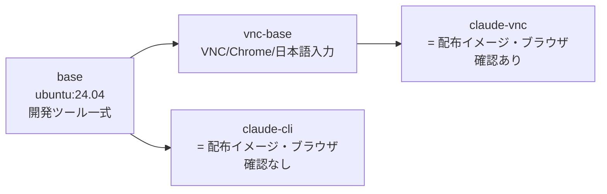
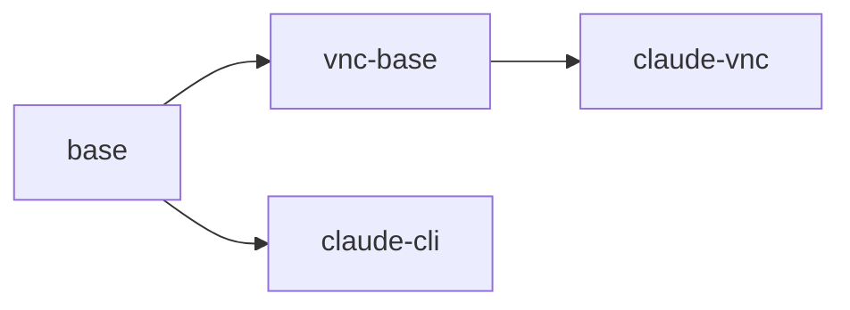

## 何をどう制御しているか

配布するイメージは1つの Dockerfile(`.devcontainer/Dockerfile.claude`)から作る。ステージは4つで、
**共通の重い層を `base` に集め、ブラウザ確認資産を `vnc-base` に積み、配布する2つの終端ステージで
エージェント CLI だけを最後に載せる**(`DSN-dist-01`)。

- `base` が `ubuntu:24.04` の上に開発ツール(Go・Python・各種 CLI)を積む。
  **`ENV container=docker` はここで焼き込む**ので、`vnc-base` も終端ステージも継承する
  (`D0-env-06`)。
- `vnc-base` が `FROM base` で VNC・Chrome・日本語入力を積む。
- 終端ステージ `claude-cli` と `claude-vnc` が、それぞれ `FROM base` /
  `FROM vnc-base` で**最後にエージェント CLI だけを入れる**。
  この2つが配布物である。

エージェント CLI の導入を終端に置くのは、更新のたびに失効するレイヤーを CLI のバイナリ層だけに
限定するためである。`vnc-base` は `base` に連なるため、`base` の途中を失効させると VNC の高コスト層
まで巻き込んで再ビルド・再取得になる(`DSN-dist-01` / `NFR-perf-01`)。

## 関係するファイル

| ファイル | 役割 |
|---|---|
| `.devcontainer/Dockerfile.claude` | 配布イメージ2つ(と中間ステージ1つ)の定義 |
| `.devcontainer/Dockerfile.docker-proxy` | docker-proxy イメージの定義 |
| `.devcontainer/tmux.conf` | コンテナ内の tmux 設定(イメージへ同梱し、起動時に読み取り専用でマウントする) |
| `Makefile` | ビルドの入口(`MODULE-makefile-build*`) |
| `.github/workflows/ghcr-images.yml` | CI からのビルドと公開。構成値は `infra/local/ghcr.md` が正 |
| `scripts/entrypoint-claude.sh` | イメージの ENTRYPOINT(実装仕様は `MODULE-entrypoint-claude`) |
| `scripts/init-firewall-claude.sh` | `/usr/local/bin/init-firewall.sh` として同梱(`MODULE-firewall-init`) |
| `scripts/dood-portsync.sh` / `scripts/wait-limit-reset.sh` | コンテナ内で使う資産として同梱(それぞれ機能間連携仕様書を持つ) |

## 依存サービスと起動順

| サービス | 起動条件 | ヘルスチェック |
|---|---|---|
| ビルド | `make build` 実行時。ネットワーク到達性が必要(パッケージ・CLI の取得) | ビルドの終了コード |
| 取得 | `claude-dev pull` 実行時。GHCR への到達性が必要 | 取得の終了コード |

## 環境変数(ビルド引数)

| 変数 | 用途 | 既定値 | 必須 | 定義箇所 |
|---|---|---|---|---|
| `USERNAME` | コンテナ内ユーザー名 | `devuser` | 任意 | `.devcontainer/Dockerfile.claude:17` |
| `USER_UID` / `USER_GID` | ビルド時のユーザー ID(起動時に entrypoint がホストへ追従させる) | `1500` / `1500` | 任意 | `:18`〜`:19` |
| `IMAGE_VERSION` | イメージのラベルに入れる版(タイムスタンプ) | `local` | 任意 | `:26`〜`:27` |
| `GO_VERSION` | 同梱する Go | `1.26.1` | 任意 | `:128` |
| `PYTHON_VERSION` | 同梱する Python | `3.13` | 任意 | `:140` |
| `CLAUDE_VERSION` | 同梱する Claude Code。**CI が具体バージョンへ解決して渡す** | `latest` | 実質必須(CI から) | `:489` / `:517` |
| `CODEX_VERSION` | 同梱する Codex CLI。**CI が具体バージョンへ解決して渡す** | `latest` | 実質必須(CI から) | `:490` / `:518` |
| `container`(ENV) | コンテナ内であることのマーカー | `docker` | 必須 | `:287` |
